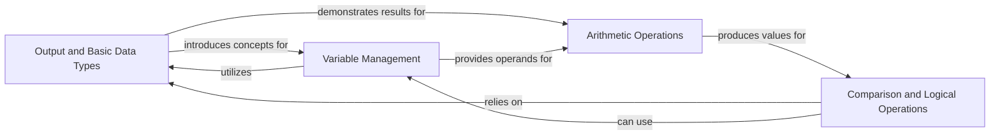

## Component Details

This foundational component introduces the absolute basics of Python programming. It covers how to write and execute simple scripts, declare variables, understand fundamental data types (integers, floats, booleans, strings), and perform operations using various operators (arithmetic, comparison, logical, assignment). It serves as the essential entry point for any Python learner, providing the building blocks for more complex programming tasks.

### Output and Basic Data Types
This component introduces the `print()` function, which is essential for displaying output and debugging. It also covers the most basic Python data types (integers, floats, complex numbers, strings, lists, dictionaries, sets, tuples, and booleans) and how to determine their type using `type()`. This is the very first step in understanding how Python handles information.

**Related Classes/Methods**:

- <a href="https://github.com/Asabeneh/30-Days-Of-Python/blob/master/01_Day_Introduction/helloworld.py#L1-L1" target="_blank" rel="noopener noreferrer">`01_Day_Introduction/helloworld.py` (1:1)</a>

### Variable Management
This component focuses on the concept of variables – named storage locations for data. It teaches how to declare variables, assign different data types to them, and perform basic operations like checking string length using `len()`. Understanding variables is crucial for storing and manipulating data throughout a program.

**Related Classes/Methods**:

- <a href="https://github.com/Asabeneh/30-Days-Of-Python/blob/master/02_Day_Variables_builtin_functions/variables.py#L1-L1" target="_blank" rel="noopener noreferrer">`02_Day_Variables_builtin_functions/variables.py` (1:1)</a>

### Arithmetic Operations
This component covers the fundamental arithmetic operators (+, -, *, /, //, %, **) used for performing mathematical calculations. It demonstrates how these operators work with both literal numbers and variables, providing the basis for any numerical processing in Python.

**Related Classes/Methods**:

- <a href="https://github.com/Asabeneh/30-Days-Of-Python/blob/master/03_Day_Operators/day-3.py#L1-L1" target="_blank" rel="noopener noreferrer">`03_Day_Operators/day-3.py` (1:1)</a>
- <a href="https://github.com/Asabeneh/30-Days-Of-Python/blob/master/01_Day_Introduction/helloworld.py#L1-L1" target="_blank" rel="noopener noreferrer">`01_Day_Introduction/helloworld.py` (1:1)</a>

### Comparison and Logical Operations
This component introduces operators that allow programs to make decisions. Comparison operators (>, >=, <, <=, ==, !=) evaluate relationships between values, while logical operators (`and`, `or`, `not`) combine or negate boolean expressions. It also touches on identity (`is`) and membership (`in`) operators. These operations are critical for controlling program flow and creating dynamic behavior.

**Related Classes/Methods**:

- <a href="https://github.com/Asabeneh/30-Days-Of-Python/blob/master/03_Day_Operators/day-3.py#L1-L1" target="_blank" rel="noopener noreferrer">`03_Day_Operators/day-3.py` (1:1)</a>

### [FAQ](https://github.com/CodeBoarding/GeneratedOnBoardings/tree/main?tab=readme-ov-file#faq)