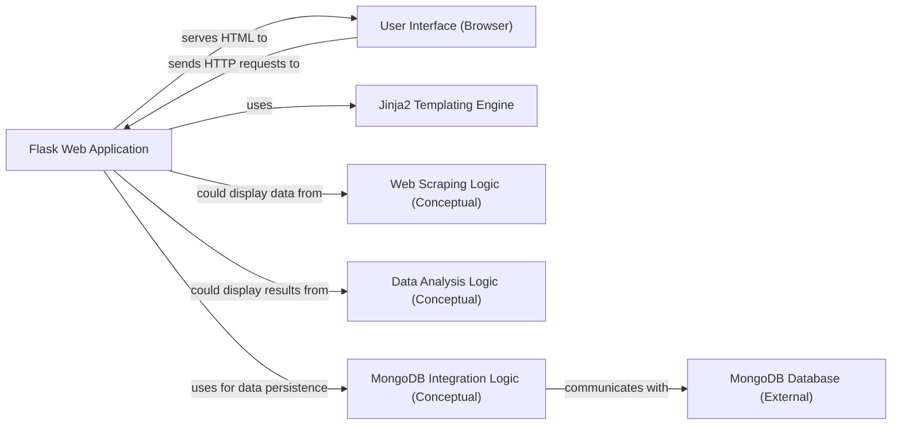

## Component Details

This component focuses on practical applications of Python in real-world scenarios, encompassing web development, data extraction, analysis, and database interaction. The core of this component is a Flask-based web application, which serves as a practical example of integrating these functionalities.

### Flask Web Application
This is the central, executable web application built using the Flask microframework. It handles incoming HTTP requests, routes URLs to specific functions, renders dynamic HTML content using templates, and processes user input from web forms. It acts as the primary interface for users.

**Related Classes/Methods**:

- <a href="https://github.com/Asabeneh/30-Days-Of-Python/blob/master/python_for_web/app.py#L1-L9999" target="_blank" rel="noopener noreferrer">`python_for_web/app.py` (1:9999)</a>

### User Interface (Browser)
Represents the client-side component (e.g., a web browser) that interacts with the Flask Web Application. It sends HTTP requests and renders the HTML responses received from the server, allowing users to interact with the application.

**Related Classes/Methods**: _None_

### Jinja2 Templating Engine
An external templating engine tightly integrated with Flask. It enables the Flask Web Application to dynamically generate HTML responses by embedding Python logic and data within HTML templates, creating a dynamic user experience.

**Related Classes/Methods**: _None_

### Web Scraping Logic (Conceptual)
This conceptual module outlines the principles and techniques for extracting structured and unstructured data from websites. While represented by a markdown file, it signifies the capability to gather external data, which could then be processed or displayed by the web application.

**Related Classes/Methods**:

- `22_Day_Web_scraping/22_web_scraping.md` (1:9999)

### Data Analysis Logic (Conceptual)
This conceptual module focuses on performing statistical analysis and manipulating datasets, likely leveraging libraries like Pandas. It represents the analytical capabilities that could be integrated into the web application to process collected data or provide insights.

**Related Classes/Methods**:

- `26_Day_Python_web/26_python_web.md` (1:9999)

### MongoDB Integration Logic (Conceptual)
This conceptual module is designed for interacting with MongoDB, a NoSQL database. It would encapsulate functionalities for connecting to a MongoDB instance, performing CRUD (Create, Read, Update, Delete) operations, and managing data persistence for the application.

**Related Classes/Methods**:

- `27_Day_Python_with_mongodb/27_python_with_mongodb.md` (1:9999)

### MongoDB Database (External)
The actual NoSQL database instance where application data is stored and retrieved. It serves as the persistent storage layer for the application.

**Related Classes/Methods**: _None_

### [FAQ](https://github.com/CodeBoarding/GeneratedOnBoardings/tree/main?tab=readme-ov-file#faq)