```mermaid
graph LR
    Python_Fundamentals["Python Fundamentals"]
    Core_Data_Structures_Control_Flow["Core Data Structures & Control Flow"]
    Functions_Modularity["Functions & Modularity"]
    Error_Handling_File_Operations["Error Handling & File Operations"]
    Object_Oriented_Programming_OOP_Packaging["Object-Oriented Programming (OOP) & Packaging"]
    Web_Data_Applications["Web & Data Applications"]
    Python_Fundamentals -- "feeds into" --> Core_Data_Structures_Control_Flow
    Core_Data_Structures_Control_Flow -- "depends on" --> Python_Fundamentals
    Core_Data_Structures_Control_Flow -- "provides data to" --> Functions_Modularity
    Functions_Modularity -- "depends on" --> Core_Data_Structures_Control_Flow
    Functions_Modularity -- "is fundamental for" --> Object_Oriented_Programming_OOP_Packaging
    Error_Handling_File_Operations -- "depends on" --> Functions_Modularity
    Error_Handling_File_Operations -- "provides data to" --> Web_Data_Applications
    Object_Oriented_Programming_OOP_Packaging -- "depends on" --> Functions_Modularity
    Object_Oriented_Programming_OOP_Packaging -- "is fundamental for" --> Web_Data_Applications
    Web_Data_Applications -- "depends on" --> Object_Oriented_Programming_OOP_Packaging
    Web_Data_Applications -- "utilizes" --> Error_Handling_File_Operations
    click Python_Fundamentals href "https://github.com/CodeBoarding/GeneratedOnBoardings/blob/main//30-Days-Of-Python/Python_Fundamentals.md" "Details"
    click Web_Data_Applications href "https://github.com/CodeBoarding/GeneratedOnBoardings/blob/main//30-Days-Of-Python/Web_Data_Applications.md" "Details"
```

## Component Details

The `30-Days-Of-Python` project is structured as a progressive curriculum, building foundational Python knowledge step-by-step. The Control Flow Graph (CFG) and Source Analysis reveal a clear pedagogical flow, where each concept builds upon previously introduced ones. The project's architecture is inherently modular, with each "day" or set of "days" representing a distinct learning component. These six components are fundamental because they represent a logical progression through the core concepts of Python programming, from basic syntax to advanced application development.

### Python Fundamentals
This foundational component introduces the absolute basics of Python programming. It covers how to write and execute simple scripts, declare variables, understand fundamental data types (integers, floats, booleans), and perform operations using various operators (arithmetic, comparison, logical). It serves as the essential entry point for any Python learner.

**Related Classes/Methods**:

- <a href="https://github.com/Asabeneh/30-Days-Of-Python/blob/master/01_Day_Introduction/helloworld.py#L1-L1" target="_blank" rel="noopener noreferrer">`01_Day_Introduction/helloworld.py` (1:1)</a>
- <a href="https://github.com/Asabeneh/30-Days-Of-Python/blob/master/02_Day_Variables_builtin_functions/variables.py#L1-L1" target="_blank" rel="noopener noreferrer">`02_Day_Variables_builtin_functions/variables.py` (1:1)</a>
- <a href="https://github.com/Asabeneh/30-Days-Of-Python/blob/master/03_Day_Operators/day-3.py#L1-L1" target="_blank" rel="noopener noreferrer">`03_Day_Operators/day-3.py` (1:1)</a>

### Core Data Structures & Control Flow
This component delves into Python's essential built-in collection types: strings (immutable sequences), lists (mutable ordered sequences), tuples (immutable ordered sequences), sets (unordered collections of unique items), and dictionaries (unordered key-value pairs). It also introduces the logic that dictates program execution, including conditional statements (`if`, `elif`, `else`) for decision-making and various looping constructs (`for`, `while`) for repetitive tasks.

**Related Classes/Methods**:

- <a href="https://github.com/Asabeneh/30-Days-Of-Python/blob/master/04_Day_Strings/day_4.py#L1-L1" target="_blank" rel="noopener noreferrer">`04_Day_Strings/day_4.py` (1:1)</a>
- <a href="https://github.com/Asabeneh/30-Days-Of-Python/blob/master/05_Day_Lists/day_5.py#L1-L1" target="_blank" rel="noopener noreferrer">`05_Day_Lists/day_5.py` (1:1)</a>
- `06_Day_Tuples/06_tuples.md` (1:1)
- `09_Day_Conditionals/09_conditionals.md` (1:1)

### Functions & Modularity
This component focuses on organizing and reusing code through functions, including defining, calling, and passing arguments. It also covers the concept of modules, allowing for grouping related functions and code into separate files for better project structure and reusability. Advanced functional programming concepts like list comprehensions are also introduced here.

**Related Classes/Methods**:

- `11_Day_Functions/11_functions.md` (1:1)
- <a href="https://github.com/Asabeneh/30-Days-Of-Python/blob/master/12_Day_Modules/main.py#L1-L1" target="_blank" rel="noopener noreferrer">`12_Day_Modules/main.py` (1:1)</a>
- <a href="https://github.com/Asabeneh/30-Days-Of-Python/blob/master/12_Day_Modules/mymodule.py#L1-L1" target="_blank" rel="noopener noreferrer">`12_Day_Modules/mymodule.py` (1:1)</a>
- `13_Day_List_comprehension/13_list_comprehension.md` (1:1)

### Error Handling & File Operations
This component teaches how to build robust applications by gracefully managing runtime errors and unexpected events using `try-except` blocks. It also covers working with dates and times, performing advanced pattern matching with regular expressions, and interacting with the file system to read from and write to various file types (text, CSV, JSON).

**Related Classes/Methods**:

- `15_Day_Python_type_errors/15_python_type_errors.md` (1:1)
- `16_Day_Python_date_time/16_python_datetime.md` (1:1)
- `18_Day_Regular_expressions/18_regular_expressions.md` (1:1)
- `19_Day_File_handling/19_file_handling.md` (1:1)

### Object-Oriented Programming (OOP) & Packaging
This component introduces the principles of Object-Oriented Programming, including classes, objects, attributes, methods, and inheritance, for building structured and scalable applications. It also covers best practices for structuring and managing Python packages and virtual environments for distribution and dependency management.

**Related Classes/Methods**:

- <a href="https://github.com/Asabeneh/30-Days-Of-Python/blob/master/20_Day_Python_package_manager/arithmetic.py#L1-L1" target="_blank" rel="noopener noreferrer">`20_Day_Python_package_manager/arithmetic.py` (1:1)</a>
- <a href="https://github.com/Asabeneh/30-Days-Of-Python/blob/master/20_Day_Python_package_manager/greet.py#L1-L1" target="_blank" rel="noopener noreferrer">`20_Day_Python_package_manager/greet.py` (1:1)</a>
- `21_Day_Classes_and_objects/21_classes_and_objects.md` (1:1)
- `23_Day_Virtual_environment/23_virtual_environment.md` (1:1)

### Web & Data Applications
This component focuses on practical applications of Python in real-world scenarios. It covers building web applications using the Flask microframework, extracting data from the web (web scraping), performing basic statistical analysis, manipulating data with the Pandas library, and interacting with NoSQL databases like MongoDB. This component integrates many prior concepts into functional projects.

**Related Classes/Methods**:

- `22_Day_Web_scraping/22_web_scraping.md` (1:1)
- <a href="https://github.com/Asabeneh/30-Days-Of-Python/blob/master/python_for_web/app.py#L1-L1" target="_blank" rel="noopener noreferrer">`python_for_web/app.py` (1:1)</a>
- `26_Day_Python_web/26_python_web.md` (1:1)
- `27_Day_Python_with_mongodb/27_python_with_mongodb.md` (1:1)

### [FAQ](https://github.com/CodeBoarding/GeneratedOnBoardings/tree/main?tab=readme-ov-file#faq)