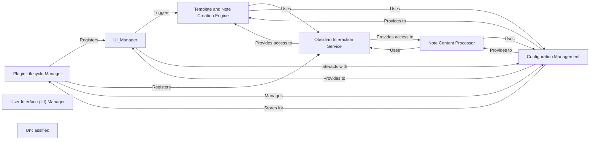

## Details

The "ABCs of Control" plugin for Obsidian is structured around a central `Plugin Lifecycle Manager` (`ABCsOfControlPlugin`) that orchestrates the entire plugin's operation. This manager initializes the plugin, loads and saves user `Configuration Management` settings, and registers key functionalities. User interaction is primarily handled by the `User Interface (UI) Manager`, which includes a main modal (`ABCsModal`) for template-driven note creation and a settings tab (`ABCsSettingTab`). All interactions with the core Obsidian application, such as file system operations, command registration, and event listening, are facilitated by the `Obsidian Interaction Service`, which is essentially the `ABCsOfControlPlugin` itself leveraging the Obsidian API. The `Note Content Processor` handles specific text manipulation tasks like highlighting, copying, pasting, and quoting within notes, relying on the `Obsidian Interaction Service` for editor access and `Configuration Management` for preferences. A dedicated `Template and Note Creation Engine` is responsible for loading templates, gathering user input for placeholders, executing embedded scripts, and ultimately creating or modifying notes based on these templates, also utilizing the `Obsidian Interaction Service` for vault operations and `Configuration Management` for template folder paths. This modular design ensures clear separation of concerns, making the plugin maintainable and extensible.

### Plugin Lifecycle Manager
Orchestrates the plugin's entire lifecycle, from initialization (onload) to cleanup (onunload). It is responsible for loading and saving plugin settings, registering UI elements like the ribbon icon and settings tab, and setting up event listeners for user interactions.

**Related Classes/Methods**:

- <a href="https://github.com/waheed11/ABCs-of-control/blob/mainsrc/main.ts#L35-L425" target="_blank" rel="noopener noreferrer">`src.main.ABCsOfControlPlugin`:35-425</a>

### User Interface (UI) Manager
Manages all user-facing components, including the main modal for selecting templates and creating notes, and the dedicated settings tab for configuring plugin preferences. It handles rendering and user input for these interfaces.

**Related Classes/Methods**:

- <a href="https://github.com/waheed11/ABCs-of-control/blob/mainsrc/main.ts#L427-L1616" target="_blank" rel="noopener noreferrer">`src.main.ABCsModal`:427-1616</a>
- <a href="https://github.com/waheed11/ABCs-of-control/blob/mainsrc/main.ts#L1710-L1729" target="_blank" rel="noopener noreferrer">`src.main.ABCsSettingTab`:1710-1729</a>

### Obsidian Interaction Service
Provides an abstracted layer for direct interaction with the core Obsidian API. This includes accessing the vault for file operations, managing the workspace for UI elements (ribbon icons, commands), and handling editor-specific events.

**Related Classes/Methods**:

- <a href="https://github.com/waheed11/ABCs-of-control/blob/mainsrc/main.ts#L48-L54" target="_blank" rel="noopener noreferrer">`src.main.ABCsOfControlPlugin.addCommand`:48-54</a>
- `src.main.ABCsOfControlPlugin.registerEvent`

### Note Content Processor
Encapsulates the core logic for manipulating and formatting content within Obsidian notes. This includes handling user selections for highlighting, copying, pasting, and quoting, as well as formatting the output before insertion into a note.

**Related Classes/Methods**:

- `src.main.ABCsOfControlPlugin.handlePasteHighlight`
- `src.main.ABCsOfControlPlugin.handleQuote`
- <a href="https://github.com/waheed11/ABCs-of-control/blob/mainsrc/main.ts#L290-L298" target="_blank" rel="noopener noreferrer">`src.main.ABCsOfControlPlugin.formatHighlight`:290-298</a>

### Template and Note Creation Engine
Manages the discovery, processing, and application of templates for creating new notes or inserting content into existing ones. It handles user input for template placeholders, executes embedded JavaScript within templates, and ensures proper folder structures are maintained.

**Related Classes/Methods**:

- `src.main.ABCsModal.showTemplatesForLetter`:1-10
- `src.main.ABCsModal.createNoteFromTemplate`
- `src.main.ABCsModal.extractJavaScriptCode`

### Configuration Management
Handles the storage, retrieval, and updating of all plugin settings. It defines the structure of the plugin's configuration and provides mechanisms for persistence across Obsidian sessions.

**Related Classes/Methods**:

- <a href="https://github.com/waheed11/ABCs-of-control/blob/mainsrc/main.ts#L4-L8" target="_blank" rel="noopener noreferrer">`src.main.MyPluginSettings`:4-8</a>
- <a href="https://github.com/waheed11/ABCs-of-control/blob/mainsrc/main.ts#L10-L14" target="_blank" rel="noopener noreferrer">`src.main.DEFAULT_SETTINGS`:10-14</a>
- `src.main.ABCsOfControlPlugin.loadSettings`
- <a href="https://github.com/waheed11/ABCs-of-control/blob/mainsrc/main.ts#L322-L324" target="_blank" rel="noopener noreferrer">`src.main.ABCsOfControlPlugin.saveSettings`:322-324</a>

### Unclassified
Component for all unclassified files and utility functions (Utility functions/External Libraries/Dependencies)

**Related Classes/Methods**: _None_

### [FAQ](https://github.com/CodeBoarding/GeneratedOnBoardings/tree/main?tab=readme-ov-file#faq)