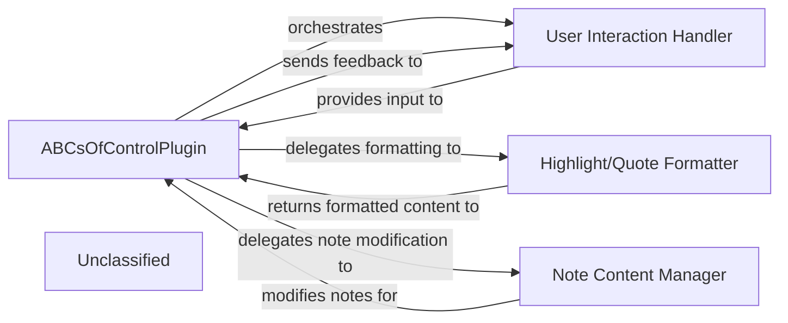

## Details

The "ABCs of Control" plugin for Obsidian is centered around the `ABCsOfControlPlugin` class, which serves as the primary orchestrator for all plugin functionalities. User interactions, such as highlighting text or adding quotes, are managed by the `User Interaction Handler`, which captures events and gathers necessary input. The `ABCsOfControlPlugin` then coordinates with the `Highlight/Quote Formatter` to structure the user's input into the appropriate Markdown format. Finally, the `Note Content Manager` is responsible for seamlessly integrating these formatted highlights and quotes into the user's Obsidian notes, ensuring proper placement and persistence. This architecture emphasizes a clear separation of concerns, with the main plugin class directing the flow and specialized components handling specific tasks like UI, content formatting, and note manipulation.

### ABCsOfControlPlugin
The core plugin class, orchestrating all functionalities, managing settings, and coordinating interactions between other components.

**Related Classes/Methods**:

- <a href="https://github.com/waheed11/ABCs-of-control/blob/mainsrc/main.ts#L35-L425" target="_blank" rel="noopener noreferrer">`ABCsOfControlPlugin`:35-425</a>

### User Interaction Handler
Manages user input events (ribbon icon clicks, commands, editor context menu interactions) and handles displaying user feedback and input modals.

**Related Classes/Methods**:

- <a href="https://github.com/waheed11/ABCs-of-control/blob/mainsrc/main.ts" target="_blank" rel="noopener noreferrer">`ABCsOfControlPlugin.onload`</a>
- <a href="https://github.com/waheed11/ABCs-of-control/blob/mainsrc/main.ts" target="_blank" rel="noopener noreferrer">`ABCsOfControlPlugin.addRibbonIcon`</a>
- <a href="https://github.com/waheed11/ABCs-of-control/blob/mainsrc/main.ts" target="_blank" rel="noopener noreferrer">`ABCsOfControlPlugin.addCommand`</a>
- <a href="https://github.com/waheed11/ABCs-of-control/blob/mainsrc/main.ts" target="_blank" rel="noopener noreferrer">`ABCsOfControlPlugin.registerEvent`</a>
- <a href="https://github.com/waheed11/ABCs-of-control/blob/mainsrc/main.ts" target="_blank" rel="noopener noreferrer">`ABCsOfControlPlugin.openColorPicker`</a>
- <a href="https://github.com/waheed11/ABCs-of-control/blob/mainsrc/main.ts" target="_blank" rel="noopener noreferrer">`ABCsOfControlPlugin.openPromptModal`</a>

### Note Content Manager
Handles reading, modifying, and writing content to Obsidian notes, specifically for adding highlights and quotes to designated sections.

**Related Classes/Methods**:

- <a href="https://github.com/waheed11/ABCs-of-control/blob/mainsrc/main.ts" target="_blank" rel="noopener noreferrer">`ABCsOfControlPlugin.addHighlightToNote`</a>
- <a href="https://github.com/waheed11/ABCs-of-control/blob/mainsrc/main.ts" target="_blank" rel="noopener noreferrer">`ABCsOfControlPlugin.handleQuote`</a>
- <a href="https://github.com/waheed11/ABCs-of-control/blob/mainsrc/main.ts" target="_blank" rel="noopener noreferrer">`ABCsOfControlPlugin.getFileFromView`</a>

### Highlight/Quote Formatter
Responsible for formatting selected text and comments into the appropriate Markdown syntax for highlights and quotes, including language-specific section headers.

**Related Classes/Methods**:

- <a href="https://github.com/waheed11/ABCs-of-control/blob/mainsrc/main.ts" target="_blank" rel="noopener noreferrer">`ABCsOfControlPlugin.formatHighlight`</a>
- <a href="https://github.com/waheed11/ABCs-of-control/blob/mainsrc/main.ts" target="_blank" rel="noopener noreferrer">`ABCsOfControlPlugin.detectArabicContent`</a>

### Unclassified
Component for all unclassified files and utility functions (Utility functions/External Libraries/Dependencies)

**Related Classes/Methods**: _None_

### [FAQ](https://github.com/CodeBoarding/GeneratedOnBoardings/tree/main?tab=readme-ov-file#faq)