```mermaid
graph LR
    Main_Plugin_Orchestrator["Main Plugin Orchestrator"]
    UI_Components["UI Components"]
    Event_Handlers_Listeners["Event Handlers/Listeners"]
    Configuration_Manager["Configuration Manager"]
    Tool_Executor["Tool Executor"]
    Obsidian_API_Wrapper["Obsidian API Wrapper"]
    Core_Logic_Business_Logic["Core Logic / Business Logic"]
    Unclassified["Unclassified"]
    Main_Plugin_Orchestrator -- "initializes" --> UI_Components
    Main_Plugin_Orchestrator -- "registers" --> Event_Handlers_Listeners
    UI_Components -- "triggers" --> Event_Handlers_Listeners
    UI_Components -- "reads/writes settings via" --> Configuration_Manager
    Event_Handlers_Listeners -- "notifies" --> Core_Logic_Business_Logic
    Event_Handlers_Listeners -- "instructs" --> Tool_Executor
    Configuration_Manager -- "provides settings to" --> UI_Components
    Configuration_Manager -- "provides settings to" --> Core_Logic_Business_Logic
    Tool_Executor -- "utilizes" --> Obsidian_API_Wrapper
    Obsidian_API_Wrapper -- "provides interface for" --> Tool_Executor
    Obsidian_API_Wrapper -- "provides interface for" --> Core_Logic_Business_Logic
    Core_Logic_Business_Logic -- "requests actions from" --> Tool_Executor
    Core_Logic_Business_Logic -- "interacts with" --> Obsidian_API_Wrapper
```

## Details

The ABCs of Control plugin for Obsidian is orchestrated by the `ABCsOfControlPlugin`, which serves as the central hub for initialization, event registration, and overall plugin lifecycle management. User interaction is primarily handled by `UI Components` such as `ABCsModal` and `ABCsSettingTab`, which allow users to configure settings and initiate actions. These UI interactions, along with other Obsidian events, are captured and processed by `Event Handlers/Listeners` within the main plugin class. The plugin's persistent state and user preferences are managed by the `Configuration Manager`, which loads and saves settings. The core functionality, encompassing actions like highlighting and quoting, is encapsulated within the `Core Logic / Business Logic` and executed through the `Tool Executor`. All interactions with the Obsidian application's API, such as reading and modifying notes, are facilitated by the `Obsidian API Wrapper`, ensuring a clean separation of concerns and robust integration.

### Main Plugin Orchestrator
The core entry point and coordinator for the plugin. It handles initialization, lifecycle management, settings registration, and orchestrates interactions between other components.

**Related Classes/Methods**:

- <a href="https://github.com/waheed11/ABCs-of-control/blob/mainsrc/main.ts#L35-L425" target="_blank" rel="noopener noreferrer">`ABCsOfControlPlugin`:35-425</a>

### UI Components
Manages all user-facing elements of the plugin, including modals, settings tabs, and the ribbon icon. It's responsible for rendering and capturing user input.

**Related Classes/Methods**:

- <a href="https://github.com/waheed11/ABCs-of-control/blob/mainsrc/main.ts#L427-L1616" target="_blank" rel="noopener noreferrer">`ABCsModal`:427-1616</a>
- <a href="https://github.com/waheed11/ABCs-of-control/blob/mainsrc/main.ts#L1710-L1729" target="_blank" rel="noopener noreferrer">`ABCsSettingTab`:1710-1729</a>
- `ABCsOfControlPlugin.openColorPicker`
- `ABCsOfControlPlugin.openPromptModal`

### Event Handlers/Listeners
Responsible for subscribing to and processing various events within the Obsidian application (e.g., ribbon icon clicks, global clicks, interval events). It dispatches these events to the appropriate components for further action.

**Related Classes/Methods**:

- `ABCsOfControlPlugin.onload`:39-91
- `ABCsOfControlPlugin.handleHighlight`:94-123
- `ABCsOfControlPlugin.handleCopyHighlight`:126-147
- `ABCsOfControlPlugin.handlePasteHighlight`:150-163
- `ABCsOfControlPlugin.handleQuote`:166-223

### Configuration Manager
Handles the loading, saving, and management of the plugin's settings and persistent data. It provides an interface for other components to access and modify configuration values.

**Related Classes/Methods**:

- <a href="https://github.com/waheed11/ABCs-of-control/blob/mainsrc/main.ts#L4-L8" target="_blank" rel="noopener noreferrer">`MyPluginSettings`:4-8</a>
- <a href="https://github.com/waheed11/ABCs-of-control/blob/mainsrc/main.ts#L10-L14" target="_blank" rel="noopener noreferrer">`DEFAULT_SETTINGS`:10-14</a>
- `ABCsOfControlPlugin.loadSettings`:301-303
- <a href="https://github.com/waheed11/ABCs-of-control/blob/mainsrc/main.ts#L1710-L1729" target="_blank" rel="noopener noreferrer">`ABCsSettingTab`:1710-1729</a>

### Tool Executor
This component is responsible for executing specific actions or interacting with external APIs/services as directed by the plugin's internal logic or external instructions (e.g., from an integrated language model service). It abstracts the details of how various "tools" or functionalities are invoked.

**Related Classes/Methods**:

- `ABCsOfControlPlugin.addHighlightToNote`:236-287
- `ABCsOfControlPlugin.handleQuote`:166-223

### Obsidian API Wrapper
Provides a structured and potentially simplified interface for other plugin components to interact with the complex Obsidian API. It abstracts direct API calls, promoting cleaner code and easier maintenance.

**Related Classes/Methods**:

- `ABCsOfControlPlugin.getFileFromView`:226-233

### Core Logic / Business Logic
Encapsulates the primary functional logic of the plugin, distinct from UI or event handling. This component contains the specific note-taking or knowledge management features that the plugin provides.

**Related Classes/Methods**:

- `ABCsOfControlPlugin.handleHighlight`:94-123
- `ABCsOfControlPlugin.handleCopyHighlight`:126-147
- `ABCsOfControlPlugin.handlePasteHighlight`:150-163
- `ABCsOfControlPlugin.handleQuote`:166-223
- `ABCsOfControlPlugin.addHighlightToNote`:236-287
- `ABCsOfControlPlugin.formatHighlight`:290-298
- `ABCsOfControlPlugin.detectArabicContent`:301-303

### Unclassified
Component for all unclassified files and utility functions (Utility functions/External Libraries/Dependencies)

**Related Classes/Methods**: _None_

### [FAQ](https://github.com/CodeBoarding/GeneratedOnBoardings/tree/main?tab=readme-ov-file#faq)