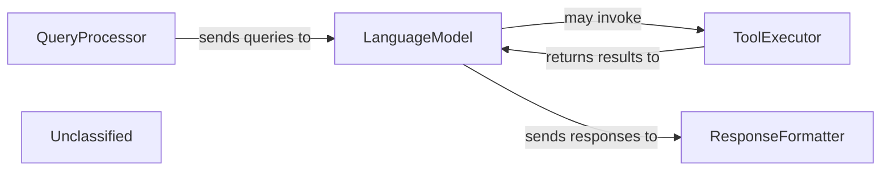

## Details

This graph represents the core functionality of a system that processes user queries, generates responses using a language model, and potentially interacts with external tools. The main flow involves receiving a query, parsing it, generating a response, and then presenting it to the user. Its purpose is to provide an intelligent conversational interface.

### QueryProcessor [[Expand]](./QueryProcessor.md)
Handles incoming user queries, including parsing and initial validation.

**Related Classes/Methods**:

- `QueryParser:parse`
- `QueryValidator:validate`

### LanguageModel [[Expand]](./LanguageModel.md)
Generates responses based on processed queries using a large language model.

**Related Classes/Methods**:

- `LLM:generate_response`

### ToolExecutor [[Expand]](./ToolExecutor.md)
Executes external tools or APIs as directed by the language model.

**Related Classes/Methods**:

- `ToolRegistry:get_tool`
- `ExternalTool:execute`

### ResponseFormatter
Formats the generated response for presentation to the user.

**Related Classes/Methods**:

- <a href="https://github.com/waheed11/ABCs-of-control/blob/mainsrc/main.ts#L290-L298" target="_blank" rel="noopener noreferrer">`Formatter:format`:290-298</a>

### Unclassified
Component for all unclassified files and utility functions (Utility functions/External Libraries/Dependencies)

**Related Classes/Methods**: _None_

### [FAQ](https://github.com/CodeBoarding/GeneratedOnBoardings/tree/main?tab=readme-ov-file#faq)