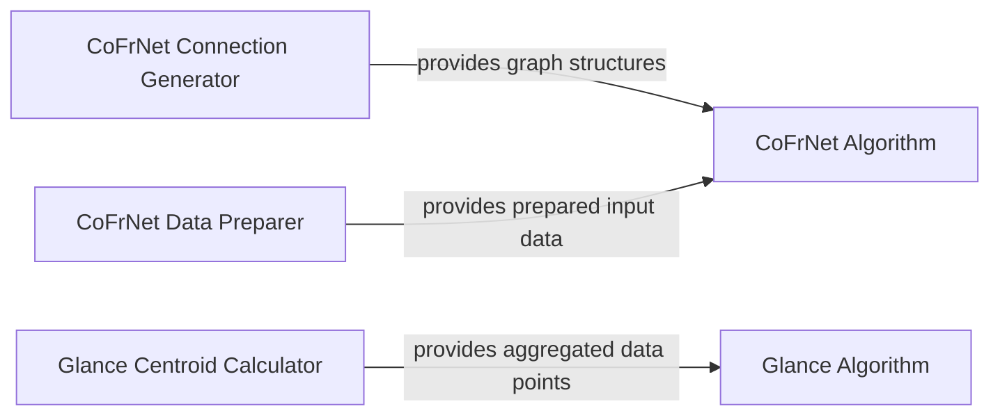

## Details

The aix360.algorithms subsystem encompasses various explainability and machine learning algorithms. The CoFrNet algorithm, central to this analysis, relies on the CoFrNet Connection Generator to establish its unique network topology and the CoFrNet Data Preparer for input data transformation. These prepared inputs and generated connections are then consumed by the CoFrNet Algorithm component, which encapsulates the CoFrNet_Model for its core computations. Separately, the Glance algorithm leverages the Glance Centroid Calculator to derive aggregated data points, which are then utilized by the Glance Algorithm component for its specific explainability or clustering tasks. This modular design promotes clear separation of concerns, with dedicated components for data preparation, connection generation, and the core algorithm execution.

### CoFrNet Connection Generator
Orchestrates the creation of diverse network connection patterns for the CoFrNet algorithm. This component encapsulates various strategies for generating graph structures, which are fundamental for the CoFrNet's operation.

**Related Classes/Methods**:

- <a href="https://github.com/Trusted-AI/AIX360/blob/master/aix360/algorithms/cofrnet/utils.py#L24-L135" target="_blank" rel="noopener noreferrer">`aix360.algorithms.cofrnet.utils.generate_connections`:24-135</a>

### CoFrNet Data Preparer
Handles data transformation and preparation steps essential for training the CoFrNet model, specifically focusing on one-hot encoding and training routines.

**Related Classes/Methods**:

- <a href="https://github.com/Trusted-AI/AIX360/blob/master/aix360/algorithms/cofrnet/utils.py#L217-L253" target="_blank" rel="noopener noreferrer">`aix360.algorithms.cofrnet.utils.train`:217-253</a>
- <a href="https://github.com/Trusted-AI/AIX360/blob/master/aix360/algorithms/cofrnet/utils.py#L202-L208" target="_blank" rel="noopener noreferrer">`aix360.algorithms.cofrnet.utils.onehot_encoding`:202-208</a>

### CoFrNet Algorithm
Implements the core logic of the Continued Fractions Nets (CoFrNets) model, including its unique architecture and forward pass computations. It utilizes generated connections and processed data to perform its learning task.

**Related Classes/Methods**:

- <a href="https://github.com/Trusted-AI/AIX360/blob/master/aix360/algorithms/cofrnet/CoFrNet.py#L27-L87" target="_blank" rel="noopener noreferrer">`aix360.algorithms.cofrnet.CoFrNet_Model`:27-87</a>

### Glance Centroid Calculator
Computes centroids for data aggregation or clustering operations within the Glance algorithm, providing a representative point for data groups.

**Related Classes/Methods**:

- <a href="https://github.com/Trusted-AI/AIX360/blob/master/aix360/algorithms/glance/utils/centroid.py#L39-L71" target="_blank" rel="noopener noreferrer">`aix360.algorithms.glance.utils.centroid.centroid_numpy`:39-71</a>

### Glance Algorithm
Represents the main Glance algorithm, responsible for orchestrating data processing, centroid calculations, and potentially other sub-processes to achieve its explainability or clustering objectives.

**Related Classes/Methods**:

- <a href="https://github.com/Trusted-AI/AIX360/blob/master/aix360/algorithms/glance/base.py#L27-L100" target="_blank" rel="noopener noreferrer">`aix360.algorithms.glance.base.Glance`:27-100</a>

### [FAQ](https://github.com/CodeBoarding/GeneratedOnBoardings/tree/main?tab=readme-ov-file#faq)