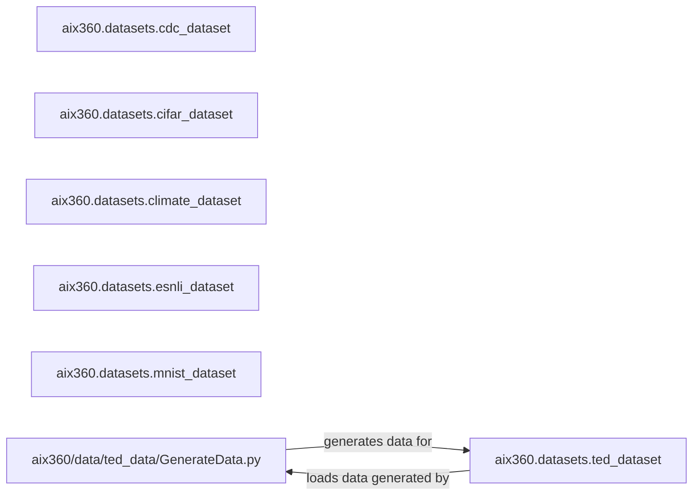

## Details

The aix360 project's data management subsystem provides a standardized interface for various datasets, ensuring they are readily available and pre-processed for use with explainability algorithms. This subsystem is primarily composed of specialized dataset handlers, each tailored to a specific data type or source, such as tabular (CDC), image (CIFAR, MNIST), time-series (Climate), and natural language inference (e-SNLI) datasets. A unique aspect is the synthetic data generation capability for the TED framework, where the GenerateData.py script produces data that is then loaded and managed by the TEDDataset component. Each dataset component is responsible for data ingestion, format conversion, and initial preparation, ensuring consistency and ease of integration with downstream explainability models.

### aix360.datasets.cdc_dataset
Handles loading and initial processing of CDC (Centers for Disease Control) datasets, including format conversions, data ingestion, and initial processing/preparation. It acts as a specialized adapter for this specific type of tabular data.

**Related Classes/Methods**:

- <a href="https://github.com/Trusted-AI/AIX360/blob/master/aix360/datasets/cdc_dataset.py" target="_blank" rel="noopener noreferrer">`aix360.datasets.cdc_dataset`</a>

### aix360.datasets.cifar_dataset
Manages downloading and processing of CIFAR image datasets (e.g., CIFAR-10, CIFAR-100), including data ingestion, format conversion, and initial processing/preparation. This component specializes in image data handling.

**Related Classes/Methods**:

- <a href="https://github.com/Trusted-AI/AIX360/blob/master/aix360/datasets/cifar_dataset.py" target="_blank" rel="noopener noreferrer">`aix360.datasets.cifar_dataset`</a>

### aix360.datasets.climate_dataset
Focuses on loading and normalizing climate time-series data, including data ingestion, format conversion, and initial processing/preparation. It is tailored for sequential, time-dependent data.

**Related Classes/Methods**:

- <a href="https://github.com/Trusted-AI/AIX360/blob/master/aix360/datasets/climate_dataset.py" target="_blank" rel="noopener noreferrer">`aix360.datasets.climate_dataset`</a>

### aix360.datasets.esnli_dataset
Provides functionality to retrieve and manage examples from the e-SNLI (extended Stanford Natural Language Inference) dataset, including data ingestion, format conversion, and initial processing/preparation. This component specializes in natural language inference data.

**Related Classes/Methods**:

- <a href="https://github.com/Trusted-AI/AIX360/blob/master/aix360/datasets/esnli_dataset.py" target="_blank" rel="noopener noreferrer">`aix360.datasets.esnli_dataset`</a>

### aix360.datasets.mnist_dataset
Responsible for extracting image data and labels from the MNIST dataset, including data ingestion, format conversion, and initial processing/preparation. Similar to CIFAR, it's an image data specialist.

**Related Classes/Methods**:

- <a href="https://github.com/Trusted-AI/AIX360/blob/master/aix360/datasets/mnist_dataset.py" target="_blank" rel="noopener noreferrer">`aix360.datasets.mnist_dataset`</a>

### aix360/data/ted_data/GenerateData.py
This Python script is responsible for generating synthetic data, including features, labels, and explanations, specifically for the TED framework. It creates a controlled environment for testing and demonstrating explainability algorithms.

**Related Classes/Methods**:

- <a href="https://github.com/Trusted-AI/AIX360/blob/master/aix360/data/ted_data/GenerateData.py" target="_blank" rel="noopener noreferrer">`aix360/data/ted_data/GenerateData.py`</a>

### aix360.datasets.ted_dataset
Manages the loading and initial processing of the TED (Teaching AI to Explain its Decisions) dataset. It provides functionality to read the generated synthetic data (features, labels, and explanations) into a usable format for models and explainability algorithms.

**Related Classes/Methods**:

- <a href="https://github.com/Trusted-AI/AIX360/blob/master/aix360/datasets/ted_dataset.py#L6-L73" target="_blank" rel="noopener noreferrer">`aix360.datasets.ted_dataset.TEDDataset`:6-73</a>

### [FAQ](https://github.com/CodeBoarding/GeneratedOnBoardings/tree/main?tab=readme-ov-file#faq)