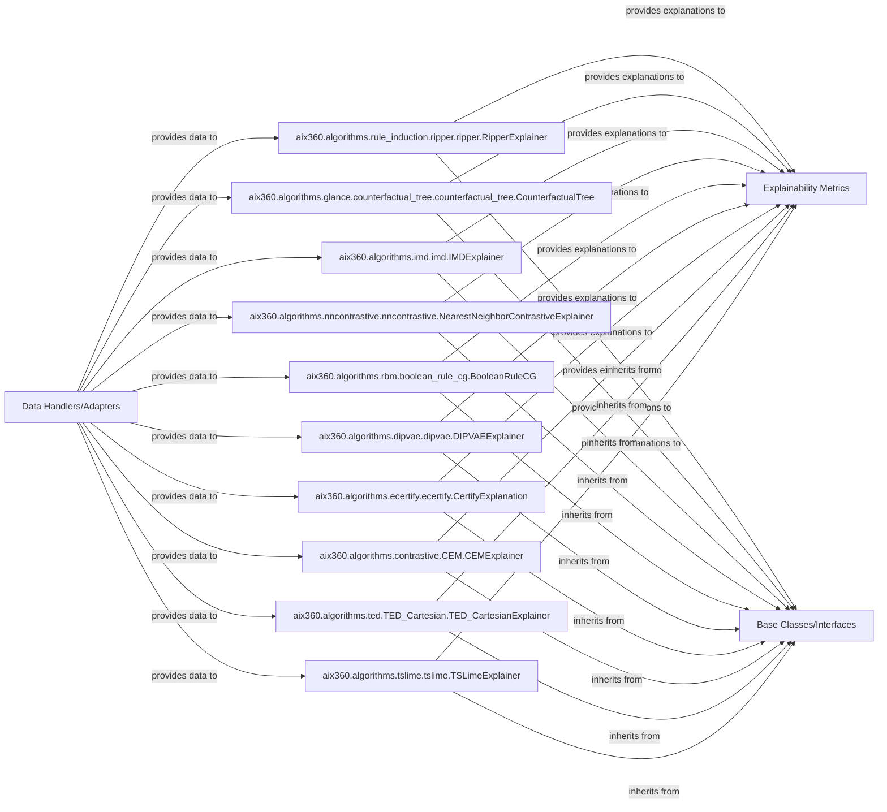

## Details

The aix360 project's explainability subsystem is designed to provide a comprehensive suite of tools for generating and evaluating explanations for machine learning models. At its core, the system processes input data through specialized data handlers, which then feed into a diverse set of explainability algorithms. These algorithms, adhering to a common set of base classes and interfaces, produce various forms of explanations. The quality and characteristics of these explanations are subsequently assessed by a dedicated metrics component, ensuring the reliability and interpretability of the generated insights. This architecture promotes modularity, extensibility, and a clear separation of concerns, facilitating the development and integration of new explainability techniques.

### aix360.algorithms.rule_induction.ripper.ripper.RipperExplainer
Responsible for generating explanations using rule induction techniques, fitting models, and making predictions based on learned rules.

**Related Classes/Methods**:

- <a href="https://github.com/Trusted-AI/AIX360/blob/master/aix360/algorithms/rule_induction/ripper/ripper.py#L23-L592" target="_blank" rel="noopener noreferrer">`aix360.algorithms.rule_induction.ripper.ripper.RipperExplainer`:23-592</a>

### aix360.algorithms.glance.counterfactual_tree.counterfactual_tree.CounterfactualTree
Implements the GLANCE explainability algorithm, encompassing explanation generation, model fitting, and prediction capabilities.

**Related Classes/Methods**:

- <a href="https://github.com/Trusted-AI/AIX360/blob/master/aix360/algorithms/glance/counterfactual_tree/counterfactual_tree.py" target="_blank" rel="noopener noreferrer">`aix360.algorithms.glance.counterfactual_tree.counterfactual_tree.CounterfactualTree`</a>

### aix360.algorithms.imd.imd.IMDExplainer
Implements the IMD (Influence-based Model Debugging) explainability algorithm, responsible for explanation generation, model fitting, and prediction.

**Related Classes/Methods**:

- <a href="https://github.com/Trusted-AI/AIX360/blob/master/aix360/algorithms/imd/imd.py#L11-L179" target="_blank" rel="noopener noreferrer">`aix360.algorithms.imd.imd.IMDExplainer`:11-179</a>

### aix360.algorithms.nncontrastive.nncontrastive.NearestNeighborContrastiveExplainer
Implements the NNContrastive explainability algorithm, specifically designed for neural networks, handling explanation generation, model fitting, and prediction.

**Related Classes/Methods**:

- <a href="https://github.com/Trusted-AI/AIX360/blob/master/aix360/algorithms/nncontrastive/nncontrastive.py#L15-L472" target="_blank" rel="noopener noreferrer">`aix360.algorithms.nncontrastive.nncontrastive.NearestNeighborContrastiveExplainer`:15-472</a>

### aix360.algorithms.rbm.boolean_rule_cg.BooleanRuleCG
Implements an explainability algorithm based on Restricted Boltzmann Machines (RBM), covering explanation generation, model fitting, and prediction.

**Related Classes/Methods**:

- <a href="https://github.com/Trusted-AI/AIX360/blob/master/aix360/algorithms/rbm/boolean_rule_cg.py#L12-L245" target="_blank" rel="noopener noreferrer">`aix360.algorithms.rbm.boolean_rule_cg.BooleanRuleCG`:12-245</a>

### aix360.algorithms.dipvae.dipvae.DIPVAEExplainer
Implements the DIP-VAE (Disentangled Inferred Prior Variational Autoencoder) explainability algorithm, responsible for explanation generation, model fitting, and prediction.

**Related Classes/Methods**:

- <a href="https://github.com/Trusted-AI/AIX360/blob/master/aix360/algorithms/dipvae/dipvae.py#L18-L168" target="_blank" rel="noopener noreferrer">`aix360.algorithms.dipvae.dipvae.DIPVAEExplainer`:18-168</a>

### aix360.algorithms.ecertify.ecertify.CertifyExplanation
Implements the ECertify explainability algorithm, focusing on generating explanations, fitting models, and making predictions, potentially with an emphasis on robustness or certification.

**Related Classes/Methods**:

- <a href="https://github.com/Trusted-AI/AIX360/blob/master/aix360/algorithms/ecertify/ecertify.py#L9-L76" target="_blank" rel="noopener noreferrer">`aix360.algorithms.ecertify.ecertify.CertifyExplanation`:9-76</a>

### aix360.algorithms.contrastive.CEM.CEMExplainer
Implements a general Contrastive explainability algorithm, responsible for explanation generation, model fitting, and prediction.

**Related Classes/Methods**:

- <a href="https://github.com/Trusted-AI/AIX360/blob/master/aix360/algorithms/contrastive/CEM.py#L11-L110" target="_blank" rel="noopener noreferrer">`aix360.algorithms.contrastive.CEM.CEMExplainer`:11-110</a>

### aix360.algorithms.ted.TED_Cartesian.TED_CartesianExplainer
Implements the TED explainability algorithm, encompassing explanation generation, model fitting, and prediction.

**Related Classes/Methods**:

- <a href="https://github.com/Trusted-AI/AIX360/blob/master/aix360/algorithms/ted/TED_Cartesian.py#L4-L142" target="_blank" rel="noopener noreferrer">`aix360.algorithms.ted.TED_Cartesian.TED_CartesianExplainer`:4-142</a>

### aix360.algorithms.tslime.tslime.TSLimeExplainer
Implements the TSLIME (Time Series LIME) explainability algorithm, specifically adapted for time-series data, handling explanation generation, model fitting, and prediction.

**Related Classes/Methods**:

- <a href="https://github.com/Trusted-AI/AIX360/blob/master/aix360/algorithms/tslime/tslime.py#L20-L224" target="_blank" rel="noopener noreferrer">`aix360.algorithms.tslime.tslime.TSLimeExplainer`:20-224</a>

### Explainability Metrics
Component responsible for evaluating and assessing the quality of explanations.

**Related Classes/Methods**:

### Data Handlers/Adapters
Component responsible for processing and adapting input datasets for explainability algorithms.

**Related Classes/Methods**:

- <a href="https://github.com/Trusted-AI/AIX360/blob/master/aix360/datasets/adult_dataset.py#L43-L86" target="_blank" rel="noopener noreferrer">`aix360.datasets.adult_dataset.AdultDataset`:43-86</a>

### Base Classes/Interfaces
Common base classes and interfaces for explainability algorithms, ensuring a standardized API.

**Related Classes/Methods**:

- <a href="https://github.com/Trusted-AI/AIX360/blob/master/aix360/algorithms/die.py#L11-L43" target="_blank" rel="noopener noreferrer">`aix360.algorithms.die.DIExplainer`:11-43</a>

### [FAQ](https://github.com/CodeBoarding/GeneratedOnBoardings/tree/main?tab=readme-ov-file#faq)