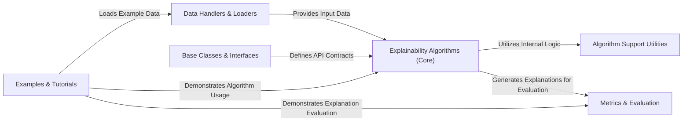

## Details

The AIX360 project is structured around a core set of `Explainability Algorithms`, which are central to its functionality. These algorithms rely on `Data Handlers & Loaders` to prepare and ingest data, ensuring that the input is in a suitable format for processing. The foundational `Base Classes & Interfaces` define the common contracts and abstract structures that all algorithms adhere to, promoting consistency and extensibility. To support the complex operations of the core algorithms, `Algorithm Support Utilities` provide essential helper functions and transformations. Once explanations are generated, the `Metrics & Evaluation` component is responsible for assessing their quality and effectiveness. Finally, `Examples & Tutorials` serve as a crucial entry point for users, demonstrating practical applications and interactions across the `Data Handlers & Loaders`, `Explainability Algorithms (Core)`, and `Metrics & Evaluation` components, illustrating the typical data flow and usage patterns within the library. This modular design facilitates clear separation of concerns and promotes maintainability and scalability.

### Data Handlers & Loaders [[Expand]](./Data_Handlers_Loaders.md)
Manages data ingestion, format conversion, and preparation of datasets for explainability algorithms.

**Related Classes/Methods**:

- <a href="https://github.com/Trusted-AI/AIX360/blob/master/aix360/data/" target="_blank" rel="noopener noreferrer">`aix360/data/`</a>

### Base Classes & Interfaces
Defines foundational abstract classes and interfaces, establishing common contracts for explainability algorithms and related components.

**Related Classes/Methods**:

- <a href="https://github.com/Trusted-AI/AIX360/blob/master/aix360/algorithms/glance/base.py" target="_blank" rel="noopener noreferrer">`aix360.algorithms.glance.base`</a>

### Explainability Algorithms (Core) [[Expand]](./Explainability_Algorithms_Core_.md)
Encapsulates the primary explainability algorithms responsible for generating explanations, fitting models, and making predictions.

**Related Classes/Methods**:

- <a href="https://github.com/Trusted-AI/AIX360/blob/master/aix360/algorithms/" target="_blank" rel="noopener noreferrer">`aix360/algorithms/`</a>

### Algorithm Support Utilities [[Expand]](./Algorithm_Support_Utilities.md)
Provides helper functions and classes that support the core explainability algorithms, handling data transformations, internal model interactions, and specific sub-routines.

**Related Classes/Methods**:

- <a href="https://github.com/Trusted-AI/AIX360/blob/master/aix360/algorithms/glance/utils/" target="_blank" rel="noopener noreferrer">`aix360/algorithms/glance/utils/`</a>
- <a href="https://github.com/Trusted-AI/AIX360/blob/master/aix360/algorithms/cofrnet/utils.py" target="_blank" rel="noopener noreferrer">`aix360/algorithms/cofrnet/utils.py`</a>

### Metrics & Evaluation
Offers functionalities for evaluating the quality and effectiveness of explanations generated by the algorithms, including various metrics and tools for quantitative assessment.

**Related Classes/Methods**:

- <a href="https://github.com/Trusted-AI/AIX360/blob/master/aix360/metrics/" target="_blank" rel="noopener noreferrer">`aix360/metrics/`</a>

### Examples & Tutorials
Contains runnable examples and tutorial code demonstrating how to use the AIX360 library and its various explainability algorithms.

**Related Classes/Methods**:

- <a href="https://github.com/Trusted-AI/AIX360/blob/master/examples/" target="_blank" rel="noopener noreferrer">`aix360/examples/`</a>

### [FAQ](https://github.com/CodeBoarding/GeneratedOnBoardings/tree/main?tab=readme-ov-file#faq)