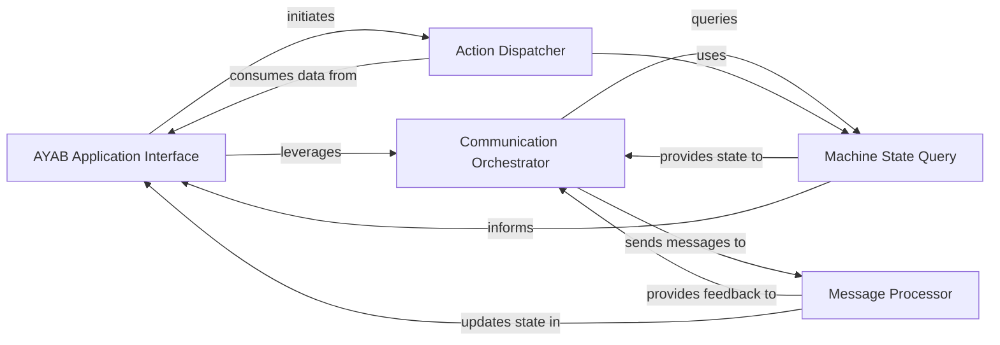

## Details

The `AYABInterface` subsystem is designed to manage the intricate interactions with the AYAB knitting machine. It establishes a clear separation of concerns, with the `AYAB Application Interface` acting as the central orchestrator, handling high-level commands and maintaining the overall knitting pattern context. Communication with the physical machine is managed by the `Communication Orchestrator`, which ensures structured message exchange. The `Action Dispatcher` translates abstract knitting operations into concrete machine commands, while the `Message Processor` interprets machine responses to update the application's internal state. Complementing these, the `Machine State Query` component continuously assesses and provides the current physical configuration of the knitting machine, ensuring that both actions and communication are informed by real-time machine conditions.

### AYAB Application Interface [[Expand]](./AYAB_Application_Interface.md)
The top-level interface for external applications, providing high-level control and status retrieval for the AYAB knitting machine. It acts as the orchestrator for user commands and machine interactions, and holds the overall knitting pattern context including `colors`.

**Related Classes/Methods**:

- <a href="https://github.com/fossasia/AYABInterface/blob/master/AYABInterface/interaction.py#L1-L9999" target="_blank" rel="noopener noreferrer">`AYABInterface.interaction`:1-9999</a>
- <a href="https://github.com/fossasia/AYABInterface/blob/master/AYABInterface/interaction.py" target="_blank" rel="noopener noreferrer">`AYABInterface.interaction.colors`</a>

### Communication Orchestrator
Manages the sequence of high-level communication with the AYAB machine. It initiates queries for machine state (e.g., carriage limits, needle positions) and coordinates the processing of incoming messages, ensuring a structured dialogue with the hardware.

**Related Classes/Methods**:

- <a href="https://github.com/fossasia/AYABInterface/blob/master/AYABInterface/interaction.py#L47-L59" target="_blank" rel="noopener noreferrer">`AYABInterface.interaction.communicate_through`:47-59</a>

### Action Dispatcher
Translates high-level action requests (e.g., move carriage, switch machine on, put color) into specific, lower-level machine commands. It provides an abstraction layer for executing physical operations on the knitting machine, leveraging machine state and pattern data.

**Related Classes/Methods**:

- <a href="https://github.com/fossasia/AYABInterface/blob/master/AYABInterface/actions.py#L1-L9999" target="_blank" rel="noopener noreferrer">`AYABInterface.actions`:1-9999</a>
- <a href="https://github.com/fossasia/AYABInterface/blob/master/AYABInterface/interaction.py" target="_blank" rel="noopener noreferrer">`AYABInterface.interaction.actions`</a>

### Message Processor
Responsible for parsing and interpreting raw messages received from the AYAB machine. It updates the application's internal state based on machine responses and triggers subsequent logic, crucial for the command/response pattern.

**Related Classes/Methods**:

- <a href="https://github.com/fossasia/AYABInterface/blob/master/AYABInterface/interaction.py#L89-L90" target="_blank" rel="noopener noreferrer">`AYABInterface.interaction._on_message_received`:89-90</a>

### Machine State Query
Gathers and calculates the current operational state of the knitting machine, specifically focusing on needle positions and configurations. It provides critical feedback for application logic and state management. This component also encompasses the logic for determining carriage boundaries (`left_end_needle`, `right_end_needle`) and row-specific needle calculations (`_get_row_needles`).

**Related Classes/Methods**:

- <a href="https://github.com/fossasia/AYABInterface/blob/master/AYABInterface/interaction.py#L71-L87" target="_blank" rel="noopener noreferrer">`AYABInterface.interaction._get_needle_positions`:71-87</a>
- <a href="https://github.com/fossasia/AYABInterface/blob/master/AYABInterface/interaction.py#L31-L33" target="_blank" rel="noopener noreferrer">`AYABInterface.interaction.left_end_needle`:31-33</a>
- <a href="https://github.com/fossasia/AYABInterface/blob/master/AYABInterface/interaction.py#L35-L37" target="_blank" rel="noopener noreferrer">`AYABInterface.interaction.right_end_needle`:35-37</a>
- <a href="https://github.com/fossasia/AYABInterface/blob/master/AYABInterface/interaction.py#L65-L69" target="_blank" rel="noopener noreferrer">`AYABInterface.interaction._get_row_needles`:65-69</a>

### [FAQ](https://github.com/CodeBoarding/GeneratedOnBoardings/tree/main?tab=readme-ov-file#faq)