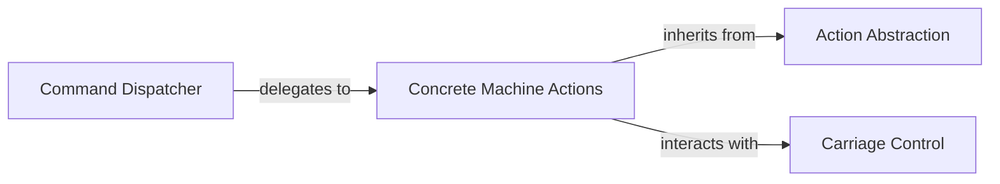

## Details

The AYAB Command & Action Handler subsystem is responsible for translating abstract user commands into concrete, machine-executable actions, encapsulating the logic for various machine operations. It forms a core part of the AYABInterface module, specifically focusing on the actions and carriages components.

### Command Dispatcher
The primary entry point for machine operations. It receives high-level user commands, translates them into concrete machine actions, and dispatches them for execution. It orchestrates the overall flow of machine operations.

**Related Classes/Methods**:

- <a href="https://github.com/fossasia/AYABInterface/blob/master/AYABInterface/interaction.py" target="_blank" rel="noopener noreferrer">`AYABInterface.interaction.actions`</a>

### Action Abstraction
A foundational class that defines the common interface and structure for all concrete machine actions. It promotes a consistent command pattern, ensuring that all actions adhere to a predictable execution model.

**Related Classes/Methods**:

- <a href="https://github.com/fossasia/AYABInterface/blob/master/AYABInterface/actions.py" target="_blank" rel="noopener noreferrer">`AYABInterface.actions.BaseAction`</a>

### Concrete Machine Actions
A collection of specific classes, each encapsulating the low-level sequence of commands and logic required to perform a single, well-defined machine operation (e.g., moving the carriage, switching machine power, putting color). These are the executable units of work.

**Related Classes/Methods**:

- <a href="https://github.com/fossasia/AYABInterface/blob/master/AYABInterface/actions.py" target="_blank" rel="noopener noreferrer">`AYABInterface.actions`</a>

### Carriage Control
Manages the state and provides control mechanisms for the machine's physical carriage. This component acts as a hardware abstraction layer for carriage-related operations, allowing higher-level actions to interact with the carriage without needing to know its low-level implementation details.

**Related Classes/Methods**:

- <a href="https://github.com/fossasia/AYABInterface/blob/master/AYABInterface/carriages.py#L4-L18" target="_blank" rel="noopener noreferrer">`AYABInterface.carriages.Carriage`:4-18</a>

### [FAQ](https://github.com/CodeBoarding/GeneratedOnBoardings/tree/main?tab=readme-ov-file#faq)