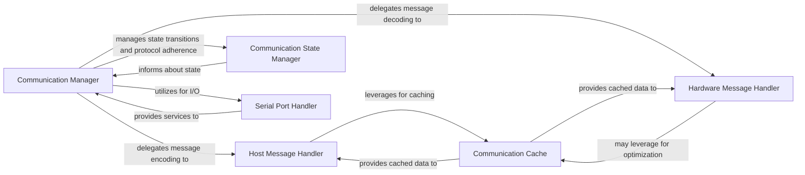

## Details

The AYAB Communication Stack subsystem is central to the AYABInterface project, managing all aspects of communication with the AYAB shield. It embodies the project's architectural bias towards clear separation of concerns, employing a layered approach, a hardware abstraction layer, and a state machine for robust protocol handling.

### Communication Manager
The primary orchestrator of the AYAB communication lifecycle. It manages the connection, ensures thread-safe operations, directs message flow (sending and receiving), and coordinates with the state machine to enforce protocol adherence. It acts as the central control point for all interactions with the AYAB shield.

**Related Classes/Methods**:

- <a href="https://github.com/fossasia/AYABInterface/blob/master/AYABInterface/communication/__init__.py" target="_blank" rel="noopener noreferrer">`Communication Manager`</a>

### Host Message Handler
Responsible for defining and encapsulating messages originating from the host application. It translates high-level commands into the specific byte-formatted messages required by the AYAB shield protocol, acting as the serialization layer for outgoing data.

**Related Classes/Methods**:

- <a href="https://github.com/fossasia/AYABInterface/blob/master/AYABInterface/communication/host_messages.py" target="_blank" rel="noopener noreferrer">`Host Message Handler`</a>

### Hardware Message Handler
Defines and processes messages received from the AYAB shield. It is responsible for parsing raw incoming byte streams into structured, meaningful hardware message objects, serving as the deserialization layer for incoming data.

**Related Classes/Methods**:

- <a href="https://github.com/fossasia/AYABInterface/blob/master/AYABInterface/communication/hardware_messages.py" target="_blank" rel="noopener noreferrer">`Hardware Message Handler`</a>

### Communication State Manager
Implements the finite state machine that governs the AYAB communication protocol. It ensures that messages are processed and state transitions occur in a defined, sequential, and protocol-compliant order, maintaining the integrity of the communication flow.

**Related Classes/Methods**:

- <a href="https://github.com/fossasia/AYABInterface/blob/master/AYABInterface/communication/states.py" target="_blank" rel="noopener noreferrer">`Communication State Manager`</a>

### Serial Port Handler
Provides the fundamental, low-level interface for interacting with the physical serial port. It abstracts away OS-specific details, enabling the listing of available ports and handling raw byte transmission and reception. This component forms a critical part of the Hardware Abstraction Layer (HAL).

**Related Classes/Methods**:

- <a href="https://github.com/fossasia/AYABInterface/blob/master/AYABInterface/serial.py" target="_blank" rel="noopener noreferrer">`Serial Port Handler`</a>

### Communication Cache
A utility component that caches specific communication data, such as line configuration messages or frequently used message components. Its purpose is to optimize performance by avoiding redundant computations or re-transmissions of static or frequently accessed data.

**Related Classes/Methods**:

- <a href="https://github.com/fossasia/AYABInterface/blob/master/AYABInterface/communication/cache.py" target="_blank" rel="noopener noreferrer">`Communication Cache`</a>

### [FAQ](https://github.com/CodeBoarding/GeneratedOnBoardings/tree/main?tab=readme-ov-file#faq)