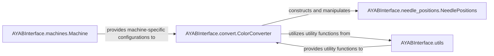

## Details

The AYAB Data & Configuration subsystem is responsible for managing and transforming data critical to the operation of AYAB knitting machines. It encompasses the definition of machine models, the handling of knitting pattern data, and utility functions for data manipulation.

### AYABInterface.machines.Machine
Defines the core data model for AYAB knitting machines, including parameters like the number of needles, end needle positions, and unique identifiers. It also provides methods for retrieving and comparing machine configurations. This component is fundamental as it provides the foundational specifications for any machine the system interacts with.

**Related Classes/Methods**:

- <a href="https://github.com/fossasia/AYABInterface/blob/master/AYABInterface/machines.py#L15-L166" target="_blank" rel="noopener noreferrer">`AYABInterface.machines.Machine`:15-166</a>

### AYABInterface.needle_positions.NeedlePositions
Encapsulates and validates the structured data representing needle positions for knitting patterns. It ensures the integrity and correctness of this critical pattern data, which is the low-level instruction set for the machine.

**Related Classes/Methods**:

- <a href="https://github.com/fossasia/AYABInterface/blob/master/AYABInterface/needle_positions.py#L8-L101" target="_blank" rel="noopener noreferrer">`AYABInterface.needle_positions.NeedlePositions`:8-101</a>

### AYABInterface.convert.ColorConverter
Implements the logic for transforming high-level color data (representing knitting patterns) into low-level, machine-interpretable needle position data. This is a key data transformation utility, bridging the gap between abstract pattern representation and concrete machine commands.

**Related Classes/Methods**:

- <a href="https://github.com/fossasia/AYABInterface/blob/master/AYABInterface/convert/__init__.py" target="_blank" rel="noopener noreferrer">`AYABInterface.convert.ColorConverter`</a>

### AYABInterface.utils
Provides a collection of general-purpose utility functions that support various operations related to data processing and configuration management within the AYAB Data & Configuration subsystem, such as counting colors or other common data manipulations. This component supports the other components by offering reusable helper functions.

**Related Classes/Methods**:

- <a href="https://github.com/fossasia/AYABInterface/blob/master/AYABInterface/utils.py" target="_blank" rel="noopener noreferrer">`AYABInterface.utils`</a>

### [FAQ](https://github.com/CodeBoarding/GeneratedOnBoardings/tree/main?tab=readme-ov-file#faq)