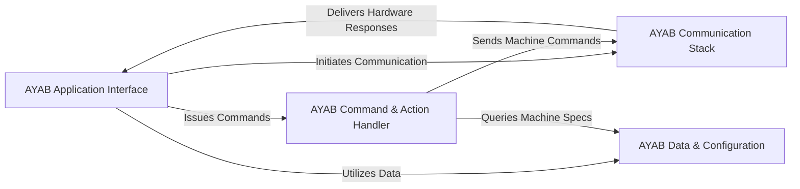

## Details

The `AYABInterface` library provides a robust, layered architecture for controlling the AYAB knitting machine. At its highest level, the AYAB Application Interface serves as the primary entry point for external applications, translating user intentions into machine-executable commands. These commands are then processed by the AYAB Command & Action Handler, which encapsulates the specific logic for various knitting operations. All interactions with the physical AYAB shield are managed by the comprehensive AYAB Communication Stack, which handles everything from low-level serial communication and message protocol encoding/decoding to state-machine driven message sequencing. Complementing these core operational components, the AYAB Data & Configuration module provides essential services for managing machine model specifications, transforming knitting pattern data, and handling needle positions, ensuring the system can adapt to different machine types and knitting requirements. This clear separation of concerns facilitates maintainability, extensibility, and a well-defined data flow for controlling the AYAB hardware.

### AYAB Application Interface [[Expand]](./AYAB_Application_Interface.md)
The primary entry point for external applications to interact with the AYAB knitting machine, orchestrating high-level operations and user commands.

**Related Classes/Methods**:

- <a href="https://github.com/fossasia/AYABInterface/blob/master/AYABInterface/interaction.py" target="_blank" rel="noopener noreferrer">`AYABInterface/interaction.py`</a>

### AYAB Command & Action Handler [[Expand]](./AYAB_Command_Action_Handler.md)
Translates abstract user commands into concrete, machine-executable actions, encapsulating the logic for various machine operations.

**Related Classes/Methods**:

- <a href="https://github.com/fossasia/AYABInterface/blob/master/AYABInterface/actions.py" target="_blank" rel="noopener noreferrer">`AYABInterface/actions.py`</a>
- <a href="https://github.com/fossasia/AYABInterface/blob/master/AYABInterface/carriages.py" target="_blank" rel="noopener noreferrer">`AYABInterface/carriages.py`</a>

### AYAB Communication Stack [[Expand]](./AYAB_Communication_Stack.md)
Manages the entire lifecycle of communication with the AYAB shield, including connection, message queuing, protocol handling (encoding/decoding), and state management.

**Related Classes/Methods**:

- <a href="https://github.com/fossasia/AYABInterface/blob/master/AYABInterface/communication/__init__.py" target="_blank" rel="noopener noreferrer">`AYABInterface/communication/__init__.py`</a>
- <a href="https://github.com/fossasia/AYABInterface/blob/master/AYABInterface/communication/host_messages.py" target="_blank" rel="noopener noreferrer">`AYABInterface/communication/host_messages.py`</a>
- <a href="https://github.com/fossasia/AYABInterface/blob/master/AYABInterface/communication/hardware_messages.py" target="_blank" rel="noopener noreferrer">`AYABInterface/communication/hardware_messages.py`</a>
- <a href="https://github.com/fossasia/AYABInterface/blob/master/AYABInterface/communication/states.py" target="_blank" rel="noopener noreferrer">`AYABInterface/communication/states.py`</a>
- <a href="https://github.com/fossasia/AYABInterface/blob/master/AYABInterface/serial.py" target="_blank" rel="noopener noreferrer">`AYABInterface/serial.py`</a>

### AYAB Data & Configuration [[Expand]](./AYAB_Data_Configuration.md)
Stores and provides detailed specifications for AYAB machine models, offers utility functions for data transformation, and manages knitting pattern and needle position data.

**Related Classes/Methods**:

- <a href="https://github.com/fossasia/AYABInterface/blob/master/AYABInterface/machines.py" target="_blank" rel="noopener noreferrer">`AYABInterface/machines.py`</a>
- <a href="https://github.com/fossasia/AYABInterface/blob/master/AYABInterface/convert/__init__.py" target="_blank" rel="noopener noreferrer">`AYABInterface/convert/__init__.py`</a>
- <a href="https://github.com/fossasia/AYABInterface/blob/master/AYABInterface/utils.py" target="_blank" rel="noopener noreferrer">`AYABInterface/utils.py`</a>
- <a href="https://github.com/fossasia/AYABInterface/blob/master/AYABInterface/needle_positions.py" target="_blank" rel="noopener noreferrer">`AYABInterface/needle_positions.py`</a>

### [FAQ](https://github.com/CodeBoarding/GeneratedOnBoardings/tree/main?tab=readme-ov-file#faq)