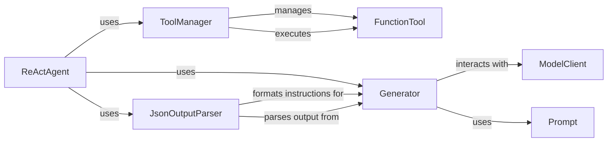

## Component Details

The Agentic Systems subsystem enables the creation of intelligent agents capable of reasoning, planning, and interacting with external tools to solve complex tasks. Its main flow involves a ReActAgent orchestrating interactions between a Generator (for LLM communication), a ToolManager (for tool execution), and various FunctionTools. The Generator utilizes a Prompt component for prompt construction and interacts with a ModelClient for LLM API calls. JsonOutputParser is used to interpret the LLM's structured outputs, especially for tool calls.

### ReActAgent
Implements the ReAct (Reasoning and Acting) agent, which uses a language model as a planner to generate and execute sequential functional calls to achieve a task. It manages tools, step history, and handles both training and evaluation modes. It orchestrates the overall agentic flow.

**Related Classes/Methods**:

- <a href="https://github.com/SylphAI-Inc/AdalFlow/blob/master/adalflow/adalflow/components/agent/react.py#L152-L716" target="_blank" rel="noopener noreferrer">`adalflow.components.agent.react.ReActAgent` (152:716)</a>
- <a href="https://github.com/SylphAI-Inc/AdalFlow/blob/master/adalflow/adalflow/components/agent/react.py#L209-L293" target="_blank" rel="noopener noreferrer">`adalflow.components.agent.react.ReActAgent.__init__` (209:293)</a>
- <a href="https://github.com/SylphAI-Inc/AdalFlow/blob/master/adalflow/adalflow/components/agent/react.py#L295-L344" target="_blank" rel="noopener noreferrer">`adalflow.components.agent.react.ReActAgent._init_tools` (295:344)</a>
- <a href="https://github.com/SylphAI-Inc/AdalFlow/blob/master/adalflow/adalflow/components/agent/react.py#L346-L435" target="_blank" rel="noopener noreferrer">`adalflow.components.agent.react.ReActAgent._execute_action` (346:435)</a>
- <a href="https://github.com/SylphAI-Inc/AdalFlow/blob/master/adalflow/adalflow/components/agent/react.py#L483-L600" target="_blank" rel="noopener noreferrer">`adalflow.components.agent.react.ReActAgent._run_one_step` (483:600)</a>
- <a href="https://github.com/SylphAI-Inc/AdalFlow/blob/master/adalflow/adalflow/components/agent/react.py#L669-L712" target="_blank" rel="noopener noreferrer">`adalflow.components.agent.react.ReActAgent.bicall` (669:712)</a>

### FunctionTool
A wrapper for functions (synchronous or asynchronous) or component methods, standardizing their interface and metadata for use by agents. It handles the creation of function definitions and execution of the wrapped functions.

**Related Classes/Methods**:

- <a href="https://github.com/SylphAI-Inc/AdalFlow/blob/master/adalflow/adalflow/core/func_tool.py#L63-L425" target="_blank" rel="noopener noreferrer">`adalflow.core.func_tool.FunctionTool` (63:425)</a>
- <a href="https://github.com/SylphAI-Inc/AdalFlow/blob/master/adalflow/adalflow/core/func_tool.py#L121-L147" target="_blank" rel="noopener noreferrer">`adalflow.core.func_tool.FunctionTool.__init__` (121:147)</a>
- <a href="https://github.com/SylphAI-Inc/AdalFlow/blob/master/adalflow/adalflow/core/func_tool.py#L335-L417" target="_blank" rel="noopener noreferrer">`adalflow.core.func_tool.FunctionTool.execute` (335:417)</a>
- <a href="https://github.com/SylphAI-Inc/AdalFlow/blob/master/adalflow/adalflow/core/func_tool.py#L212-L227" target="_blank" rel="noopener noreferrer">`adalflow.core.func_tool.FunctionTool.call` (212:227)</a>
- <a href="https://github.com/SylphAI-Inc/AdalFlow/blob/master/adalflow/adalflow/core/func_tool.py#L298-L333" target="_blank" rel="noopener noreferrer">`adalflow.core.func_tool.FunctionTool.acall` (298:333)</a>

### ToolManager
Manages a collection of FunctionTool instances, providing a context for their execution. It can parse function call expressions and execute functions, supporting both synchronous and asynchronous operations.

**Related Classes/Methods**:

- <a href="https://github.com/SylphAI-Inc/AdalFlow/blob/master/adalflow/adalflow/core/tool_manager.py#L133-L435" target="_blank" rel="noopener noreferrer">`adalflow.core.tool_manager.ToolManager` (133:435)</a>
- <a href="https://github.com/SylphAI-Inc/AdalFlow/blob/master/adalflow/adalflow/core/tool_manager.py#L143-L167" target="_blank" rel="noopener noreferrer">`adalflow.core.tool_manager.ToolManager.__init__` (143:167)</a>
- <a href="https://github.com/SylphAI-Inc/AdalFlow/blob/master/adalflow/adalflow/core/tool_manager.py#L218-L239" target="_blank" rel="noopener noreferrer">`adalflow.core.tool_manager.ToolManager.parse_func_expr` (218:239)</a>
- <a href="https://github.com/SylphAI-Inc/AdalFlow/blob/master/adalflow/adalflow/core/tool_manager.py#L310-L338" target="_blank" rel="noopener noreferrer">`adalflow.core.tool_manager.ToolManager.execute_func` (310:338)</a>
- <a href="https://github.com/SylphAI-Inc/AdalFlow/blob/master/adalflow/adalflow/core/tool_manager.py#L352-L384" target="_blank" rel="noopener noreferrer">`adalflow.core.tool_manager.ToolManager.execute_func_expr` (352:384)</a>

### Generator
A core component responsible for interacting with language models (LLMs). It formats prompts, sends requests to the model client, and processes the LLM's output. It is central to the agent's reasoning and planning capabilities.

**Related Classes/Methods**:

- `adalflow.core.generator.Generator` (full file reference)
- `adalflow.core.generator.Generator.call` (full file reference)
- `adalflow.core.generator.Generator.forward` (full file reference)

### JsonOutputParser
An output parser specifically designed to parse JSON strings into Python objects, typically dataclasses. It provides methods to format instructions for the LLM to generate JSON output according to a defined schema and to parse the raw JSON response.

**Related Classes/Methods**:

- <a href="https://github.com/SylphAI-Inc/AdalFlow/blob/master/adalflow/adalflow/components/output_parsers/outputs.py#L231-L317" target="_blank" rel="noopener noreferrer">`adalflow.components.output_parsers.outputs.JsonOutputParser` (231:317)</a>
- <a href="https://github.com/SylphAI-Inc/AdalFlow/blob/master/adalflow/adalflow/components/output_parsers/outputs.py#L262-L296" target="_blank" rel="noopener noreferrer">`adalflow.components.output_parsers.outputs.JsonOutputParser.format_instructions` (262:296)</a>
- <a href="https://github.com/SylphAI-Inc/AdalFlow/blob/master/adalflow/adalflow/components/output_parsers/outputs.py#L298-L312" target="_blank" rel="noopener noreferrer">`adalflow.components.output_parsers.outputs.JsonOutputParser.call` (298:312)</a>

### ModelClient
An abstract base class for interacting with various language model APIs. Concrete implementations (e.g., OpenAIClient, GoogleGenAIClient) provide the actual interface to send requests and receive responses from LLMs.

**Related Classes/Methods**:

- <a href="https://github.com/SylphAI-Inc/AdalFlow/blob/master/adalflow/adalflow/core/model_client.py#L16-L127" target="_blank" rel="noopener noreferrer">`adalflow.core.model_client.ModelClient` (16:127)</a>

### Prompt
A component responsible for constructing and formatting prompts for language models. It can incorporate various elements like instructions, examples, and tool definitions to guide the LLM's generation.

**Related Classes/Methods**:

- <a href="https://github.com/SylphAI-Inc/AdalFlow/blob/master/adalflow/adalflow/core/prompt_builder.py#L20-L185" target="_blank" rel="noopener noreferrer">`adalflow.core.prompt_builder.Prompt` (20:185)</a>

### [FAQ](https://github.com/CodeBoarding/GeneratedOnBoardings/tree/main?tab=readme-ov-file#faq)