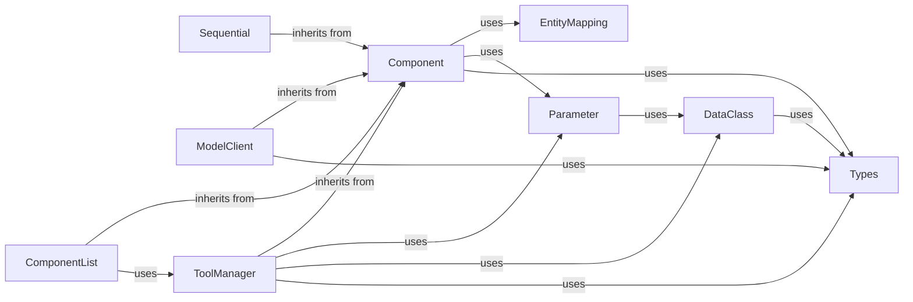

## Component Details

The Core Framework provides the foundational building blocks, base classes (Component, DataClass), and container structures (Sequential, ComponentList) that all other AdalFlow components inherit from or utilize. It also includes a registry for component management and defines core data types, along with essential interfaces like ModelClient and foundational data structures like Parameter, and core utilities like ToolManager.

### Component
Base class for all LLM task pipeline components. It handles states recursively, such as training, components, parameters recursively along with serialization and deserialization. Components can also contain other Components, allowing to nest them in a tree structure. It supports three modes: Training mode, Tracing mode, and Teacher mode.

**Related Classes/Methods**:

- `adalflow.core.component` (full file reference)

### DataClass
The base data class for all data types that interact with LLMs. It provides methods for handling, serialization, and description of data, especially for LLM prompts.

**Related Classes/Methods**:

- `adalflow.core.base_data_class` (full file reference)

### Sequential
A container component that executes a list of components in a sequential order.

**Related Classes/Methods**:

- <a href="https://github.com/SylphAI-Inc/AdalFlow/blob/master/adalflow/adalflow/core/container.py#L62-L362" target="_blank" rel="noopener noreferrer">`adalflow.core.container.Sequential` (62:362)</a>

### ComponentList
A container component that manages a list of components.

**Related Classes/Methods**:

- <a href="https://github.com/SylphAI-Inc/AdalFlow/blob/master/adalflow/adalflow/core/container.py#L377-L533" target="_blank" rel="noopener noreferrer">`adalflow.core.container.ComponentList` (377:533)</a>

### EntityMapping
A registry for managing and mapping entities (components, models, etc.) within the AdalFlow framework.

**Related Classes/Methods**:

- <a href="https://github.com/SylphAI-Inc/AdalFlow/blob/master/adalflow/adalflow/utils/registry.py#L4-L21" target="_blank" rel="noopener noreferrer">`adalflow.utils.registry.EntityMapping` (4:21)</a>

### Types
Defines core data types and enums used throughout the AdalFlow framework, including types for models, clients, and various data structures.

**Related Classes/Methods**:

- `adalflow.core.types` (full file reference)

### ModelClient
The protocol and abstract class for all models (either via APIs or local models) to communicate with components. It initializes the client, converts inputs to API-specific formats, calls the API, parses the response, and handles API-specific exceptions.

**Related Classes/Methods**:

- <a href="https://github.com/SylphAI-Inc/AdalFlow/blob/master/adalflow/adalflow/core/model_client.py#L16-L127" target="_blank" rel="noopener noreferrer">`adalflow.core.model_client.ModelClient` (16:127)</a>

### Parameter
A data container to represent a parameter used for optimization. It enforces a specific data type and can be updated in-place. When parameters are used in a component, they are automatically added to the list of its parameters.

**Related Classes/Methods**:

- `adalflow.optim.parameter.Parameter` (full file reference)

### ToolManager
Manages a list of tools, context, and all ways to execute functions. It can parse function call expressions and execute functions, supporting both synchronous and asynchronous operations.

**Related Classes/Methods**:

- <a href="https://github.com/SylphAI-Inc/AdalFlow/blob/master/adalflow/adalflow/core/tool_manager.py#L133-L435" target="_blank" rel="noopener noreferrer">`adalflow.core.tool_manager.ToolManager` (133:435)</a>

### [FAQ](https://github.com/CodeBoarding/GeneratedOnBoardings/tree/main?tab=readme-ov-file#faq)