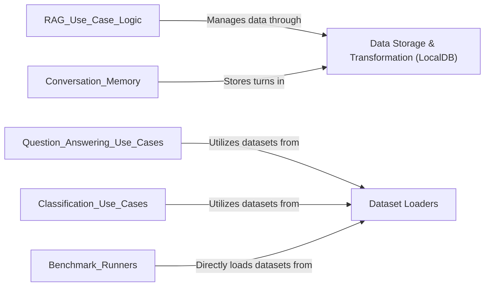

## Component Details

The Data Management component in AdalFlow is responsible for the comprehensive handling of data, encompassing local storage, transformation, and the preparation of various benchmark datasets. It provides a unified interface for managing documents and data, enabling operations like adding, retrieving, and transforming information within the AdalFlow ecosystem. Furthermore, it integrates functionalities for loading and preparing diverse benchmark datasets, crucial for evaluating and training models.

### Data Storage & Transformation (LocalDB)
This component is responsible for in-memory data storage, managing data transformation pipelines, and handling data persistence through serialization. It serves as a central repository for various data models like documents and dialog turns, allowing for CRUD operations and the application of registered transformers.

**Related Classes/Methods**:

- <a href="https://github.com/SylphAI-Inc/AdalFlow/blob/master/adalflow/adalflow/core/db.py#L25-L388" target="_blank" rel="noopener noreferrer">`adalflow.core.db.LocalDB` (25:388)</a>
- <a href="https://github.com/SylphAI-Inc/AdalFlow/blob/master/adalflow/adalflow/core/db.py#L130-L146" target="_blank" rel="noopener noreferrer">`adalflow.core.db.LocalDB.get_transformed_data` (130:146)</a>
- <a href="https://github.com/SylphAI-Inc/AdalFlow/blob/master/adalflow/adalflow/core/db.py#L223-L239" target="_blank" rel="noopener noreferrer">`adalflow.core.db.LocalDB.load` (223:239)</a>
- <a href="https://github.com/SylphAI-Inc/AdalFlow/blob/master/adalflow/adalflow/core/db.py#L173-L175" target="_blank" rel="noopener noreferrer">`adalflow.core.db.LocalDB.transform` (173:175)</a>
- <a href="https://github.com/SylphAI-Inc/AdalFlow/blob/master/adalflow/adalflow/core/db.py#L331-L352" target="_blank" rel="noopener noreferrer">`adalflow.core.db.LocalDB.save_state` (331:352)</a>
- <a href="https://github.com/SylphAI-Inc/AdalFlow/blob/master/adalflow/adalflow/core/db.py#L355-L362" target="_blank" rel="noopener noreferrer">`adalflow.core.db.LocalDB.load_state` (355:362)</a>
- <a href="https://github.com/SylphAI-Inc/AdalFlow/blob/master/adalflow/adalflow/core/db.py#L241-L261" target="_blank" rel="noopener noreferrer">`adalflow.core.db.LocalDB.extend` (241:261)</a>
- <a href="https://github.com/SylphAI-Inc/AdalFlow/blob/master/adalflow/adalflow/core/db.py#L277-L311" target="_blank" rel="noopener noreferrer">`adalflow.core.db.LocalDB.add` (277:311)</a>
- <a href="https://github.com/SylphAI-Inc/AdalFlow/blob/master/adalflow/adalflow/core/db.py#L155-L170" target="_blank" rel="noopener noreferrer">`adalflow.core.db.LocalDB.register_transformer` (155:170)</a>
- <a href="https://github.com/SylphAI-Inc/AdalFlow/blob/master/adalflow/adalflow/core/db.py#L148-L153" target="_blank" rel="noopener noreferrer">`adalflow.core.db.LocalDB._get_transformer_name` (148:153)</a>
- `adalflow.core.component.Component.__init__` (full file reference)
- <a href="https://github.com/SylphAI-Inc/AdalFlow/blob/master/adalflow/adalflow/utils/registry.py#L16-L17" target="_blank" rel="noopener noreferrer">`adalflow.utils.registry.EntityMapping.get` (16:17)</a>
- <a href="https://github.com/SylphAI-Inc/AdalFlow/blob/master/adalflow/adalflow/utils/global_config.py#L5-L12" target="_blank" rel="noopener noreferrer">`adalflow.utils.global_config.get_adalflow_default_root_path` (5:12)</a>

### Dataset Loaders
This component provides standardized interfaces for loading, preparing, and managing various benchmark datasets. It handles the logic for downloading, splitting, and formatting data into appropriate structures for different use cases.

**Related Classes/Methods**:

- <a href="https://github.com/SylphAI-Inc/AdalFlow/blob/master/adalflow/adalflow/datasets/gsm8k.py#L17-L163" target="_blank" rel="noopener noreferrer">`adalflow.datasets.gsm8k.GSM8K` (17:163)</a>
- <a href="https://github.com/SylphAI-Inc/AdalFlow/blob/master/adalflow/adalflow/datasets/gsm8k.py#L80-L157" target="_blank" rel="noopener noreferrer">`adalflow.datasets.gsm8k.GSM8K._check_or_download_dataset` (80:157)</a>
- <a href="https://github.com/SylphAI-Inc/AdalFlow/blob/master/adalflow/adalflow/datasets/big_bench_hard.py#L15-L147" target="_blank" rel="noopener noreferrer">`adalflow.datasets.big_bench_hard.BigBenchHard` (15:147)</a>
- <a href="https://github.com/SylphAI-Inc/AdalFlow/blob/master/adalflow/adalflow/datasets/big_bench_hard.py#L67-L136" target="_blank" rel="noopener noreferrer">`adalflow.datasets.big_bench_hard.BigBenchHard._check_or_download_dataset` (67:136)</a>
- <a href="https://github.com/SylphAI-Inc/AdalFlow/blob/master/adalflow/adalflow/datasets/trec.py#L148-L229" target="_blank" rel="noopener noreferrer">`adalflow.datasets.trec.TrecDataset` (148:229)</a>
- <a href="https://github.com/SylphAI-Inc/AdalFlow/blob/master/adalflow/adalflow/datasets/trec.py#L187-L223" target="_blank" rel="noopener noreferrer">`adalflow.datasets.trec.TrecDataset._check_or_download_dataset` (187:223)</a>
- <a href="https://github.com/SylphAI-Inc/AdalFlow/blob/master/adalflow/adalflow/datasets/hotpot_qa.py#L15-L224" target="_blank" rel="noopener noreferrer">`adalflow.datasets.hotpot_qa.HotPotQA` (15:224)</a>
- <a href="https://github.com/SylphAI-Inc/AdalFlow/blob/master/adalflow/adalflow/datasets/hotpot_qa.py#L74-L218" target="_blank" rel="noopener noreferrer">`adalflow.datasets.hotpot_qa.HotPotQA._check_or_download_dataset` (74:218)</a>
- <a href="https://github.com/SylphAI-Inc/AdalFlow/blob/master/adalflow/adalflow/datasets/utils.py#L5-L11" target="_blank" rel="noopener noreferrer">`adalflow.datasets.utils.prepare_dataset_path` (5:11)</a>
- <a href="https://github.com/SylphAI-Inc/AdalFlow/blob/master/adalflow/adalflow/datasets/trec.py#L44-L126" target="_blank" rel="noopener noreferrer">`adalflow.datasets.trec.prepare_datasets` (44:126)</a>
- <a href="https://github.com/SylphAI-Inc/AdalFlow/blob/master/adalflow/adalflow/datasets/trec.py#L20-L27" target="_blank" rel="noopener noreferrer">`adalflow.datasets.trec.calculate_class_weights` (20:27)</a>
- <a href="https://github.com/SylphAI-Inc/AdalFlow/blob/master/adalflow/adalflow/datasets/trec.py#L30-L41" target="_blank" rel="noopener noreferrer">`adalflow.datasets.trec.sample_subset_dataset` (30:41)</a>
- <a href="https://github.com/SylphAI-Inc/AdalFlow/blob/master/adalflow/adalflow/utils/lazy_import.py#L174-L226" target="_blank" rel="noopener noreferrer">`adalflow.utils.lazy_import.safe_import` (174:226)</a>
- <a href="https://github.com/SylphAI-Inc/AdalFlow/blob/master/adalflow/adalflow/utils/logger.py#L190-L217" target="_blank" rel="noopener noreferrer">`adalflow.utils.logger.printc` (190:217)</a>
- <a href="https://github.com/SylphAI-Inc/AdalFlow/blob/master/adalflow/adalflow/utils/file_io.py#L13-L30" target="_blank" rel="noopener noreferrer">`adalflow.utils.file_io.save_json` (13:30)</a>
- <a href="https://github.com/SylphAI-Inc/AdalFlow/blob/master/adalflow/adalflow/utils/file_io.py#L42-L71" target="_blank" rel="noopener noreferrer">`adalflow.utils.file_io.save_csv` (42:71)</a>
- <a href="https://github.com/SylphAI-Inc/AdalFlow/blob/master/adalflow/adalflow/utils/data.py#L13-L36" target="_blank" rel="noopener noreferrer">`adalflow.utils.data.Dataset` (13:36)</a>
- <a href="https://github.com/SylphAI-Inc/AdalFlow/blob/master/adalflow/adalflow/datasets/types.py#L8-L13" target="_blank" rel="noopener noreferrer">`adalflow.datasets.types.BaseData` (8:13)</a>
- <a href="https://github.com/SylphAI-Inc/AdalFlow/blob/master/adalflow/adalflow/datasets/types.py#L17-L26" target="_blank" rel="noopener noreferrer">`adalflow.datasets.types.Example` (17:26)</a>
- <a href="https://github.com/SylphAI-Inc/AdalFlow/blob/master/adalflow/adalflow/datasets/types.py#L30-L47" target="_blank" rel="noopener noreferrer">`adalflow.datasets.types.GSM8KData` (30:47)</a>
- <a href="https://github.com/SylphAI-Inc/AdalFlow/blob/master/adalflow/adalflow/datasets/types.py#L51-L63" target="_blank" rel="noopener noreferrer">`adalflow.datasets.types.HotPotQAData` (51:63)</a>
- <a href="https://github.com/SylphAI-Inc/AdalFlow/blob/master/adalflow/adalflow/datasets/types.py#L88-L104" target="_blank" rel="noopener noreferrer">`adalflow.datasets.types.TrecData` (88:104)</a>

### [FAQ](https://github.com/CodeBoarding/GeneratedOnBoardings/tree/main?tab=readme-ov-file#faq)