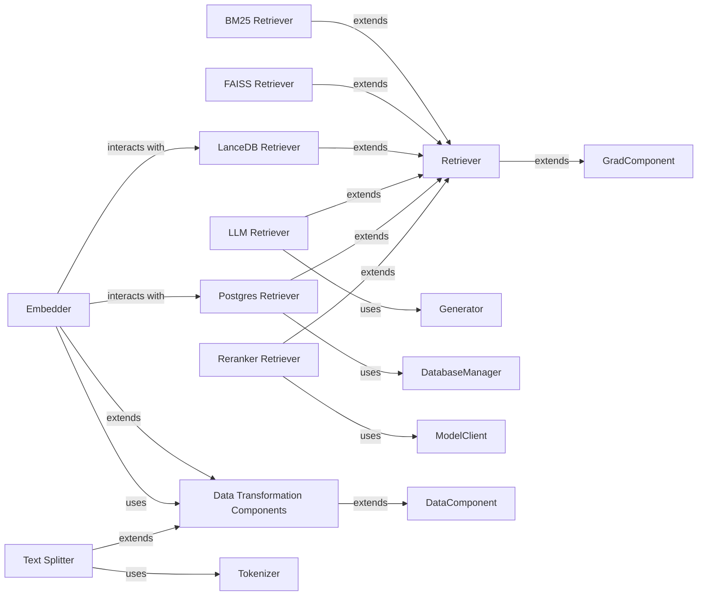

## Component Details

The Data Processing & Retrieval subsystem is responsible for transforming raw textual data into a format suitable for efficient search and retrieval, and for implementing various strategies to fetch relevant information from a knowledge base. It encompasses components for converting text into numerical vector embeddings, splitting large documents into smaller chunks, and diverse retriever implementations that leverage different technologies and algorithms for information retrieval.

### Embedder
Converts textual data into numerical vector representations (embeddings). It serves as an abstract interface for various embedding models and integrates with different retriever implementations for indexing and storage.

**Related Classes/Methods**:

- `adalflow.core.embedder` (full file reference)
- <a href="https://github.com/SylphAI-Inc/AdalFlow/blob/master/adalflow/adalflow/components/model_client/transformers_client.py#L44-L126" target="_blank" rel="noopener noreferrer">`adalflow.components.model_client.transformers_client.TransformerEmbedder` (44:126)</a>

### Text Splitter
Splits large documents into smaller, manageable chunks to facilitate processing and improve retrieval accuracy. It utilizes a tokenizer for this segmentation.

**Related Classes/Methods**:

- `adalflow.components.data_process.text_splitter` (full file reference)

### Retriever
The abstract base component for fetching relevant documents from a knowledge base. It defines the common interface and functionalities for various retrieval strategies.

**Related Classes/Methods**:

- `adalflow.core.retriever` (full file reference)

### BM25 Retriever
Implements the BM25 retrieval algorithm, a statistical method for keyword-based document retrieval.

**Related Classes/Methods**:

- `adalflow.components.retriever.bm25_retriever` (full file reference)

### FAISS Retriever
Implements a retriever that leverages FAISS (Facebook AI Similarity Search) for efficient similarity search on vector embeddings.

**Related Classes/Methods**:

- `adalflow.components.retriever.faiss_retriever` (full file reference)

### LanceDB Retriever
Implements a retriever that interacts with LanceDB, a columnar database for vector embeddings, for storage and retrieval operations.

**Related Classes/Methods**:

- `adalflow.components.retriever.lancedb_retriver` (full file reference)

### LLM Retriever
A retriever that utilizes Large Language Models (LLMs) to perform more advanced document retrieval, often involving semantic understanding and contextual reasoning.

**Related Classes/Methods**:

- `adalflow.components.retriever.llm_retriever` (full file reference)

### Postgres Retriever
Implements a retriever that uses a PostgreSQL database for document storage and retrieval, likely integrating with vector extensions for similarity search.

**Related Classes/Methods**:

- `adalflow.components.retriever.postgres_retriever` (full file reference)

### Reranker Retriever
A specialized retriever that re-ranks an initial set of retrieved documents to improve their relevance, typically by employing a separate re-ranking model.

**Related Classes/Methods**:

- `adalflow.components.retriever.reranker_retriever` (full file reference)

### Data Transformation Components
Utility components responsible for various data transformations, including converting data into embeddings and formatting retriever outputs into context strings for further processing.

**Related Classes/Methods**:

- `adalflow.components.data_process.data_components` (full file reference)

### [FAQ](https://github.com/CodeBoarding/GeneratedOnBoardings/tree/main?tab=readme-ov-file#faq)