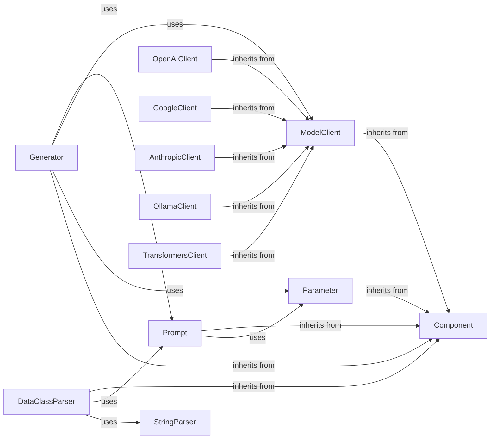

## Component Details

Central to text generation, the LLM Interaction component orchestrates interactions with various Large Language Models. It handles prompt construction via the `Prompt` component, model invocation through the unified `ModelClient` interface and its concrete implementations (e.g., `OpenAIClient`, `GoogleClient`), and response processing, potentially using `DataClassParser` or `StringParser`. The `Generator` acts as the core orchestrator, integrating these parts and supporting advanced features like caching and backpropagation for optimization using `Parameter`.

### Generator
The Generator component is a core orchestration unit for LLM predictions. It integrates a Prompt, a ModelClient, and optional OutputProcessors to handle the entire lifecycle of an LLM call, from prompt rendering to response parsing. It supports both synchronous and asynchronous calls, caching, and is designed to be a 'GradComponent' for backpropagation in training scenarios, allowing for in-context learning and optimization of prompt parameters.

**Related Classes/Methods**:

- `adalflow.core.generator.Generator` (full file reference)

### Prompt
The Prompt component is responsible for rendering text strings (prompts) from Jinja2 templates. It manages prompt variables, combines preset and runtime keyword arguments, and provides methods for printing and retrieving the rendered prompt. It is a DataComponent, meaning it handles data processing but is not directly trainable.

**Related Classes/Methods**:

- <a href="https://github.com/SylphAI-Inc/AdalFlow/blob/master/adalflow/adalflow/core/prompt_builder.py#L20-L185" target="_blank" rel="noopener noreferrer">`adalflow.core.prompt_builder.Prompt` (20:185)</a>

### ModelClient
The ModelClient is an abstract base class for interacting with various AI models (LLMs, Embedders, Image Generation). It defines a common interface for initializing clients, converting inputs to API-specific formats, parsing model responses, and handling API calls (both synchronous and asynchronous). Concrete implementations like OpenAIClient extend this class to provide specific model integrations.

**Related Classes/Methods**:

- <a href="https://github.com/SylphAI-Inc/AdalFlow/blob/master/adalflow/adalflow/core/model_client.py#L16-L127" target="_blank" rel="noopener noreferrer">`adalflow.core.model_client.ModelClient` (16:127)</a>

### OpenAIClient
A concrete implementation of the ModelClient for interacting with OpenAI models.

**Related Classes/Methods**:

- <a href="https://github.com/SylphAI-Inc/AdalFlow/blob/master/adalflow/adalflow/components/model_client/openai_client.py#L120-L548" target="_blank" rel="noopener noreferrer">`adalflow.components.model_client.openai_client.OpenAIClient` (120:548)</a>

### GoogleClient
A concrete implementation of the ModelClient for interacting with Google GenAI models.

**Related Classes/Methods**:

- <a href="https://github.com/SylphAI-Inc/AdalFlow/blob/master/adalflow/adalflow/components/model_client/google_client.py#L30-L152" target="_blank" rel="noopener noreferrer">`adalflow.components.model_client.google_client.GoogleGenAIClient` (30:152)</a>

### AnthropicClient
A concrete implementation of the ModelClient for interacting with Anthropic models.

**Related Classes/Methods**:

- <a href="https://github.com/SylphAI-Inc/AdalFlow/blob/master/adalflow/adalflow/components/model_client/anthropic_client.py#L42-L177" target="_blank" rel="noopener noreferrer">`adalflow.components.model_client.anthropic_client.AnthropicAPIClient` (42:177)</a>

### OllamaClient
A concrete implementation of the ModelClient for interacting with Ollama models.

**Related Classes/Methods**:

- <a href="https://github.com/SylphAI-Inc/AdalFlow/blob/master/adalflow/adalflow/components/model_client/ollama_client.py#L60-L298" target="_blank" rel="noopener noreferrer">`adalflow.components.model_client.ollama_client.OllamaClient` (60:298)</a>

### TransformersClient
A concrete implementation of the ModelClient for interacting with Hugging Face Transformers models.

**Related Classes/Methods**:

- <a href="https://github.com/SylphAI-Inc/AdalFlow/blob/master/adalflow/adalflow/components/model_client/transformers_client.py#L506-L687" target="_blank" rel="noopener noreferrer">`adalflow.components.model_client.transformers_client.TransformersClient` (506:687)</a>

### DataClassParser
The DataClassParser is an output processing component that simplifies structured output from LLMs by leveraging Python dataclasses. It can parse model responses into dataclass instances, supporting both JSON and YAML formats. It also provides methods to generate schema-based format instructions for prompts and extract examples.

**Related Classes/Methods**:

- <a href="https://github.com/SylphAI-Inc/AdalFlow/blob/master/adalflow/adalflow/components/output_parsers/dataclass_parser.py#L46-L185" target="_blank" rel="noopener noreferrer">`adalflow.components.output_parsers.dataclass_parser.DataClassParser` (46:185)</a>

### StringParser
The StringParser module provides various utility classes for extracting and converting string representations of data into Python objects. This includes parsers for boolean, integer, float, list, JSON, and YAML formats. These parsers are DataComponents, meaning they are designed for data processing and are not trainable.

**Related Classes/Methods**:

- <a href="https://github.com/SylphAI-Inc/AdalFlow/blob/master/adalflow/adalflow/core/string_parser.py#L170-L216" target="_blank" rel="noopener noreferrer">`adalflow.core.string_parser.JsonParser` (170:216)</a>
- <a href="https://github.com/SylphAI-Inc/AdalFlow/blob/master/adalflow/adalflow/core/string_parser.py#L33-L53" target="_blank" rel="noopener noreferrer">`adalflow.core.string_parser.BooleanParser` (33:53)</a>
- <a href="https://github.com/SylphAI-Inc/AdalFlow/blob/master/adalflow/adalflow/core/string_parser.py#L59-L85" target="_blank" rel="noopener noreferrer">`adalflow.core.string_parser.IntParser` (59:85)</a>
- <a href="https://github.com/SylphAI-Inc/AdalFlow/blob/master/adalflow/adalflow/core/string_parser.py#L91-L117" target="_blank" rel="noopener noreferrer">`adalflow.core.string_parser.FloatParser` (91:117)</a>
- <a href="https://github.com/SylphAI-Inc/AdalFlow/blob/master/adalflow/adalflow/core/string_parser.py#L123-L164" target="_blank" rel="noopener noreferrer">`adalflow.core.string_parser.ListParser` (123:164)</a>
- <a href="https://github.com/SylphAI-Inc/AdalFlow/blob/master/adalflow/adalflow/core/string_parser.py#L223-L253" target="_blank" rel="noopener noreferrer">`adalflow.core.string_parser.YamlParser` (223:253)</a>

### Parameter
The Parameter component is a data container used for optimization within AdalFlow. It represents a trainable or non-trainable value in the LLM pipeline, such as prompt instructions or few-shot examples. It tracks gradients, scores, and traces of its usage during forward and backward passes, enabling in-context learning and optimization.

**Related Classes/Methods**:

- `adalflow.optim.parameter.Parameter` (full file reference)

### Component
The Component is the foundational building block for all LLM task pipelines in AdalFlow. It provides core functionalities such as managing child components and parameters, handling training/evaluation modes, and supporting serialization/deserialization. It serves as the base for more specialized components like Generator and ModelClient.

**Related Classes/Methods**:

- `adalflow.core.component.Component` (full file reference)

### [FAQ](https://github.com/CodeBoarding/GeneratedOnBoardings/tree/main?tab=readme-ov-file#faq)