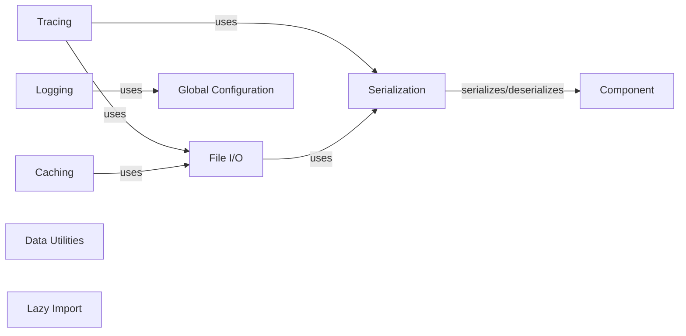

## Component Details

This graph illustrates the structure and interactions within the Observability & Utilities subsystem of the AdalFlow framework. It details how various utility components, including tracing, logging, file I/O, caching, data handling, serialization, lazy imports, and global configuration, support the core functionalities of AdalFlow by providing essential services for monitoring, data persistence, performance optimization, and system-wide settings management.

### Tracing
Provides functionalities for detailed logging and tracing of component execution, specifically for generator calls and state changes within the AdalFlow framework, persisting these traces to files.

**Related Classes/Methods**:

- `adalflow.tracing.generator_call_logger` (full file reference)
- `adalflow.tracing.generator_state_logger` (full file reference)

### Logging
Offers structured logging capabilities for the AdalFlow system, including colored output and integration with global configuration for log paths and levels, used for debugging and monitoring.

**Related Classes/Methods**:

- `adalflow.utils.logger` (full file reference)

### File I/O
A collection of utility functions for handling file input/output operations, including saving and loading JSON, JSONL, CSV, and pickle files, crucial for persistence and data management. It leverages the Serialization component for complex object handling.

**Related Classes/Methods**:

- `adalflow.utils.file_io` (full file reference)

### Caching
Provides caching mechanisms to store and retrieve data, improving performance by avoiding redundant computations. It includes a CachedEngine for managing cached data, relying on underlying file persistence.

**Related Classes/Methods**:

- <a href="https://github.com/SylphAI-Inc/AdalFlow/blob/master/adalflow/adalflow/utils/cache.py#L19-L47" target="_blank" rel="noopener noreferrer">`adalflow.utils.cache.CachedEngine` (19:47)</a>

### Data Utilities
Contains abstract classes and utility functions for data handling, including defining Dataset and DataLoader for managing and batching data within the AdalFlow framework.

**Related Classes/Methods**:

- <a href="https://github.com/SylphAI-Inc/AdalFlow/blob/master/adalflow/adalflow/utils/data.py#L72-L135" target="_blank" rel="noopener noreferrer">`adalflow.utils.data.DataLoader` (72:135)</a>

### Serialization
A utility module dedicated to handling the serialization and deserialization of Python objects, particularly for AdalFlow components and data structures, ensuring complex objects can be converted to and from dictionary representations for storage and transfer.

**Related Classes/Methods**:

- `adalflow.utils.serialization` (full file reference)

### Lazy Import
A utility for lazy loading of Python modules and classes, reducing initial startup time and memory footprint by deferring imports until needed.

**Related Classes/Methods**:

- `adalflow.utils.lazy_import` (full file reference)

### Global Configuration
Manages global configuration settings for the AdalFlow framework, providing a centralized way to access environment-specific parameters and control system-wide behavior, such as default root paths.

**Related Classes/Methods**:

- `adalflow.utils.global_config` (full file reference)

### [FAQ](https://github.com/CodeBoarding/GeneratedOnBoardings/tree/main?tab=readme-ov-file#faq)