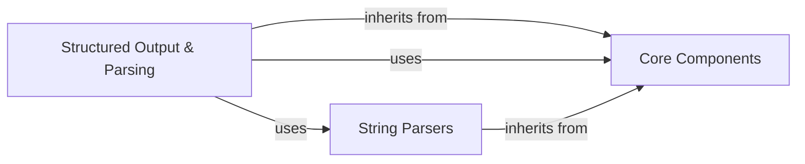

## Component Details

This graph illustrates the architecture of the `Structured Output & Parsing` subsystem within AdalFlow. Its primary purpose is to convert raw string outputs from Large Language Models (LLMs) into structured Python objects, enabling easier programmatic access and manipulation. The main flow involves specialized output parsers that leverage lower-level string parsers and integrate with core components for prompt building and data structuring. This design ensures robust and flexible handling of diverse output formats from LLMs.

### Structured Output & Parsing
Converts raw string outputs from LLMs into structured Python objects (e.g., dataclasses, JSON, YAML, lists, integers, floats, booleans) for easier programmatic access and manipulation. It leverages specialized string parsers and integrates with prompt building for structured output instructions.

**Related Classes/Methods**:

- <a href="https://github.com/SylphAI-Inc/AdalFlow/blob/master/adalflow/adalflow/components/output_parsers/dataclass_parser.py#L46-L185" target="_blank" rel="noopener noreferrer">`adalflow.components.output_parsers.dataclass_parser.DataClassParser` (46:185)</a>
- <a href="https://github.com/SylphAI-Inc/AdalFlow/blob/master/adalflow/adalflow/components/output_parsers/outputs.py#L100-L228" target="_blank" rel="noopener noreferrer">`adalflow.components.output_parsers.outputs.YamlOutputParser` (100:228)</a>
- <a href="https://github.com/SylphAI-Inc/AdalFlow/blob/master/adalflow/adalflow/components/output_parsers/outputs.py#L231-L317" target="_blank" rel="noopener noreferrer">`adalflow.components.output_parsers.outputs.JsonOutputParser` (231:317)</a>
- <a href="https://github.com/SylphAI-Inc/AdalFlow/blob/master/adalflow/adalflow/components/output_parsers/outputs.py#L320-L332" target="_blank" rel="noopener noreferrer">`adalflow.components.output_parsers.outputs.ListOutputParser` (320:332)</a>
- <a href="https://github.com/SylphAI-Inc/AdalFlow/blob/master/adalflow/adalflow/components/output_parsers/outputs.py#L345-L371" target="_blank" rel="noopener noreferrer">`adalflow.components.output_parsers.outputs.BooleanOutputParser` (345:371)</a>
- <a href="https://github.com/SylphAI-Inc/AdalFlow/blob/master/adalflow/adalflow/components/output_parsers/outputs.py#L72-L97" target="_blank" rel="noopener noreferrer">`adalflow.components.output_parsers.outputs.OutputParser` (72:97)</a>

### Core Components
This component represents fundamental building blocks within AdalFlow, including the base `Component` class from which many other components inherit, `DataClass` for structured data representation, and `Prompt` for constructing prompts for language models. These core elements provide the foundational structure and utilities for the AdalFlow framework.

**Related Classes/Methods**:

- `adalflow.core.component.DataComponent` (full file reference)
- <a href="https://github.com/SylphAI-Inc/AdalFlow/blob/master/adalflow/adalflow/core/base_data_class.py#L97-L757" target="_blank" rel="noopener noreferrer">`adalflow.core.base_data_class.DataClass` (97:757)</a>
- <a href="https://github.com/SylphAI-Inc/AdalFlow/blob/master/adalflow/adalflow/core/prompt_builder.py#L20-L185" target="_blank" rel="noopener noreferrer">`adalflow.core.prompt_builder.Prompt` (20:185)</a>

### String Parsers
Provides low-level string parsing functionalities to extract and convert various data types (JSON, YAML, lists, booleans, integers, floats) from raw text. These parsers are utilized by the higher-level output parsers to process LLM outputs.

**Related Classes/Methods**:

- <a href="https://github.com/SylphAI-Inc/AdalFlow/blob/master/adalflow/adalflow/core/string_parser.py#L170-L216" target="_blank" rel="noopener noreferrer">`adalflow.core.string_parser.JsonParser` (170:216)</a>
- <a href="https://github.com/SylphAI-Inc/AdalFlow/blob/master/adalflow/adalflow/core/string_parser.py#L59-L85" target="_blank" rel="noopener noreferrer">`adalflow.core.string_parser.IntParser` (59:85)</a>
- <a href="https://github.com/SylphAI-Inc/AdalFlow/blob/master/adalflow/adalflow/core/string_parser.py#L91-L117" target="_blank" rel="noopener noreferrer">`adalflow.core.string_parser.FloatParser` (91:117)</a>
- <a href="https://github.com/SylphAI-Inc/AdalFlow/blob/master/adalflow/adalflow/core/string_parser.py#L123-L164" target="_blank" rel="noopener noreferrer">`adalflow.core.string_parser.ListParser` (123:164)</a>
- <a href="https://github.com/SylphAI-Inc/AdalFlow/blob/master/adalflow/adalflow/core/string_parser.py#L223-L253" target="_blank" rel="noopener noreferrer">`adalflow.core.string_parser.YamlParser` (223:253)</a>
- <a href="https://github.com/SylphAI-Inc/AdalFlow/blob/master/adalflow/adalflow/core/string_parser.py#L33-L53" target="_blank" rel="noopener noreferrer">`adalflow.core.string_parser.BooleanParser` (33:53)</a>
- `adalflow.core.functional.extract_first_boolean` (full file reference)
- `adalflow.core.functional.extract_first_int` (full file reference)
- `adalflow.core.functional.extract_first_float` (full file reference)
- `adalflow.core.functional.extract_list_str` (full file reference)
- `adalflow.core.functional.parse_json_str_to_obj` (full file reference)
- `adalflow.core.functional.extract_json_str` (full file reference)
- `adalflow.core.functional.extract_yaml_str` (full file reference)
- `adalflow.core.functional.parse_yaml_str_to_obj` (full file reference)

### [FAQ](https://github.com/CodeBoarding/GeneratedOnBoardings/tree/main?tab=readme-ov-file#faq)