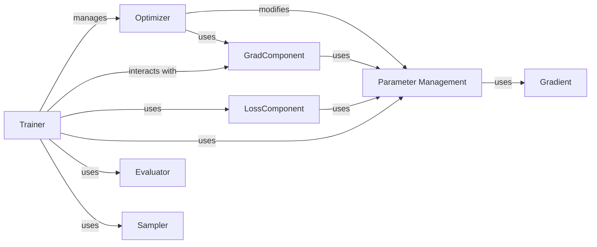

## Component Details

The Training & Evaluation subsystem of AdalFlow is responsible for the core learning process of LLM-based components. It encompasses the orchestration of training steps, parameter optimization, gradient computation, and the assessment of model performance. This subsystem integrates various components to manage trainable parameters, calculate loss, apply optimization strategies, and provide comprehensive evaluation metrics.

### Trainer
Orchestrates the training process for AdalFlow tasks, managing training steps, handling loss computation, and interacting with optimizers to update model parameters. It also includes functionalities for validation, checkpointing, and tracing training results.

**Related Classes/Methods**:

- <a href="https://github.com/SylphAI-Inc/AdalFlow/blob/master/adalflow/adalflow/optim/trainer/trainer.py#L43-L1000" target="_blank" rel="noopener noreferrer">`adalflow.optim.trainer.trainer.Trainer` (43:1000)</a>

### Optimizer
The base class for all optimizers in AdalFlow, defining the fundamental interfaces for `propose`, `step`, and `revert` operations, which are crucial for adjusting parameters during the optimization process. Subclasses specialize in different optimization strategies like text optimization or few-shot optimization.

**Related Classes/Methods**:

- <a href="https://github.com/SylphAI-Inc/AdalFlow/blob/master/adalflow/adalflow/optim/optimizer.py#L12-L28" target="_blank" rel="noopener noreferrer">`adalflow.optim.optimizer.Optimizer` (12:28)</a>
- <a href="https://github.com/SylphAI-Inc/AdalFlow/blob/master/adalflow/adalflow/optim/optimizer.py#L31-L46" target="_blank" rel="noopener noreferrer">`adalflow.optim.optimizer.TextOptimizer` (31:46)</a>
- <a href="https://github.com/SylphAI-Inc/AdalFlow/blob/master/adalflow/adalflow/optim/optimizer.py#L49-L91" target="_blank" rel="noopener noreferrer">`adalflow.optim.optimizer.DemoOptimizer` (49:91)</a>
- <a href="https://github.com/SylphAI-Inc/AdalFlow/blob/master/adalflow/adalflow/optim/_llm_optimizer.py#L95-L187" target="_blank" rel="noopener noreferrer">`adalflow.optim._llm_optimizer.LLMOptimizer` (95:187)</a>
- <a href="https://github.com/SylphAI-Inc/AdalFlow/blob/master/adalflow/adalflow/optim/few_shot/bootstrap_optimizer.py#L22-L307" target="_blank" rel="noopener noreferrer">`adalflow.optim.few_shot.bootstrap_optimizer.BootstrapFewShot` (22:307)</a>
- <a href="https://github.com/SylphAI-Inc/AdalFlow/blob/master/adalflow/adalflow/optim/text_grad/tgd_optimizer.py#L282-L628" target="_blank" rel="noopener noreferrer">`adalflow.optim.text_grad.tgd_optimizer.TGDOptimizer` (282:628)</a>

### GradComponent
An extension of the `Component` class that introduces auto-differentiation capabilities. It defines `forward` and `backward` passes, allowing for tracing and backpropagation of gradients. It can also utilize a `BackwardEngine` (a specialized `Generator`) for LLM-based gradient computation.

**Related Classes/Methods**:

- <a href="https://github.com/SylphAI-Inc/AdalFlow/blob/master/adalflow/adalflow/optim/grad_component.py#L40-L479" target="_blank" rel="noopener noreferrer">`adalflow.optim.grad_component.GradComponent` (40:479)</a>

### LossComponent
Defines the interface for loss functions used in the training process, enabling the calculation of discrepancies between predicted and target outputs.

**Related Classes/Methods**:

- <a href="https://github.com/SylphAI-Inc/AdalFlow/blob/master/adalflow/adalflow/optim/loss_component.py#L14-L56" target="_blank" rel="noopener noreferrer">`adalflow.optim.loss_component.LossComponent` (14:56)</a>
- <a href="https://github.com/SylphAI-Inc/AdalFlow/blob/master/adalflow/adalflow/optim/text_grad/llm_text_loss.py#L29-L74" target="_blank" rel="noopener noreferrer">`adalflow.optim.text_grad.llm_text_loss.LLMAsTextLoss` (29:74)</a>
- <a href="https://github.com/SylphAI-Inc/AdalFlow/blob/master/adalflow/adalflow/optim/text_grad/text_loss_with_eval_fn.py#L36-L385" target="_blank" rel="noopener noreferrer">`adalflow.optim.text_grad.text_loss_with_eval_fn.EvalFnToTextLoss` (36:385)</a>

### Parameter Management
Manages trainable parameters within the AdalFlow system, including their tracing and handling during optimization.

**Related Classes/Methods**:

- `adalflow.optim.parameter.Parameter` (full file reference)

### Evaluator
Provides a suite of evaluators and metrics to quantitatively assess the performance of AdalFlow components and models.

**Related Classes/Methods**:

- <a href="https://github.com/SylphAI-Inc/AdalFlow/blob/master/adalflow/adalflow/eval/base.py#L17-L31" target="_blank" rel="noopener noreferrer">`adalflow.eval.base.BaseEvaluator` (17:31)</a>
- <a href="https://github.com/SylphAI-Inc/AdalFlow/blob/master/adalflow/adalflow/eval/answer_match_acc.py#L9-L157" target="_blank" rel="noopener noreferrer">`adalflow.eval.answer_match_acc.AnswerMatchAcc` (9:157)</a>
- <a href="https://github.com/SylphAI-Inc/AdalFlow/blob/master/adalflow/adalflow/eval/llm_as_judge.py#L167-L249" target="_blank" rel="noopener noreferrer">`adalflow.eval.llm_as_judge.LLMasJudge` (167:249)</a>
- <a href="https://github.com/SylphAI-Inc/AdalFlow/blob/master/adalflow/adalflow/eval/g_eval.py#L199-L263" target="_blank" rel="noopener noreferrer">`adalflow.eval.g_eval.GEvalJudgeEvaluator` (199:263)</a>
- <a href="https://github.com/SylphAI-Inc/AdalFlow/blob/master/adalflow/adalflow/eval/retriever_recall.py#L9-L125" target="_blank" rel="noopener noreferrer">`adalflow.eval.retriever_recall.RetrieverEvaluator` (9:125)</a>

### Sampler
Provides different strategies for sampling data during the training process.

**Related Classes/Methods**:

- <a href="https://github.com/SylphAI-Inc/AdalFlow/blob/master/adalflow/adalflow/optim/sampler.py#L41-L65" target="_blank" rel="noopener noreferrer">`adalflow.optim.sampler.Sampler` (41:65)</a>

### Gradient
Represents the gradient information and its context during the backpropagation process.

**Related Classes/Methods**:

- <a href="https://github.com/SylphAI-Inc/AdalFlow/blob/master/adalflow/adalflow/optim/gradient.py#L45-L132" target="_blank" rel="noopener noreferrer">`adalflow.optim.gradient.Gradient` (45:132)</a>

### [FAQ](https://github.com/CodeBoarding/GeneratedOnBoardings/tree/main?tab=readme-ov-file#faq)