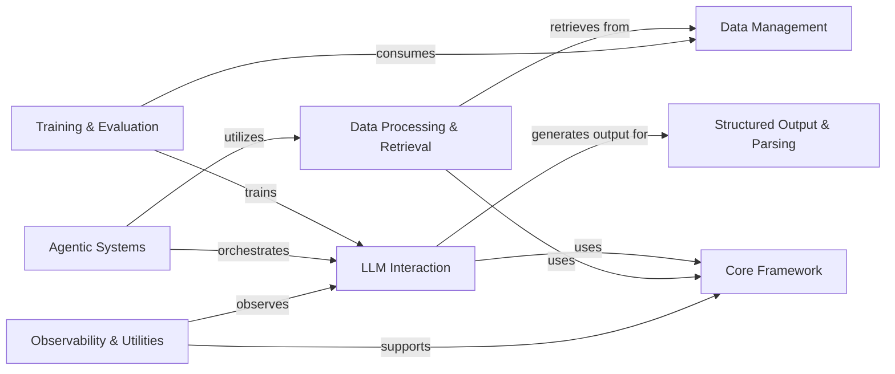

## Component Details

AdalFlow is a comprehensive framework designed for building, training, and evaluating applications powered by Large Language Models (LLMs). Its core functionality revolves around orchestrating interactions with various LLMs, processing and retrieving data, and providing robust mechanisms for training, optimization, and performance evaluation. The framework supports agentic capabilities for complex task execution and includes utilities for structured output parsing, data management, and system observability.

### Core Framework
Provides the foundational building blocks, base classes (Component, DataClass), and container structures (Sequential, ComponentList) that all other AdalFlow components inherit from or utilize. It also includes a registry for component management and defines core data types.

**Related Classes/Methods**:

- `adalflow.core.component` (full file reference)
- `adalflow.core.container` (full file reference)
- <a href="https://github.com/SylphAI-Inc/AdalFlow/blob/master/adalflow/adalflow/utils/registry.py#L4-L21" target="_blank" rel="noopener noreferrer">`adalflow.utils.registry.EntityMapping` (4:21)</a>
- `adalflow.core.base_data_class` (full file reference)
- `adalflow.core.types` (full file reference)

### LLM Interaction
Central to text generation, this component orchestrates interactions with various Large Language Models, handling prompt construction, model invocation, and response processing through a unified client interface.

**Related Classes/Methods**:

- `adalflow.core.generator` (full file reference)
- `adalflow.core.model_client` (full file reference)
- `adalflow.components.model_client.openai_client` (full file reference)
- `adalflow.components.model_client.google_client` (full file reference)
- `adalflow.components.model_client.anthropic_client` (full file reference)
- `adalflow.components.model_client.ollama_client` (full file reference)
- `adalflow.components.model_client.transformers_client` (full file reference)
- `adalflow.core.prompt_builder` (full file reference)

### Data Processing & Retrieval
Responsible for converting textual data into numerical vector representations (embeddings), splitting documents into manageable chunks, and implementing various strategies for searching and retrieving relevant information from a knowledge base.

**Related Classes/Methods**:

- `adalflow.core.embedder` (full file reference)
- <a href="https://github.com/SylphAI-Inc/AdalFlow/blob/master/adalflow/adalflow/components/model_client/transformers_client.py#L44-L126" target="_blank" rel="noopener noreferrer">`adalflow.components.model_client.transformers_client.TransformerEmbedder` (44:126)</a>
- `adalflow.core.retriever` (full file reference)
- `adalflow.components.retriever.bm25_retriever` (full file reference)
- `adalflow.components.retriever.faiss_retriever` (full file reference)
- `adalflow.components.retriever.llm_retriever` (full file reference)
- `adalflow.components.retriever.reranker_retriever` (full file reference)
- `adalflow.components.retriever.lancedb_retriver` (full file reference)
- `adalflow.components.retriever.postgres_retriever` (full file reference)
- `adalflow.components.data_process.text_splitter` (full file reference)
- `adalflow.components.data_process.data_components` (full file reference)

### Structured Output & Parsing
Converts raw string outputs from LLMs into structured Python objects (e.g., dataclasses, JSON, YAML, lists, integers, floats, booleans) for easier programmatic access and manipulation.

**Related Classes/Methods**:

- `adalflow.components.output_parsers.dataclass_parser` (full file reference)
- `adalflow.components.output_parsers.outputs` (full file reference)
- `adalflow.core.string_parser` (full file reference)

### Training & Evaluation
Implements the core training and optimization algorithms of AdalFlow, managing trainable parameters, calculating gradients, and orchestrating the learning process for LLM-based components. It also provides a suite of evaluators and metrics to quantitatively assess performance.

**Related Classes/Methods**:

- `adalflow.optim.trainer` (full file reference)
- `adalflow.optim.parameter` (full file reference)
- `adalflow.optim.grad_component` (full file reference)
- `adalflow.optim.loss_component` (full file reference)
- `adalflow.optim.text_grad` (full file reference)
- `adalflow.optim.few_shot` (full file reference)
- `adalflow.eval.answer_match_acc` (full file reference)
- `adalflow.eval.llm_as_judge` (full file reference)
- `adalflow.eval.g_eval` (full file reference)
- `adalflow.eval.retriever_recall` (full file reference)
- `adalflow.eval.base` (full file reference)

### Agentic Systems
Enables the creation of intelligent agents that can reason, plan, and interact with external tools or functions to solve complex tasks, often employing techniques like ReAct. It manages the execution of various tools.

**Related Classes/Methods**:

- `adalflow.components.agent.react` (full file reference)
- `adalflow.core.tool_manager` (full file reference)
- `adalflow.core.func_tool` (full file reference)

### Data Management
Manages local storage and transformation of documents and data, providing an interface for adding, retrieving, and transforming data within the AdalFlow ecosystem. It also handles loading and preparing various benchmark datasets.

**Related Classes/Methods**:

- <a href="https://github.com/SylphAI-Inc/AdalFlow/blob/master/adalflow/adalflow/core/db.py#L25-L388" target="_blank" rel="noopener noreferrer">`adalflow.core.db.LocalDB` (25:388)</a>
- `adalflow.datasets.gsm8k` (full file reference)
- `adalflow.datasets.big_bench_hard` (full file reference)
- `adalflow.datasets.trec` (full file reference)
- `adalflow.datasets.hotpot_qa` (full file reference)
- `adalflow.datasets.utils` (full file reference)

### Observability & Utilities
A collection of miscellaneous utility functions supporting various aspects of the AdalFlow framework, including detailed logging and tracing of component execution, file I/O, caching, data serialization, and environment configuration.

**Related Classes/Methods**:

- `adalflow.tracing.generator_call_logger` (full file reference)
- `adalflow.tracing.generator_state_logger` (full file reference)
- `adalflow.utils.logger` (full file reference)
- `adalflow.utils.file_io` (full file reference)
- <a href="https://github.com/SylphAI-Inc/AdalFlow/blob/master/adalflow/adalflow/utils/cache.py#L19-L47" target="_blank" rel="noopener noreferrer">`adalflow.utils.cache.CachedEngine` (19:47)</a>
- `adalflow.utils.serialization` (full file reference)
- `adalflow.utils.lazy_import` (full file reference)
- `adalflow.utils.global_config` (full file reference)
- <a href="https://github.com/SylphAI-Inc/AdalFlow/blob/master/adalflow/adalflow/utils/data.py#L72-L135" target="_blank" rel="noopener noreferrer">`adalflow.utils.data.DataLoader` (72:135)</a>

### [FAQ](https://github.com/CodeBoarding/GeneratedOnBoardings/tree/main?tab=readme-ov-file#faq)