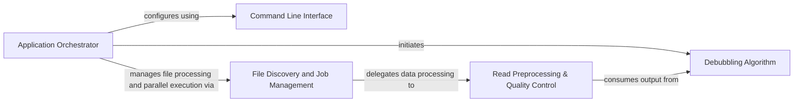

## Component Details

The AfterQC pipeline is orchestrated by the Application Orchestrator, which handles command-line argument parsing, discovers FASTQ files for processing, and manages the parallel execution of preprocessing, quality control, and debubbling tasks. It delegates specific functionalities to dedicated components for efficient and modular data analysis.

### Application Orchestrator
The Application Orchestrator component, embodied by the `after.py` script, serves as the central control unit for the AfterQC pipeline. It is responsible for parsing command-line arguments, discovering input FASTQ files, initiating parallel processing jobs, and coordinating the overall workflow by delegating tasks to the Read Preprocessing & Quality Control and Structural Anomaly Processing components.

**Related Classes/Methods**:

- <a href="https://github.com/OpenGene/AfterQC/blob/master/after.py#L13-L92" target="_blank" rel="noopener noreferrer">`after.parseCommand` (13:92)</a>
- <a href="https://github.com/OpenGene/AfterQC/blob/master/after.py#L100-L170" target="_blank" rel="noopener noreferrer">`after.processDir` (100:170)</a>
- <a href="https://github.com/OpenGene/AfterQC/blob/master/after.py#L172-L174" target="_blank" rel="noopener noreferrer">`after.processOptions` (172:174)</a>
- <a href="https://github.com/OpenGene/AfterQC/blob/master/after.py#L176-L183" target="_blank" rel="noopener noreferrer">`after.runDebubble` (176:183)</a>

### Command Line Interface
This component is responsible for defining and parsing command-line arguments, allowing users to configure various parameters for the AfterQC tool, such as input/output paths, trimming settings, and quality control thresholds.

**Related Classes/Methods**:

- <a href="https://github.com/OpenGene/AfterQC/blob/master/after.py#L13-L92" target="_blank" rel="noopener noreferrer">`after.parseCommand` (13:92)</a>

### File Discovery and Job Management
This component automates the discovery of relevant FASTQ files within a specified directory, prepares unique processing options for each identified file set, and manages the creation and execution of multiprocessing jobs to enable parallel processing of sequencing data.

**Related Classes/Methods**:

- <a href="https://github.com/OpenGene/AfterQC/blob/master/after.py#L100-L170" target="_blank" rel="noopener noreferrer">`after.processDir` (100:170)</a>
- <a href="https://github.com/OpenGene/AfterQC/blob/master/util.py#L28-L33" target="_blank" rel="noopener noreferrer">`util.parseBool` (28:33)</a>

### Read Preprocessing & Quality Control
This component performs the core preprocessing and quality control operations on sequencing data. It applies trimming, assesses base quality, handles barcode sequences, and conducts overlap analysis, generating quality statistics and filtering reads based on user-defined criteria.

**Related Classes/Methods**:

- <a href="https://github.com/OpenGene/AfterQC/blob/master/preprocesser.py#L140-L818" target="_blank" rel="noopener noreferrer">`preprocesser.seqFilter` (140:818)</a>
- <a href="https://github.com/OpenGene/AfterQC/blob/master/after.py#L172-L174" target="_blank" rel="noopener noreferrer">`after.processOptions` (172:174)</a>

### Debubbling Algorithm
This component implements the debubbling algorithm to identify and remove 'bubble' reads from sequencing data, which are often indicative of sequencing errors or artifacts. It processes input directories to generate and utilize bubble circle information for filtering.

**Related Classes/Methods**:

- <a href="https://github.com/OpenGene/AfterQC/blob/master/debubble.py#L35-L52" target="_blank" rel="noopener noreferrer">`debubble.debubbleDir` (35:52)</a>
- <a href="https://github.com/OpenGene/AfterQC/blob/master/after.py#L176-L183" target="_blank" rel="noopener noreferrer">`after.runDebubble` (176:183)</a>
- <a href="https://github.com/OpenGene/AfterQC/blob/master/preprocesser.py#L156-L173" target="_blank" rel="noopener noreferrer">`preprocesser.seqFilter:loadBubbleCircles` (156:173)</a>
- <a href="https://github.com/OpenGene/AfterQC/blob/master/preprocesser.py#L175-L203" target="_blank" rel="noopener noreferrer">`preprocesser.seqFilter:isInBubble` (175:203)</a>

### [FAQ](https://github.com/CodeBoarding/GeneratedOnBoardings/tree/main?tab=readme-ov-file#faq)