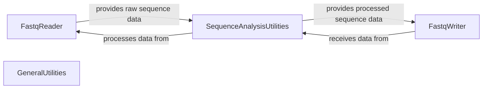

## Component Details

The Data I/O & Utilities component serves as the foundational layer for handling FASTQ sequencing data within the AfterQC project. It provides robust functionalities for reading and writing FASTQ files, supporting various compression formats. Additionally, it offers a suite of general-purpose and sequence-specific utility functions for data manipulation, quality assessment, and sequence analysis, promoting modularity and reusability across the project's data processing workflows.

### FastqReader
Manages the reading of FASTQ files, supporting gzipped and bzipped formats. It initializes file handles and provides functionality to iterate through reads. It also includes a utility to check if a file is a FASTQ file.

**Related Classes/Methods**:

- <a href="https://github.com/OpenGene/AfterQC/blob/master/fastq.py#L18-L30" target="_blank" rel="noopener noreferrer">`fastq.Reader.__init__` (18:30)</a>
- <a href="https://github.com/OpenGene/AfterQC/blob/master/fastq.py#L36-L48" target="_blank" rel="noopener noreferrer">`fastq.Reader.nextRead` (36:48)</a>
- <a href="https://github.com/OpenGene/AfterQC/blob/master/fastq.py#L50-L51" target="_blank" rel="noopener noreferrer">`fastq.Reader.isEOF` (50:51)</a>
- <a href="https://github.com/OpenGene/AfterQC/blob/master/fastq.py#L6-L11" target="_blank" rel="noopener noreferrer">`fastq.isFastq` (6:11)</a>

### FastqWriter
Handles the writing of data to FASTQ files, including support for gzipped output. It provides methods to write individual lines or complete sequence reads and to manage file stream operations like flushing and closing.

**Related Classes/Methods**:

- <a href="https://github.com/OpenGene/AfterQC/blob/master/fastq.py#L62-L75" target="_blank" rel="noopener noreferrer">`fastq.Writer.__init__` (62:75)</a>
- <a href="https://github.com/OpenGene/AfterQC/blob/master/fastq.py#L77-L79" target="_blank" rel="noopener noreferrer">`fastq.Writer.flush` (77:79)</a>
- <a href="https://github.com/OpenGene/AfterQC/blob/master/fastq.py#L81-L84" target="_blank" rel="noopener noreferrer">`fastq.Writer.close` (81:84)</a>
- <a href="https://github.com/OpenGene/AfterQC/blob/master/fastq.py#L86-L92" target="_blank" rel="noopener noreferrer">`fastq.Writer.writeLines` (86:92)</a>
- <a href="https://github.com/OpenGene/AfterQC/blob/master/fastq.py#L94-L103" target="_blank" rel="noopener noreferrer">`fastq.Writer.writeRead` (94:103)</a>

### SequenceAnalysisUtilities
Provides core utility functions for sequence manipulation and analysis, including calculating edit distances, Hamming distances, determining overlaps using various algorithms, and generating reverse complements. It also includes functions for quality score conversion.

**Related Classes/Methods**:

- <a href="https://github.com/OpenGene/AfterQC/blob/master/util.py#L35-L36" target="_blank" rel="noopener noreferrer">`util.complement` (35:36)</a>
- <a href="https://github.com/OpenGene/AfterQC/blob/master/util.py#L38-L39" target="_blank" rel="noopener noreferrer">`util.qualNum` (38:39)</a>
- <a href="https://github.com/OpenGene/AfterQC/blob/master/util.py#L41-L50" target="_blank" rel="noopener noreferrer">`util.reverseComplement` (41:50)</a>
- <a href="https://github.com/OpenGene/AfterQC/blob/master/util.py#L55-L61" target="_blank" rel="noopener noreferrer">`util.hammingDistance` (55:61)</a>
- <a href="https://github.com/OpenGene/AfterQC/blob/master/util.py#L64-L82" target="_blank" rel="noopener noreferrer">`util.editDistance` (64:82)</a>
- <a href="https://github.com/OpenGene/AfterQC/blob/master/util.py#L84-L85" target="_blank" rel="noopener noreferrer">`util.distance_threshold` (84:85)</a>
- <a href="https://github.com/OpenGene/AfterQC/blob/master/util.py#L87-L88" target="_blank" rel="noopener noreferrer">`util.overlap` (87:88)</a>
- <a href="https://github.com/OpenGene/AfterQC/blob/master/util.py#L90-L154" target="_blank" rel="noopener noreferrer">`util.overlap_ed` (90:154)</a>
- <a href="https://github.com/OpenGene/AfterQC/blob/master/util.py#L157-L211" target="_blank" rel="noopener noreferrer">`util.overlap_hm` (157:211)</a>

### GeneralUtilities
Contains general-purpose helper functions not specific to sequence data or FASTQ files, such as boolean parsing and string reversal.

**Related Classes/Methods**:

- <a href="https://github.com/OpenGene/AfterQC/blob/master/util.py#L28-L33" target="_blank" rel="noopener noreferrer">`util.parseBool` (28:33)</a>
- <a href="https://github.com/OpenGene/AfterQC/blob/master/util.py#L52-L53" target="_blank" rel="noopener noreferrer">`util.reverse` (52:53)</a>

### [FAQ](https://github.com/CodeBoarding/GeneratedOnBoardings/tree/main?tab=readme-ov-file#faq)