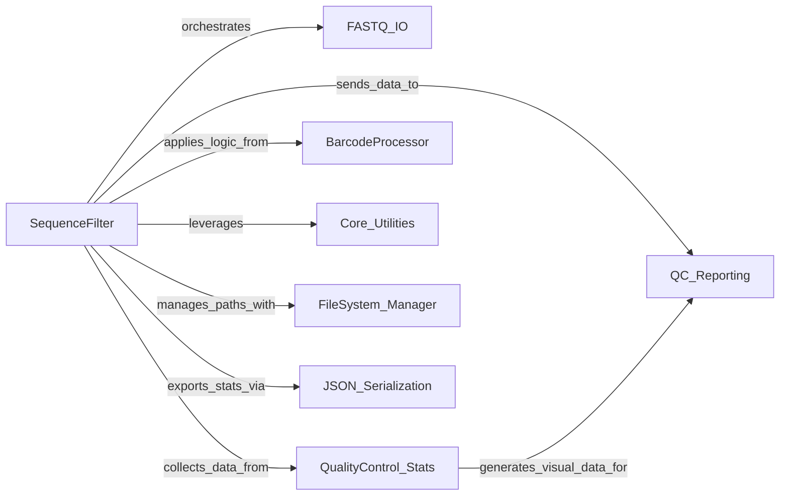

## Component Details

This graph illustrates the architecture of the 'Read Preprocessing & Quality Control' subsystem. The `SequenceFilter` component acts as the central orchestrator, managing the flow of sequencing data from input to filtered output. It interacts with `FASTQ_IO` for file operations, `QualityControl_Stats` for data analysis, and `QC_Reporting` for generating reports. `BarcodeProcessor` and `Core_Utilities` provide specialized functionalities, while `FileSystem_Manager` and `JSON_Serialization` handle system-level tasks.

### SequenceFilter
The central component responsible for orchestrating the entire sequencing read processing pipeline. It initializes other components, manages file I/O, applies various filtering criteria (barcode, trimming, bubble, length, polyX, low quality, N count), performs overlap detection and error correction, and coordinates quality control data collection and reporting.

**Related Classes/Methods**:

- <a href="https://github.com/OpenGene/AfterQC/blob/master/preprocesser.py#L140-L818" target="_blank" rel="noopener noreferrer">`preprocesser.seqFilter` (140:818)</a>
- <a href="https://github.com/OpenGene/AfterQC/blob/master/preprocesser.py#L156-L173" target="_blank" rel="noopener noreferrer">`preprocesser.seqFilter.loadBubbleCircles` (156:173)</a>
- <a href="https://github.com/OpenGene/AfterQC/blob/master/preprocesser.py#L175-L203" target="_blank" rel="noopener noreferrer">`preprocesser.seqFilter.isInBubble` (175:203)</a>
- <a href="https://github.com/OpenGene/AfterQC/blob/master/preprocesser.py#L205-L231" target="_blank" rel="noopener noreferrer">`preprocesser.seqFilter.writeReads` (205:231)</a>
- <a href="https://github.com/OpenGene/AfterQC/blob/master/preprocesser.py#L784-L818" target="_blank" rel="noopener noreferrer">`preprocesser.seqFilter.addFiguresToReport` (784:818)</a>

### FASTQ_IO
Handles the reading of raw sequencing data from input FASTQ files and the writing of processed, filtered, or categorized reads (good, bad, overlap) to corresponding output FASTQ files. It also provides utility for extracting base names from file paths.

**Related Classes/Methods**:

- <a href="https://github.com/OpenGene/AfterQC/blob/master/fastq.py#L16-L51" target="_blank" rel="noopener noreferrer">`fastq.Reader` (16:51)</a>
- <a href="https://github.com/OpenGene/AfterQC/blob/master/fastq.py#L56-L103" target="_blank" rel="noopener noreferrer">`fastq.Writer` (56:103)</a>
- <a href="https://github.com/OpenGene/AfterQC/blob/master/fastq.py#L36-L48" target="_blank" rel="noopener noreferrer">`fastq.Reader.nextRead` (36:48)</a>
- `util.getMainName` (full file reference)

### QualityControl_Stats
Performs detailed statistical analysis on sequencing reads, both before and after filtering. It calculates metrics such as read length, base quality, base content, GC content, and kmer distribution, and prepares this data for visualization and reporting.

**Related Classes/Methods**:

- <a href="https://github.com/OpenGene/AfterQC/blob/master/qualitycontrol.py#L30-L407" target="_blank" rel="noopener noreferrer">`qualitycontrol.QualityControl` (30:407)</a>
- <a href="https://github.com/OpenGene/AfterQC/blob/master/qualitycontrol.py#L330-L356" target="_blank" rel="noopener noreferrer">`qualitycontrol.QualityControl.statFile` (330:356)</a>
- <a href="https://github.com/OpenGene/AfterQC/blob/master/qualitycontrol.py#L358-L386" target="_blank" rel="noopener noreferrer">`qualitycontrol.QualityControl.autoTrim` (358:386)</a>
- <a href="https://github.com/OpenGene/AfterQC/blob/master/qualitycontrol.py#L72-L121" target="_blank" rel="noopener noreferrer">`qualitycontrol.QualityControl.statRead` (72:121)</a>
- <a href="https://github.com/OpenGene/AfterQC/blob/master/qualitycontrol.py#L323-L328" target="_blank" rel="noopener noreferrer">`qualitycontrol.QualityControl.qc` (323:328)</a>
- <a href="https://github.com/OpenGene/AfterQC/blob/master/qualitycontrol.py#L58-L70" target="_blank" rel="noopener noreferrer">`qualitycontrol.QualityControl.squeeze` (58:70)</a>
- <a href="https://github.com/OpenGene/AfterQC/blob/master/qualitycontrol.py#L312-L321" target="_blank" rel="noopener noreferrer">`qualitycontrol.QualityControl.statPlotly` (312:321)</a>
- <a href="https://github.com/OpenGene/AfterQC/blob/master/qualitycontrol.py#L287-L310" target="_blank" rel="noopener noreferrer">`qualitycontrol.QualityControl.errorPlotly` (287:310)</a>
- <a href="https://github.com/OpenGene/AfterQC/blob/master/qualitycontrol.py#L271-L285" target="_blank" rel="noopener noreferrer">`qualitycontrol.QualityControl.overlapPlotly` (271:285)</a>
- <a href="https://github.com/OpenGene/AfterQC/blob/master/qualitycontrol.py#L157-L181" target="_blank" rel="noopener noreferrer">`qualitycontrol.QualityControl.qualityPlotly` (157:181)</a>
- <a href="https://github.com/OpenGene/AfterQC/blob/master/qualitycontrol.py#L183-L207" target="_blank" rel="noopener noreferrer">`qualitycontrol.QualityControl.contentPlotly` (183:207)</a>
- <a href="https://github.com/OpenGene/AfterQC/blob/master/qualitycontrol.py#L209-L222" target="_blank" rel="noopener noreferrer">`qualitycontrol.QualityControl.gcPlotly` (209:222)</a>
- <a href="https://github.com/OpenGene/AfterQC/blob/master/qualitycontrol.py#L224-L235" target="_blank" rel="noopener noreferrer">`qualitycontrol.QualityControl.discontinuityPlotly` (224:235)</a>
- <a href="https://github.com/OpenGene/AfterQC/blob/master/qualitycontrol.py#L237-L268" target="_blank" rel="noopener noreferrer">`qualitycontrol.QualityControl.strandBiasPlotly` (237:268)</a>

### QC_Reporting
Responsible for compiling and generating the final quality control report. It integrates statistical summaries and various plots provided by the QualityControl_Stats component, setting overall run statistics and version information before outputting the comprehensive report.

**Related Classes/Methods**:

- <a href="https://github.com/OpenGene/AfterQC/blob/master/qcreporter.py#L21-L137" target="_blank" rel="noopener noreferrer">`qcreporter.QCReporter` (21:137)</a>
- <a href="https://github.com/OpenGene/AfterQC/blob/master/qcreporter.py#L26-L27" target="_blank" rel="noopener noreferrer">`qcreporter.QCReporter.addFigure` (26:27)</a>
- <a href="https://github.com/OpenGene/AfterQC/blob/master/qcreporter.py#L29-L30" target="_blank" rel="noopener noreferrer">`qcreporter.QCReporter.setStat` (29:30)</a>
- <a href="https://github.com/OpenGene/AfterQC/blob/master/qcreporter.py#L32-L33" target="_blank" rel="noopener noreferrer">`qcreporter.QCReporter.setVersion` (32:33)</a>
- <a href="https://github.com/OpenGene/AfterQC/blob/master/qcreporter.py#L35-L37" target="_blank" rel="noopener noreferrer">`qcreporter.QCReporter.output` (35:37)</a>

### BarcodeProcessor
Manages the identification and manipulation of barcode sequences within reads. This includes detecting barcode lengths, moving barcodes to read names, and trimming them from the sequence, particularly for paired-end reads.

**Related Classes/Methods**:

- <a href="https://github.com/OpenGene/AfterQC/blob/master/barcodeprocesser.py#L10-L200" target="_blank" rel="noopener noreferrer">`barcodeprocesser.BarcodeProcessor` (10:200)</a>
- <a href="https://github.com/OpenGene/AfterQC/blob/master/barcodeprocesser.py#L18-L31" target="_blank" rel="noopener noreferrer">`barcodeprocesser.detectBarcode` (18:31)</a>
- <a href="https://github.com/OpenGene/AfterQC/blob/master/barcodeprocesser.py#L33-L44" target="_blank" rel="noopener noreferrer">`barcodeprocesser.moveBarcodeToName` (33:44)</a>
- <a href="https://github.com/OpenGene/AfterQC/blob/master/barcodeprocesser.py#L76-L81" target="_blank" rel="noopener noreferrer">`barcodeprocesser.moveAndTrimPair` (76:81)</a>

### Core_Utilities
Provides a collection of fundamental helper functions essential for sequence processing, such as trimming reads, detecting poly-X sequences, counting low-quality bases or Ns, performing sequence overlap analysis, complementing bases, converting quality scores, and managing error matrices for correction.

**Related Classes/Methods**:

- `util.trim` (full file reference)
- `util.hasPolyX` (full file reference)
- `util.lowQualityNum` (full file reference)
- `util.nNumber` (full file reference)
- <a href="https://github.com/OpenGene/AfterQC/blob/master/util.py#L87-L88" target="_blank" rel="noopener noreferrer">`util.overlap` (87:88)</a>
- <a href="https://github.com/OpenGene/AfterQC/blob/master/util.py#L35-L36" target="_blank" rel="noopener noreferrer">`util.complement` (35:36)</a>
- <a href="https://github.com/OpenGene/AfterQC/blob/master/util.py#L38-L39" target="_blank" rel="noopener noreferrer">`util.qualNum` (38:39)</a>
- <a href="https://github.com/OpenGene/AfterQC/blob/master/util.py#L235-L238" target="_blank" rel="noopener noreferrer">`util.changeString` (235:238)</a>
- `util.init_error_matrix` (full file reference)
- `util.merge_error_matrix` (full file reference)
- `util.getOverlap` (full file reference)

### FileSystem_Manager
Handles interactions with the file system, including extracting directory names, constructing file paths, checking for the existence of files or directories, and creating new directories as needed for organizing output data.

**Related Classes/Methods**: _None_

### JSON_Serialization
Facilitates the conversion of structured statistical data into a JSON string format, enabling the export of comprehensive quality control metrics for external analysis or storage.

**Related Classes/Methods**:

- `util.makeDict` (full file reference)

### [FAQ](https://github.com/CodeBoarding/GeneratedOnBoardings/tree/main?tab=readme-ov-file#faq)