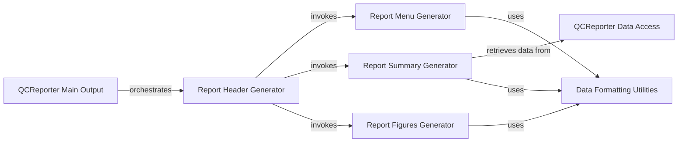

## Component Details

The Reporting & Visualization component, primarily qcreporter.py, is dedicated to generating comprehensive and user-friendly quality control reports. It takes the processed results and metrics from the Read Preprocessing & Quality Control component and visualizes them in an understandable format, often producing HTML reports with plots and summary statistics for easy interpretation of sequencing data quality.

### QCReporter Main Output
This component is responsible for the top-level orchestration of the QC report generation. It opens the output file and calls various sub-components to write different sections of the HTML report.

**Related Classes/Methods**:

- <a href="https://github.com/OpenGene/AfterQC/blob/master/qcreporter.py#L35-L37" target="_blank" rel="noopener noreferrer">`qcreporter.QCReporter.output` (35:37)</a>

### Report Header Generator
This component generates the HTML header section of the QC report, including CSS styles, and then delegates to other components to generate the menu, summary, and figures sections. It also handles the inclusion of Plotly JavaScript.

**Related Classes/Methods**:

- <a href="https://github.com/OpenGene/AfterQC/blob/master/qcreporter.py#L39-L54" target="_blank" rel="noopener noreferrer">`qcreporter.QCReporter.outputHeader` (39:54)</a>
- <a href="https://github.com/OpenGene/AfterQC/blob/master/qcreporter.py#L56-L68" target="_blank" rel="noopener noreferrer">`qcreporter.QCReporter.outputCSS` (56:68)</a>
- <a href="https://github.com/OpenGene/AfterQC/blob/master/qcreporter.py#L70-L78" target="_blank" rel="noopener noreferrer">`qcreporter.QCReporter.outputPlotly` (70:78)</a>

### Report Menu Generator
This component creates the navigation menu for the QC report, linking to different sections of the report. It utilizes a utility function to format division IDs for the menu links.

**Related Classes/Methods**:

- <a href="https://github.com/OpenGene/AfterQC/blob/master/qcreporter.py#L80-L87" target="_blank" rel="noopener noreferrer">`qcreporter.QCReporter.outputMenu` (80:87)</a>

### Report Summary Generator
This component generates the summary table section of the QC report, displaying key statistics about the sequencing run. It interacts with the data access component to retrieve information and uses formatting utilities for presentation.

**Related Classes/Methods**:

- <a href="https://github.com/OpenGene/AfterQC/blob/master/qcreporter.py#L100-L116" target="_blank" rel="noopener noreferrer">`qcreporter.QCReporter.outputSummary` (100:116)</a>
- <a href="https://github.com/OpenGene/AfterQC/blob/master/qcreporter.py#L89-L90" target="_blank" rel="noopener noreferrer">`qcreporter.QCReporter.outputRow` (89:90)</a>

### QCReporter Data Access
This component is responsible for retrieving and processing sequencing-related data from the internal statistics (`self.stat`) to be presented in the report, such as determining if the sequencing is single-end or pair-end.

**Related Classes/Methods**:

- <a href="https://github.com/OpenGene/AfterQC/blob/master/qcreporter.py#L92-L98" target="_blank" rel="noopener noreferrer">`qcreporter.QCReporter.getSequencing` (92:98)</a>

### Report Figures Generator
This component is responsible for embedding various figures, including both static images and interactive Plotly graphs, into the HTML report. It iterates through a list of figures and formats their titles and containers.

**Related Classes/Methods**:

- <a href="https://github.com/OpenGene/AfterQC/blob/master/qcreporter.py#L118-L137" target="_blank" rel="noopener noreferrer">`qcreporter.QCReporter.outputFigures` (118:137)</a>

### Data Formatting Utilities
This component provides general utility functions used across the report generation process for formatting data. This includes converting strings into valid HTML division IDs and formatting numerical values for display.

**Related Classes/Methods**:

- <a href="https://github.com/OpenGene/AfterQC/blob/master/util.py#L1-L200" target="_blank" rel="noopener noreferrer">`util.formatDivID` (1:200)</a>
- <a href="https://github.com/OpenGene/AfterQC/blob/master/util.py#L1-L200" target="_blank" rel="noopener noreferrer">`util.formatNumber` (1:200)</a>

### [FAQ](https://github.com/CodeBoarding/GeneratedOnBoardings/tree/main?tab=readme-ov-file#faq)