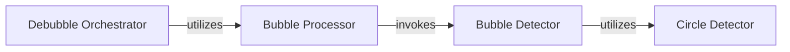

## Component Details

The Structural Anomaly Processing component focuses on identifying, detecting, and processing specific structural artifacts and anomalies within sequencing data. This involves detecting 'bubbles' and circular DNA/RNA structures, and implementing algorithms for 'debubbling' to refine or remove these artifacts, thereby improving data quality. The main flow involves an orchestrator initiating the process, which then uses a processor to handle data and delegate detection to specialized detectors for bubbles and circles.

### Bubble Detector
This component is responsible for identifying and detecting 'bubble' type structural anomalies within the input data. It performs filtering, clustering, and then specifically detects circles within the clustered data.

**Related Classes/Methods**:

- <a href="https://github.com/OpenGene/AfterQC/blob/master/bubbledetector.py#L10-L360" target="_blank" rel="noopener noreferrer">`bubbledetector.BubbleDetector` (10:360)</a>
- <a href="https://github.com/OpenGene/AfterQC/blob/master/bubbledetector.py#L40-L72" target="_blank" rel="noopener noreferrer">`bubbledetector.BubbleDetector:detect` (40:72)</a>
- <a href="https://github.com/OpenGene/AfterQC/blob/master/bubbledetector.py#L264-L289" target="_blank" rel="noopener noreferrer">`bubbledetector.BubbleDetector:detectCircles` (264:289)</a>

### Circle Detector
This component focuses on the identification of 'circle' type structural anomalies. It contains methods to detect circles directly or on edges, and calculates their area and properties.

**Related Classes/Methods**:

- <a href="https://github.com/OpenGene/AfterQC/blob/master/circledetector.py#L10-L206" target="_blank" rel="noopener noreferrer">`circledetector.CircleDetector` (10:206)</a>
- <a href="https://github.com/OpenGene/AfterQC/blob/master/circledetector.py#L22-L38" target="_blank" rel="noopener noreferrer">`circledetector.CircleDetector:detect` (22:38)</a>
- <a href="https://github.com/OpenGene/AfterQC/blob/master/circledetector.py#L168-L206" target="_blank" rel="noopener noreferrer">`circledetector.CircleDetector:detectDirectly` (168:206)</a>
- <a href="https://github.com/OpenGene/AfterQC/blob/master/circledetector.py#L107-L165" target="_blank" rel="noopener noreferrer">`circledetector.CircleDetector:detectOnEdge` (107:165)</a>

### Bubble Processor
This component orchestrates the processing of sequencing data to identify and characterize 'bubble' anomalies. It handles file input, parallel processing of files, data aggregation, and then delegates the actual bubble detection to the Bubble Detector for each tile. It also manages output and image generation.

**Related Classes/Methods**:

- <a href="https://github.com/OpenGene/AfterQC/blob/master/bubbleprocesser.py#L13-L396" target="_blank" rel="noopener noreferrer">`bubbleprocesser.BubbleProcesser` (13:396)</a>
- <a href="https://github.com/OpenGene/AfterQC/blob/master/bubbleprocesser.py#L33-L79" target="_blank" rel="noopener noreferrer">`bubbleprocesser.BubbleProcesser:run` (33:79)</a>
- <a href="https://github.com/OpenGene/AfterQC/blob/master/bubbleprocesser.py#L133-L142" target="_blank" rel="noopener noreferrer">`bubbleprocesser.BubbleProcesser:detectBubbleForTile` (133:142)</a>

### Debubble Orchestrator
This is the top-level component responsible for initiating and coordinating the entire 'debubbling' process. It parses command-line arguments, identifies input files, and then delegates the core processing to the Bubble Processor. It also handles the final output of detected circles.

**Related Classes/Methods**:

- <a href="https://github.com/OpenGene/AfterQC/blob/master/debubble.py#L35-L52" target="_blank" rel="noopener noreferrer">`debubble.debubbleDir` (35:52)</a>
- <a href="https://github.com/OpenGene/AfterQC/blob/master/debubble.py#L64-L87" target="_blank" rel="noopener noreferrer">`debubble.main` (64:87)</a>

### [FAQ](https://github.com/CodeBoarding/GeneratedOnBoardings/tree/main?tab=readme-ov-file#faq)