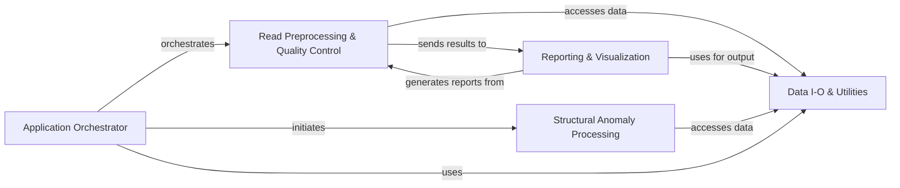

## Component Details

The AfterQC project is designed for comprehensive quality control and preprocessing of sequencing data. Its main flow involves an Application Orchestrator that manages the overall pipeline, delegating tasks to components responsible for reading and writing data, performing initial read preprocessing and quality assessment, detecting and processing structural anomalies like bubbles, and finally generating detailed quality control reports for user interpretation.

### Application Orchestrator
The Application Orchestrator component, primarily after.py, serves as the central control unit for the AfterQC pipeline. It is responsible for parsing command-line arguments, discovering input FASTQ files, initiating parallel processing jobs, and coordinating the overall workflow by delegating tasks to the Read Preprocessing & Quality Control and Structural Anomaly Processing components.

**Related Classes/Methods**:

- <a href="https://github.com/OpenGene/AfterQC/blob/master/after.py#L1-L200" target="_blank" rel="noopener noreferrer">`after` (1:200)</a>
- <a href="https://github.com/OpenGene/AfterQC/blob/master/after.py#L13-L92" target="_blank" rel="noopener noreferrer">`after.parseCommand` (13:92)</a>
- <a href="https://github.com/OpenGene/AfterQC/blob/master/after.py#L100-L170" target="_blank" rel="noopener noreferrer">`after.processDir` (100:170)</a>
- <a href="https://github.com/OpenGene/AfterQC/blob/master/after.py#L172-L174" target="_blank" rel="noopener noreferrer">`after.processOptions` (172:174)</a>
- <a href="https://github.com/OpenGene/AfterQC/blob/master/after.py#L176-L183" target="_blank" rel="noopener noreferrer">`after.runDebubble` (176:183)</a>

### Data I-O & Utilities
The Data I/O & Utilities component, encompassing fastq.py and util.py, provides fundamental functionalities for handling FASTQ formatted sequencing data, including reading, writing, and manipulation. Additionally, it offers a collection of general-purpose helper functions and common utilities used across various parts of the AfterQC project, promoting code reusability and maintainability.

**Related Classes/Methods**:

- <a href="https://github.com/OpenGene/AfterQC/blob/master/fastq.py#L1-L200" target="_blank" rel="noopener noreferrer">`fastq` (1:200)</a>
- <a href="https://github.com/OpenGene/AfterQC/blob/master/util.py#L1-L200" target="_blank" rel="noopener noreferrer">`util` (1:200)</a>

### Read Preprocessing & Quality Control
This component, comprising preprocesser.py, qualitycontrol.py, and barcodeprocesser.py, is responsible for the initial stages of data preparation and core quality assessment. It performs tasks such as trimming, filtering based on quality, N-base content, and sequence length, processes barcodes for demultiplexing, and conducts comprehensive quality analysis including read quality, GC content, base content, and kmer distribution.

**Related Classes/Methods**:

- <a href="https://github.com/OpenGene/AfterQC/blob/master/preprocesser.py#L1-L200" target="_blank" rel="noopener noreferrer">`preprocesser` (1:200)</a>
- <a href="https://github.com/OpenGene/AfterQC/blob/master/preprocesser.py#L140-L818" target="_blank" rel="noopener noreferrer">`preprocesser.seqFilter` (140:818)</a>
- <a href="https://github.com/OpenGene/AfterQC/blob/master/qualitycontrol.py#L1-L200" target="_blank" rel="noopener noreferrer">`qualitycontrol` (1:200)</a>
- <a href="https://github.com/OpenGene/AfterQC/blob/master/qualitycontrol.py#L10-L200" target="_blank" rel="noopener noreferrer">`qualitycontrol.qc` (10:200)</a>
- <a href="https://github.com/OpenGene/AfterQC/blob/master/barcodeprocesser.py#L1-L200" target="_blank" rel="noopener noreferrer">`barcodeprocesser` (1:200)</a>
- <a href="https://github.com/OpenGene/AfterQC/blob/master/barcodeprocesser.py#L10-L200" target="_blank" rel="noopener noreferrer">`barcodeprocesser.BarcodeProcessor` (10:200)</a>

### Structural Anomaly Processing
The Structural Anomaly Processing component, including bubbledetector.py, bubbleprocesser.py, circledetector.py, and debubble.py, focuses on identifying, detecting, and processing specific structural artifacts and anomalies within sequencing data. This involves detecting 'bubbles' and circular DNA/RNA structures, and implementing algorithms for 'debubbling' to refine or remove these artifacts, thereby improving data quality.

**Related Classes/Methods**:

- <a href="https://github.com/OpenGene/AfterQC/blob/master/bubbledetector.py#L1-L200" target="_blank" rel="noopener noreferrer">`bubbledetector` (1:200)</a>
- <a href="https://github.com/OpenGene/AfterQC/blob/master/bubbleprocesser.py#L1-L200" target="_blank" rel="noopener noreferrer">`bubbleprocesser` (1:200)</a>
- <a href="https://github.com/OpenGene/AfterQC/blob/master/circledetector.py#L1-L200" target="_blank" rel="noopener noreferrer">`circledetector` (1:200)</a>
- <a href="https://github.com/OpenGene/AfterQC/blob/master/debubble.py#L1-L200" target="_blank" rel="noopener noreferrer">`debubble` (1:200)</a>
- <a href="https://github.com/OpenGene/AfterQC/blob/master/debubble.py#L35-L52" target="_blank" rel="noopener noreferrer">`debubble.debubbleDir` (35:52)</a>

### Reporting & Visualization
The Reporting & Visualization component, primarily qcreporter.py, is dedicated to generating comprehensive and user-friendly quality control reports. It takes the processed results and metrics from the Read Preprocessing & Quality Control component and visualizes them in an understandable format, often producing HTML reports with plots and summary statistics for easy interpretation of sequencing data quality.

**Related Classes/Methods**:

- <a href="https://github.com/OpenGene/AfterQC/blob/master/qcreporter.py#L1-L200" target="_blank" rel="noopener noreferrer">`qcreporter` (1:200)</a>
- <a href="https://github.com/OpenGene/AfterQC/blob/master/qcreporter.py#L10-L200" target="_blank" rel="noopener noreferrer">`qcreporter.report` (10:200)</a>

### [FAQ](https://github.com/CodeBoarding/GeneratedOnBoardings/tree/main?tab=readme-ov-file#faq)