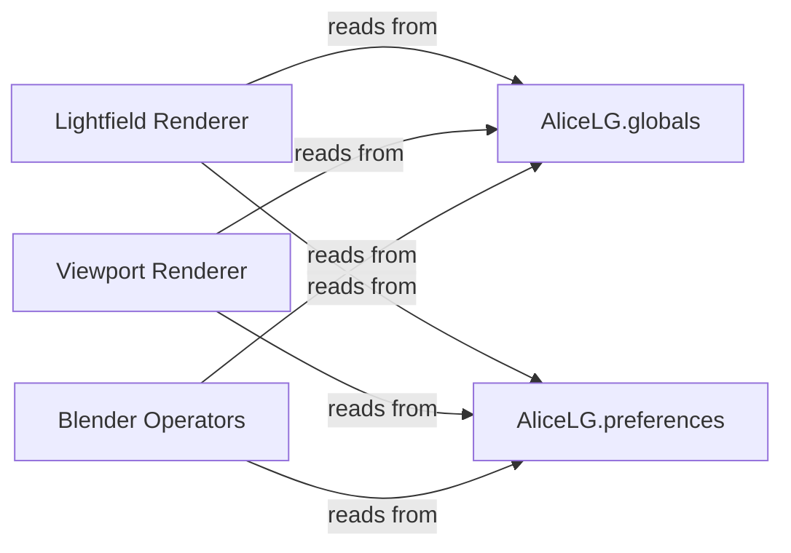

## Details

One paragraph explaining the functionality which is represented by this graph. What the main flow is and what is its purpose.

### AliceLG.globals
Manages and provides access to global application-wide state variables and data that are not user-configurable but are essential for the add-on's operation. This includes runtime flags, temporary data, or shared resources.

**Related Classes/Methods**:

- <a href="https://github.com/regcs/AliceLG/blob/master/globals.py#L1-L100" target="_blank" rel="noopener noreferrer">`AliceLG.globals` (1:100)</a>

### AliceLG.preferences
Handles the storage, retrieval, and management of user-defined preferences and configurable settings for the add-on. This includes settings persisted across Blender sessions, allowing users to customize default behaviors, paths, or display options.

**Related Classes/Methods**:

- `AliceLG.preferences`

### Lightfield Renderer
Component responsible for rendering lightfields, utilizing global state and user preferences.

**Related Classes/Methods**:

- <a href="https://github.com/regcs/AliceLG/blob/master/lightfield_render.py" target="_blank" rel="noopener noreferrer">`AliceLG.lightfield_render`</a>

### Viewport Renderer
Component responsible for rendering in the viewport, utilizing global state and user preferences.

**Related Classes/Methods**:

- `AliceLG.lightfield_viewport`

### Blender Operators
Components representing Blender operators, utilizing global state and user preferences to adjust their behavior.

**Related Classes/Methods**:

- <a href="https://github.com/regcs/AliceLG/blob/master/lightfield_render.py#L1317-L1918" target="_blank" rel="noopener noreferrer">`AliceLG.lightfield_render.LOOKINGGLASS_OT_render_quilt` (1317:1918)</a>
- <a href="https://github.com/regcs/AliceLG/blob/master/lightfield_viewport.py#L291-L958" target="_blank" rel="noopener noreferrer">`AliceLG.lightfield_viewport.LOOKINGGLASS_OT_render_viewport` (291:958)</a>

### [FAQ](https://github.com/CodeBoarding/GeneratedOnBoardings/tree/main?tab=readme-ov-file#faq)