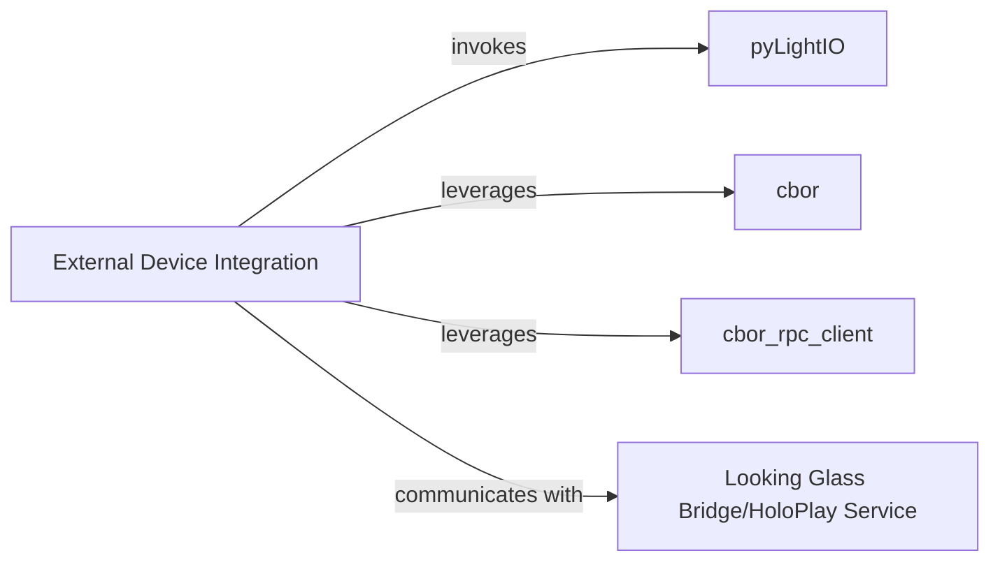

## Details

One paragraph explaining the functionality which is represented by this graph. What the main flow is and what is its purpose.

### External Device Integration [[Expand]](./External_Device_Integration.md)
This component is the critical interface for all communication and data exchange with external holographic display services and hardware, specifically Looking Glass displays. It abstracts the complexities of low-level protocols by primarily utilizing the `pyLightIO` library, which handles data serialization via CBOR (Concise Binary Object Representation) and remote command execution through RPC (Remote Procedure Call). It also facilitates interaction with the external Looking Glass Bridge/HoloPlay Service and potentially `pynng` to transmit processed 3D data from Blender to the physical display, acting as the essential bridge between the Blender add-on's internal logic and the external display ecosystem.

**Related Classes/Methods**: _None_

### pyLightIO
Core library for low-level display communication.

**Related Classes/Methods**: _None_

### cbor
Handles CBOR data serialization/deserialization.

**Related Classes/Methods**: _None_

### cbor_rpc_client
Manages RPC communication over CBOR.

**Related Classes/Methods**: _None_

### Looking Glass Bridge/HoloPlay Service
This is an **external service** responsible for discovering and managing the connection to the physical Looking Glass display. It operates outside the `AliceLG` project's codebase and is interacted with by the `External Device Integration` component.

**Related Classes/Methods**: _None_

### [FAQ](https://github.com/CodeBoarding/GeneratedOnBoardings/tree/main?tab=readme-ov-file#faq)