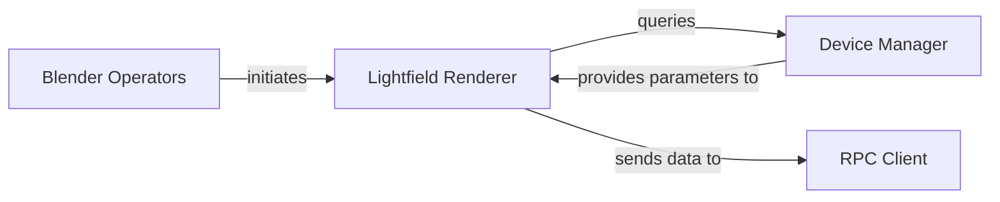

## Details

One paragraph explaining the functionality which is represented by this graph. What the main flow is and what is its purpose.

### Lightfield Renderer
Encapsulates the core logic for generating, processing, and preparing lightfield data from Blender scenes into a format suitable for holographic displays (e.g., quilt images). It manages rendering settings and orchestrates the rendering pipeline.

**Related Classes/Methods**:

- <a href="https://github.com/regcs/AliceLG/blob/master/lightfield_render.py" target="_blank" rel="noopener noreferrer">`AliceLG.lightfield_render`</a>

### Blender Operators
Provides the user interface elements and operational logic within Blender that allow users to trigger and control the lightfield rendering process. These operators act as the entry points for user interaction with the lightfield generation functionality.

**Related Classes/Methods**:

- <a href="https://github.com/regcs/AliceLG/blob/master/lightfield_render.py#L1317-L1918" target="_blank" rel="noopener noreferrer">`AliceLG.lightfield_render.LOOKINGGLASS_OT_render_quilt` (1317:1918)</a>
- <a href="https://github.com/regcs/AliceLG/blob/master/lightfield_viewport.py#L291-L958" target="_blank" rel="noopener noreferrer">`AliceLG.lightfield_viewport.LOOKINGGLASS_OT_render_viewport` (291:958)</a>

### Device Manager
Manages and provides access to device-specific parameters and capabilities (e.g., display resolution, aspect ratio, view count) required for accurate lightfield rendering and display. It abstracts away hardware-specific details, ensuring compatibility across different Looking Glass displays.

**Related Classes/Methods**:

- <a href="https://github.com/regcs/AliceLG/blob/master/lib/pylightio/lookingglass/devices.py#L40-L241" target="_blank" rel="noopener noreferrer">`AliceLG.lib.pylightio.lookingglass.devices.LookingGlassDeviceMixin` (40:241)</a>
- `LookingGlass16Landscape`
- `LookingGlassPortrait`

### RPC Client
Handles the transmission of the generated lightfield data (e.g., quilt images) to external services or the Looking Glass Bridge/HoloPlay Service. It manages the communication protocol (e.g., using `pynng` and `cbor`) to ensure efficient and reliable data transfer to the holographic display.

**Related Classes/Methods**:

- <a href="https://github.com/regcs/AliceLG/blob/master/lib/pylightio/external/cbor/cbor_rpc_client.py#L33-L158" target="_blank" rel="noopener noreferrer">`AliceLG.lib.pylightio.external.cbor.cbor_rpc_client.CborRpcClient` (33:158)</a>
- <a href="https://github.com/regcs/AliceLG/blob/master/lib/pylightio/external/cbor/cbor_rpc_client.py#L12-L30" target="_blank" rel="noopener noreferrer">`AliceLG.lib.pylightio.external.cbor.cbor_rpc_client.SocketReader` (12:30)</a>

### [FAQ](https://github.com/CodeBoarding/GeneratedOnBoardings/tree/main?tab=readme-ov-file#faq)