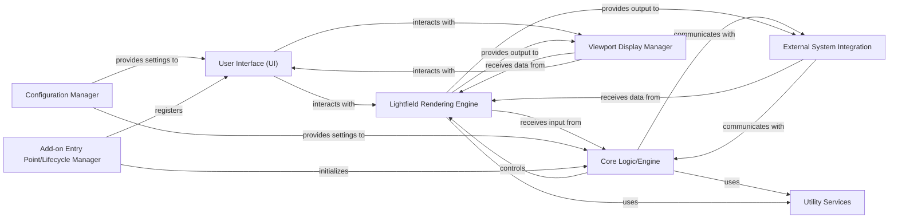

## Details

The final component overview for the `AliceLG` Blender add-on, based on the provided project context and analysis summary. The components are chosen based on their fundamental architectural importance for a Plugin/Extension (Blender Add-on) type project.

### User Interface (UI) [[Expand]](./User_Interface_UI_.md)
Provides all interactive elements within Blender, including panels, menus, and custom properties, enabling users to control the add-on's features and visualize its status. It defines the visual layout and user input mechanisms.

**Related Classes/Methods**:

- `AliceLG.ui`

### Core Logic/Engine
The central brain of the add-on, orchestrating the main business logic, managing the overall workflow, and coordinating between other components. It encapsulates the core algorithms and state management.

**Related Classes/Methods**:

- `AliceLG.core` (1:1)

### Lightfield Rendering Engine
Responsible for generating and processing lightfield data suitable for holographic displays. This component handles the specific algorithms and data structures required for lightfield representation.

**Related Classes/Methods**:

- `AliceLG.rendering` (1:1)

### Viewport Display Manager
Manages the visualization of lightfield data or other add-on specific feedback directly within Blender's 3D viewport. It handles drawing custom overlays, geometry, or textures.

**Related Classes/Methods**:

- `AliceLG.viewport` (1:1)

### External System Integration
Handles all communication and data exchange with external systems, specifically the Looking Glass Bridge/HoloPlay Service and potentially other hardware or network protocols (e.g., `pynng`, `cbor`).

**Related Classes/Methods**:

- `AliceLG.integration` (1:1)

### Configuration Manager
Manages the add-on's settings, preferences, and persistent data. It handles loading configurations from disk, saving user preferences, and providing these settings to other components.

**Related Classes/Methods**:

- `AliceLG.config` (1:1)

### Utility Services
A collection of general-purpose helper functions and modules that provide common functionalities used across various components, promoting code reusability and reducing redundancy.

**Related Classes/Methods**:

- `AliceLG.utils` (1:1)

### Add-on Entry Point/Lifecycle Manager
The primary entry point for the Blender add-on, responsible for its registration, unregistration, and overall lifecycle management within the Blender environment.

**Related Classes/Methods**:

- `AliceLG` (1:1)

### [FAQ](https://github.com/CodeBoarding/GeneratedOnBoardings/tree/main?tab=readme-ov-file#faq)