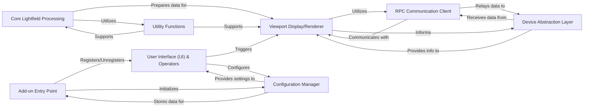

## Details

This document outlines the final component structure for the AliceLG Blender Add-on, focusing on modularity, adherence to Blender's add-on patterns, extensibility, and testability. The add-on integrates external hardware for real-time lightfield display within Blender's 3D viewport.

### Add-on Entry Point
The primary entry point for the Blender add-on, responsible for registering and unregistering all necessary modules, classes, and operators with Blender's API. It orchestrates the add-on's lifecycle.

**Related Classes/Methods**:

- <a href="https://github.com/regcs/AliceLG/blob/master/__init__.py#L1-L1" target="_blank" rel="noopener noreferrer">`__init__` (1:1)</a>

### User Interface (UI) & Operators
Manages all user-facing elements within Blender, including panels, menus, and custom operators. It provides the means for users to interact with the add-on's features, such as initiating the viewport display.

**Related Classes/Methods**:

- <a href="https://github.com/regcs/AliceLG/blob/master/ui.py#L1-L1" target="_blank" rel="noopener noreferrer">`ui.ui_panels` (1:1)</a>
- <a href="https://github.com/regcs/AliceLG/blob/master/ui.py#L1-L1" target="_blank" rel="noopener noreferrer">`ui.operators` (1:1)</a>

### Viewport Display/Renderer
The core component for managing the real-time display and interactive representation of lightfield content directly within Blender's 3D viewport. It overrides Blender's rendering context and handles rendering blocks to provide a live preview.

**Related Classes/Methods**:

- `AliceLG.lightfield_viewport.viewport_renderer`
- `AliceLG.lightfield_viewport.context_override`

### RPC Communication Client
Handles all inter-process communication (RPC) with external services, such as the Looking Glass Bridge or HoloPlay Service. It facilitates sending lightfield data and receiving device status updates.

**Related Classes/Methods**:

- `integration.rpc_client` (1:1)
- `integration.bridge_interface` (1:1)

### Device Abstraction Layer
Provides a standardized, abstract interface for interacting with various Looking Glass holographic displays. It encapsulates device-specific protocols and ensures the core logic remains independent of hardware variations.

**Related Classes/Methods**:

- `core.device_api` (1:1)
- `core.looking_glass_device` (1:1)

### Core Lightfield Processing
Contains the fundamental algorithms and logic for processing, manipulating, and preparing lightfield data for display. This includes tasks like data serialization, format conversion, and optimization.

**Related Classes/Methods**:

- `core.lightfield_data` (1:1)
- `core.processing_engine` (1:1)

### Configuration Manager
Manages all add-on settings, user preferences, and persistent data. It provides an interface for other components to store and retrieve configuration values, ensuring customizable behavior.

**Related Classes/Methods**:

- `config.settings` (1:1)
- `config.preferences` (1:1)

### Utility Functions
A collection of general-purpose helper functions and common utilities used across various components of the add-on. This promotes code reusability and reduces redundancy.

**Related Classes/Methods**:

- `utils.math_utils` (1:1)
- `utils.file_io` (1:1)

### [FAQ](https://github.com/CodeBoarding/GeneratedOnBoardings/tree/main?tab=readme-ov-file#faq)