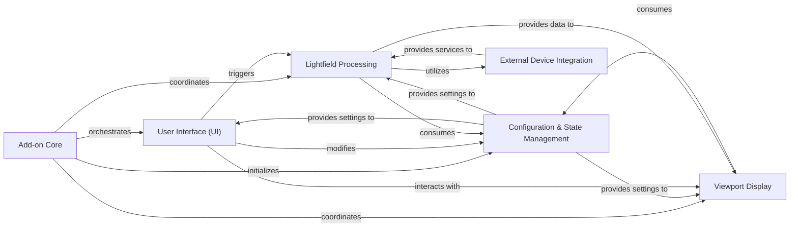

## Details

One paragraph explaining the functionality which is represented by this graph. What the main flow is and what is its purpose.

### Add-on Core
The central orchestrator for the Blender add-on, managing its lifecycle (registration, unregistration) and coordinating the initialization and interaction between other core components.

**Related Classes/Methods**:

- `AliceLG.__init__`

### Configuration & State Management [[Expand]](./Configuration_State_Management.md)
Manages all global application state, user preferences, and configurable settings, providing a centralized and consistent data source for other components.

**Related Classes/Methods**:

- <a href="https://github.com/regcs/AliceLG/blob/master/globals.py" target="_blank" rel="noopener noreferrer">`AliceLG.globals`</a>
- `AliceLG.preferences`

### User Interface (UI) [[Expand]](./User_Interface_UI_.md)
Provides all interactive elements within Blender, including panels, menus, and operators, enabling users to control the add-on's features and visualize its status.

**Related Classes/Methods**:

- `AliceLG.ui`

### Lightfield Processing [[Expand]](./Lightfield_Processing.md)
Encapsulates the core logic for generating, processing, and preparing lightfield data for holographic display, including rendering and data manipulation.

**Related Classes/Methods**:

- <a href="https://github.com/regcs/AliceLG/blob/master/lightfield_render.py" target="_blank" rel="noopener noreferrer">`AliceLG.lightfield_render`</a>

### Viewport Display [[Expand]](./Viewport_Display.md)
Manages the real-time display and interactive representation of lightfield content directly within Blender's 3D viewport, providing visual feedback to the user.

**Related Classes/Methods**:

- `AliceLG.lightfield_viewport`

### External Device Integration [[Expand]](./External_Device_Integration.md)
Handles all communication and data exchange with external holographic display services or hardware, primarily through the pyLightIO library, using protocols like CBOR and RPC.

**Related Classes/Methods**:

- `AliceLG.lib.pylightio`
- `AliceLG.lib.pylightio.external.cbor.cbor`
- `AliceLG.lib.pylightio.external.cbor.cbor_rpc_client`

### [FAQ](https://github.com/CodeBoarding/GeneratedOnBoardings/tree/main?tab=readme-ov-file#faq)