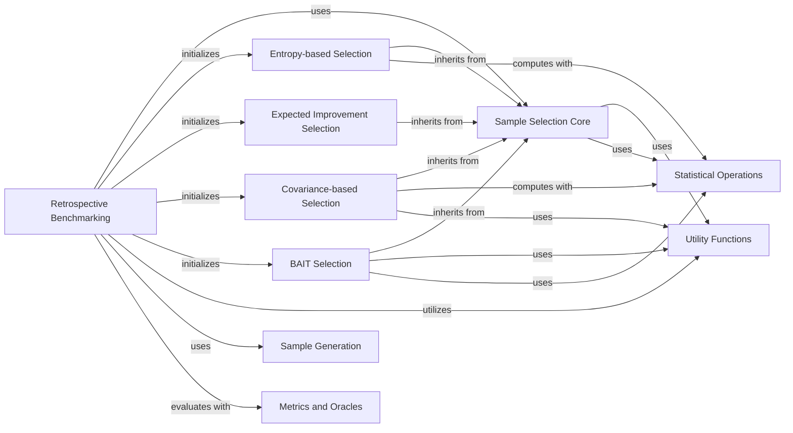

## Component Details

The Active Learning & Experimentation component in Alien orchestrates the active learning process and facilitates experiment evaluation. It encompasses various sample selection algorithms to efficiently identify informative samples for model training. The component provides a structured framework for setting up, executing, and evaluating experiments, including managing data splits, logging results, and computing performance metrics. The core flow involves initializing data and selectors, iteratively training models, selecting new samples, and evaluating performance until a stopping condition is met.

### Retrospective Benchmarking
This component manages the execution of retrospective active learning experiments. It handles data initialization, splitting, model fitting, and iterative sample selection using various selectors. It also manages experiment logging and stopping conditions.

**Related Classes/Methods**:

- <a href="https://github.com/Sanofi-Public/Alien/blob/master/alien/benchmarks/retrospective.py#L38-L207" target="_blank" rel="noopener noreferrer">`Alien.alien.benchmarks.retrospective.run_experiments` (38:207)</a>
- <a href="https://github.com/Sanofi-Public/Alien/blob/master/alien/benchmarks/retrospective.py#L210-L337" target="_blank" rel="noopener noreferrer">`Alien.alien.benchmarks.retrospective._run_retro_iter` (210:337)</a>
- <a href="https://github.com/Sanofi-Public/Alien/blob/master/alien/benchmarks/retrospective.py#L345-L381" target="_blank" rel="noopener noreferrer">`Alien.alien.benchmarks.retrospective._get_selector` (345:381)</a>
- <a href="https://github.com/Sanofi-Public/Alien/blob/master/alien/benchmarks/retrospective.py#L439-L451" target="_blank" rel="noopener noreferrer">`Alien.alien.benchmarks.retrospective._args_init` (439:451)</a>
- <a href="https://github.com/Sanofi-Public/Alien/blob/master/alien/benchmarks/retrospective.py#L424-L436" target="_blank" rel="noopener noreferrer">`Alien.alien.benchmarks.retrospective._data_init` (424:436)</a>
- <a href="https://github.com/Sanofi-Public/Alien/blob/master/alien/benchmarks/retrospective.py#L402-L421" target="_blank" rel="noopener noreferrer">`Alien.alien.benchmarks.retrospective._get_train_test` (402:421)</a>
- <a href="https://github.com/Sanofi-Public/Alien/blob/master/alien/benchmarks/retrospective.py#L384-L399" target="_blank" rel="noopener noreferrer">`Alien.alien.benchmarks.retrospective._get_train_valid` (384:399)</a>
- <a href="https://github.com/Sanofi-Public/Alien/blob/master/alien/benchmarks/retrospective.py#L454-L466" target="_blank" rel="noopener noreferrer">`Alien.alien.benchmarks.retrospective._overwrite` (454:466)</a>
- <a href="https://github.com/Sanofi-Public/Alien/blob/master/alien/benchmarks/retrospective.py#L496-L564" target="_blank" rel="noopener noreferrer">`Alien.alien.benchmarks.retrospective._setup_wandb` (496:564)</a>
- <a href="https://github.com/Sanofi-Public/Alien/blob/master/alien/benchmarks/retrospective.py#L340-L342" target="_blank" rel="noopener noreferrer">`Alien.alien.benchmarks.retrospective._save_ids` (340:342)</a>
- <a href="https://github.com/Sanofi-Public/Alien/blob/master/alien/benchmarks/retrospective.py#L469-L493" target="_blank" rel="noopener noreferrer">`Alien.alien.benchmarks.retrospective._check_retro_break` (469:493)</a>

### Sample Selection Core
This is the base component for all sample selection strategies. It provides the fundamental framework for selecting samples, including prediction priors, pre-filtering, and batch optimization. Specific selection algorithms extend this core functionality.

**Related Classes/Methods**:

- <a href="https://github.com/Sanofi-Public/Alien/blob/master/alien/selection/selector.py#L16-L324" target="_blank" rel="noopener noreferrer">`Alien.alien.selection.selector.SampleSelector` (16:324)</a>
- <a href="https://github.com/Sanofi-Public/Alien/blob/master/alien/selection/selector.py#L80-L132" target="_blank" rel="noopener noreferrer">`Alien.alien.selection.selector.SampleSelector.__init__` (80:132)</a>
- <a href="https://github.com/Sanofi-Public/Alien/blob/master/alien/selection/selector.py#L134-L137" target="_blank" rel="noopener noreferrer">`Alien.alien.selection.selector.SampleSelector.prediction_prior` (134:137)</a>
- <a href="https://github.com/Sanofi-Public/Alien/blob/master/alien/selection/selector.py#L150-L170" target="_blank" rel="noopener noreferrer">`Alien.alien.selection.selector.SampleSelector.get_prefilter` (150:170)</a>
- <a href="https://github.com/Sanofi-Public/Alien/blob/master/alien/selection/selector.py#L183-L298" target="_blank" rel="noopener noreferrer">`Alien.alien.selection.selector.SampleSelector.select` (183:298)</a>
- <a href="https://github.com/Sanofi-Public/Alien/blob/master/alien/selection/selector.py#L300-L320" target="_blank" rel="noopener noreferrer">`Alien.alien.selection.selector.SampleSelector._get_prior` (300:320)</a>
- <a href="https://github.com/Sanofi-Public/Alien/blob/master/alien/selection/selector.py#L328-L417" target="_blank" rel="noopener noreferrer">`Alien.alien.selection.selector.optimize_batch` (328:417)</a>
- <a href="https://github.com/Sanofi-Public/Alien/blob/master/alien/selection/selector.py#L420-L480" target="_blank" rel="noopener noreferrer">`Alien.alien.selection.selector._optimize_loop` (420:480)</a>
- <a href="https://github.com/Sanofi-Public/Alien/blob/master/alien/selection/selector.py#L483-L497" target="_blank" rel="noopener noreferrer">`Alien.alien.selection.selector._generate_initial_batches` (483:497)</a>
- <a href="https://github.com/Sanofi-Public/Alien/blob/master/alien/selection/selector.py#L522-L546" target="_blank" rel="noopener noreferrer">`Alien.alien.selection.selector.precomputed_ensemble_score` (522:546)</a>

### Entropy-based Selection
This component implements sample selection based on entropy, specifically joint entropy. It utilizes a JointEntropyMatrix to compute entropy-related scores for sample selection.

**Related Classes/Methods**:

- <a href="https://github.com/Sanofi-Public/Alien/blob/master/alien/selection/entropy.py#L14-L180" target="_blank" rel="noopener noreferrer">`Alien.alien.selection.entropy.EntropySelector` (14:180)</a>
- <a href="https://github.com/Sanofi-Public/Alien/blob/master/alien/selection/entropy.py#L40-L91" target="_blank" rel="noopener noreferrer">`Alien.alien.selection.entropy.EntropySelector.__init__` (40:91)</a>
- <a href="https://github.com/Sanofi-Public/Alien/blob/master/alien/selection/entropy.py#L94-L180" target="_blank" rel="noopener noreferrer">`Alien.alien.selection.entropy.EntropySelector._select` (94:180)</a>
- <a href="https://github.com/Sanofi-Public/Alien/blob/master/alien/selection/entropy.py#L183-L201" target="_blank" rel="noopener noreferrer">`Alien.alien.selection.entropy.JointEntropyMatrix` (183:201)</a>
- <a href="https://github.com/Sanofi-Public/Alien/blob/master/alien/selection/entropy.py#L184-L193" target="_blank" rel="noopener noreferrer">`Alien.alien.selection.entropy.JointEntropyMatrix.__init__` (184:193)</a>
- <a href="https://github.com/Sanofi-Public/Alien/blob/master/alien/selection/entropy.py#L195-L196" target="_blank" rel="noopener noreferrer">`Alien.alien.selection.entropy.JointEntropyMatrix.compute` (195:196)</a>
- <a href="https://github.com/Sanofi-Public/Alien/blob/master/alien/selection/entropy.py#L198-L201" target="_blank" rel="noopener noreferrer">`Alien.alien.selection.entropy.JointEntropyMatrix.compute_diagonal` (198:201)</a>

### Expected Improvement Selection
This component focuses on sample selection using the Expected Improvement criterion, a common strategy in Bayesian optimization. It aims to select samples that are expected to yield the most significant improvement in the model's performance.

**Related Classes/Methods**:

- <a href="https://github.com/Sanofi-Public/Alien/blob/master/alien/selection/expected_improvement.py#L37-L60" target="_blank" rel="noopener noreferrer">`Alien.alien.selection.expected_improvement.expected_improvement` (37:60)</a>
- <a href="https://github.com/Sanofi-Public/Alien/blob/master/alien/selection/expected_improvement.py#L77-L122" target="_blank" rel="noopener noreferrer">`Alien.alien.selection.expected_improvement.ExpectedImprovementSelector` (77:122)</a>
- <a href="https://github.com/Sanofi-Public/Alien/blob/master/alien/selection/expected_improvement.py#L78-L99" target="_blank" rel="noopener noreferrer">`Alien.alien.selection.expected_improvement.ExpectedImprovementSelector.__init__` (78:99)</a>
- <a href="https://github.com/Sanofi-Public/Alien/blob/master/alien/selection/expected_improvement.py#L102-L122" target="_blank" rel="noopener noreferrer">`Alien.alien.selection.expected_improvement.ExpectedImprovementSelector._select` (102:122)</a>
- <a href="https://github.com/Sanofi-Public/Alien/blob/master/alien/selection/expected_improvement.py#L9-L34" target="_blank" rel="noopener noreferrer">`Alien.alien.selection.expected_improvement.expected_improvement_` (9:34)</a>

### Covariance-based Selection
This component implements sample selection strategies that leverage covariance matrices. It includes functionalities for solving triangular systems and computing covariance from ensemble predictions, aiming to select diverse and informative samples.

**Related Classes/Methods**:

- <a href="https://github.com/Sanofi-Public/Alien/blob/master/alien/selection/covariance.py#L21-L28" target="_blank" rel="noopener noreferrer">`Alien.alien.selection.covariance.solve_triangular_torch` (21:28)</a>
- <a href="https://github.com/Sanofi-Public/Alien/blob/master/alien/selection/covariance.py#L33-L40" target="_blank" rel="noopener noreferrer">`Alien.alien.selection.covariance.solve_triangular_scipy` (33:40)</a>
- <a href="https://github.com/Sanofi-Public/Alien/blob/master/alien/selection/covariance.py#L46-L50" target="_blank" rel="noopener noreferrer">`Alien.alien.selection.covariance.solve_triangular` (46:50)</a>
- <a href="https://github.com/Sanofi-Public/Alien/blob/master/alien/selection/covariance.py#L57-L384" target="_blank" rel="noopener noreferrer">`Alien.alien.selection.covariance.CovarianceSelector` (57:384)</a>
- <a href="https://github.com/Sanofi-Public/Alien/blob/master/alien/selection/covariance.py#L153-L208" target="_blank" rel="noopener noreferrer">`Alien.alien.selection.covariance.CovarianceSelector.__init__` (153:208)</a>
- <a href="https://github.com/Sanofi-Public/Alien/blob/master/alien/selection/covariance.py#L211-L384" target="_blank" rel="noopener noreferrer">`Alien.alien.selection.covariance.CovarianceSelector._select` (211:384)</a>
- <a href="https://github.com/Sanofi-Public/Alien/blob/master/alien/selection/covariance.py#L387-L395" target="_blank" rel="noopener noreferrer">`Alien.alien.selection.covariance.multidiagonal` (387:395)</a>
- <a href="https://github.com/Sanofi-Public/Alien/blob/master/alien/selection/covariance.py#L398-L405" target="_blank" rel="noopener noreferrer">`Alien.alien.selection.covariance.CovarianceMatrix` (398:405)</a>
- <a href="https://github.com/Sanofi-Public/Alien/blob/master/alien/selection/covariance.py#L399-L400" target="_blank" rel="noopener noreferrer">`Alien.alien.selection.covariance.CovarianceMatrix.compute` (399:400)</a>
- <a href="https://github.com/Sanofi-Public/Alien/blob/master/alien/selection/covariance.py#L402-L405" target="_blank" rel="noopener noreferrer">`Alien.alien.selection.covariance.CovarianceMatrix.compute_diagonal` (402:405)</a>

### BAIT Selection
This component implements the BAIT (Batch Active learning with Information-Theoretic criteria) selection strategy. It involves computing Fisher information from gradient embeddings and cross-entropy to guide sample selection.

**Related Classes/Methods**:

- <a href="https://github.com/Sanofi-Public/Alien/blob/master/alien/selection/bait.py#L7-L133" target="_blank" rel="noopener noreferrer">`Alien.alien.selection.bait.BAITSelector` (7:133)</a>
- <a href="https://github.com/Sanofi-Public/Alien/blob/master/alien/selection/bait.py#L46-L58" target="_blank" rel="noopener noreferrer">`Alien.alien.selection.bait.BAITSelector.__init__` (46:58)</a>
- <a href="https://github.com/Sanofi-Public/Alien/blob/master/alien/selection/bait.py#L61-L133" target="_blank" rel="noopener noreferrer">`Alien.alien.selection.bait.BAITSelector._select` (61:133)</a>
- <a href="https://github.com/Sanofi-Public/Alien/blob/master/alien/selection/bait.py#L136-L163" target="_blank" rel="noopener noreferrer">`Alien.alien.selection.bait.fisher_cross_entropy` (136:163)</a>
- <a href="https://github.com/Sanofi-Public/Alien/blob/master/alien/selection/bait.py#L166-L184" target="_blank" rel="noopener noreferrer">`Alien.alien.selection.bait.fisher_from_grad_embeddings` (166:184)</a>
- <a href="https://github.com/Sanofi-Public/Alien/blob/master/alien/selection/bait.py#L187-L203" target="_blank" rel="noopener noreferrer">`Alien.alien.selection.bait.exp_grad_embedding` (187:203)</a>
- <a href="https://github.com/Sanofi-Public/Alien/blob/master/alien/selection/bait.py#L208-L228" target="_blank" rel="noopener noreferrer">`Alien.alien.selection.bait.mse_grad_embedding` (208:228)</a>

### Utility Functions
This component provides a collection of general-purpose utility functions used across various parts of the Alien project. These include functions for array manipulation, seed shifting, directory creation, and mathematical operations like softmax and diagonal extraction.

**Related Classes/Methods**:

- <a href="https://github.com/Sanofi-Public/Alien/blob/master/alien/utils.py#L811-L833" target="_blank" rel="noopener noreferrer">`Alien.alien.utils.create_directory` (811:833)</a>
- <a href="https://github.com/Sanofi-Public/Alien/blob/master/alien/utils.py#L304-L310" target="_blank" rel="noopener noreferrer">`Alien.alien.utils.shift_seed` (304:310)</a>
- <a href="https://github.com/Sanofi-Public/Alien/blob/master/alien/utils.py#L241-L246" target="_blank" rel="noopener noreferrer">`Alien.alien.utils.default_max` (241:246)</a>
- <a href="https://github.com/Sanofi-Public/Alien/blob/master/alien/utils.py#L233-L238" target="_blank" rel="noopener noreferrer">`Alien.alien.utils.default_min` (233:238)</a>
- <a href="https://github.com/Sanofi-Public/Alien/blob/master/alien/utils.py#L478-L504" target="_blank" rel="noopener noreferrer">`Alien.alien.utils.concatenate` (478:504)</a>
- <a href="https://github.com/Sanofi-Public/Alien/blob/master/alien/utils.py#L443-L464" target="_blank" rel="noopener noreferrer">`Alien.alien.utils.diagonal` (443:464)</a>
- <a href="https://github.com/Sanofi-Public/Alien/blob/master/alien/utils.py#L45-L57" target="_blank" rel="noopener noreferrer">`Alien.alien.utils.isint` (45:57)</a>
- <a href="https://github.com/Sanofi-Public/Alien/blob/master/alien/utils.py#L341-L377" target="_blank" rel="noopener noreferrer">`Alien.alien.utils.chunks` (341:377)</a>
- <a href="https://github.com/Sanofi-Public/Alien/blob/master/alien/utils.py#L652-L664" target="_blank" rel="noopener noreferrer">`Alien.alien.utils.softmax` (652:664)</a>

### Statistical Operations
This component encapsulates various statistical operations and metrics used for data analysis and model evaluation within the Alien project. It includes functions for entropy, similarity, covariance, variance, and ranking data.

**Related Classes/Methods**:

- <a href="https://github.com/Sanofi-Public/Alien/blob/master/alien/stats.py#L10-L13" target="_blank" rel="noopener noreferrer">`Alien.alien.stats.joint_entropy` (10:13)</a>
- <a href="https://github.com/Sanofi-Public/Alien/blob/master/alien/stats.py#L16-L19" target="_blank" rel="noopener noreferrer">`Alien.alien.stats.entropy` (16:19)</a>
- <a href="https://github.com/Sanofi-Public/Alien/blob/master/alien/stats.py#L22-L25" target="_blank" rel="noopener noreferrer">`Alien.alien.stats.similarity_exp` (22:25)</a>
- <a href="https://github.com/Sanofi-Public/Alien/blob/master/alien/stats.py#L28-L31" target="_blank" rel="noopener noreferrer">`Alien.alien.stats.covariance_from_similarity` (28:31)</a>
- <a href="https://github.com/Sanofi-Public/Alien/blob/master/alien/stats.py#L34-L37" target="_blank" rel="noopener noreferrer">`Alien.alien.stats.covariance_from_ensemble` (34:37)</a>
- <a href="https://github.com/Sanofi-Public/Alien/blob/master/alien/stats.py#L40-L43" target="_blank" rel="noopener noreferrer">`Alien.alien.stats.variance_from_ensemble` (40:43)</a>
- <a href="https://github.com/Sanofi-Public/Alien/blob/master/alien/stats.py#L46-L50" target="_blank" rel="noopener noreferrer">`Alien.alien.stats.Output` (46:50)</a>
- <a href="https://github.com/Sanofi-Public/Alien/blob/master/alien/stats.py#L53-L56" target="_blank" rel="noopener noreferrer">`Alien.alien.stats.rankdata` (53:56)</a>
- <a href="https://github.com/Sanofi-Public/Alien/blob/master/alien/stats.py#L59-L62" target="_blank" rel="noopener noreferrer">`Alien.alien.stats.augment_ensemble` (59:62)</a>

### Sample Generation
This component is responsible for generating and managing samples, particularly for active learning scenarios. It includes functionalities for removing and generating samples from a given set.

**Related Classes/Methods**:

- <a href="https://github.com/Sanofi-Public/Alien/blob/master/alien/sample_generation/from_set.py#L7-L100" target="_blank" rel="noopener noreferrer">`Alien.alien.sample_generation.from_set.SetSampleGenerator` (7:100)</a>
- <a href="https://github.com/Sanofi-Public/Alien/blob/master/alien/sample_generation/from_set.py#L70-L80" target="_blank" rel="noopener noreferrer">`Alien.alien.sample_generation.from_set.SetSampleGenerator.remove_samples` (70:80)</a>
- <a href="https://github.com/Sanofi-Public/Alien/blob/master/alien/sample_generation/from_set.py#L49-L68" target="_blank" rel="noopener noreferrer">`Alien.alien.sample_generation.from_set.SetSampleGenerator.generate_samples` (49:68)</a>

### Metrics and Oracles
This component provides tools for evaluating model performance and simulating oracle behavior in active learning. It includes a Scatter metric for visualizing results and a SetOracle for managing the true labels of samples.

**Related Classes/Methods**:

- <a href="https://github.com/Sanofi-Public/Alien/blob/master/alien/benchmarks/metrics.py#L10-L29" target="_blank" rel="noopener noreferrer">`Alien.alien.benchmarks.metrics.Scatter` (10:29)</a>
- <a href="https://github.com/Sanofi-Public/Alien/blob/master/alien/benchmarks/metrics.py#L13-L22" target="_blank" rel="noopener noreferrer">`Alien.alien.benchmarks.metrics.Scatter.compute` (13:22)</a>
- <a href="https://github.com/Sanofi-Public/Alien/blob/master/alien/benchmarks/metrics.py#L25-L29" target="_blank" rel="noopener noreferrer">`Alien.alien.benchmarks.metrics.Scatter.save` (25:29)</a>
- <a href="https://github.com/Sanofi-Public/Alien/blob/master/alien/benchmarks/oracle.py#L21-L29" target="_blank" rel="noopener noreferrer">`Alien.alien.benchmarks.oracle.SetOracle` (21:29)</a>

### [FAQ](https://github.com/CodeBoarding/GeneratedOnBoardings/tree/main?tab=readme-ov-file#faq)