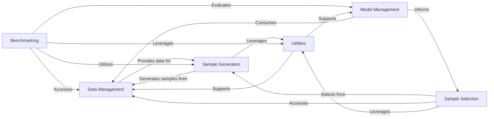

## Component Details

The Data Management & Generation component in Alien is responsible for the complete lifecycle of data within the system. It encompasses functionalities for generating new data samples, managing various dataset types (e.g., arrays, dictionaries, tuples), and ensuring data is correctly formatted for subsequent use in model training and evaluation. This component acts as the central hub for all data-related operations, providing the necessary data structures and manipulation capabilities to support the entire system's data requirements.

### Data Management
This component is responsible for handling and managing various types of datasets within the Alien system. It provides functionalities for creating, transforming, and accessing data, supporting different data structures like arrays, dictionaries, and tuples, and integrating with external libraries like DeepChem.

**Related Classes/Methods**:

- <a href="https://github.com/Sanofi-Public/Alien/blob/master/alien/data/dataset.py#L31-L158" target="_blank" rel="noopener noreferrer">`Alien.alien.data.dataset.Dataset` (31:158)</a>
- `Alien.alien.data.dataset.TeachableDataset` (full file reference)
- `Alien.alien.data.dataset.DictDataset` (full file reference)
- `Alien.alien.data.dataset.TupleDataset` (full file reference)
- `Alien.alien.data.dataset.ShuffledDataset` (full file reference)
- `Alien.alien.data.dataset.ArrayDataset` (full file reference)
- `Alien.alien.data.dataset.NumpyDataset` (full file reference)
- `Alien.alien.data.dataset.TorchDataset` (full file reference)
- `Alien.alien.data.dataset.ObjectDataset` (full file reference)
- `Alien.alien.data.dataset.PandasSeriesDataset` (full file reference)
- `Alien.alien.data.dataset.DataFrameDataset` (full file reference)
- `Alien.alien.data.dataset.find_dataset_class` (full file reference)
- `Alien.alien.data.dataset.find_imported_dataset_class` (full file reference)
- `Alien.alien.data.dataset.compute_bdim` (full file reference)
- <a href="https://github.com/Sanofi-Public/Alien/blob/master/alien/data/deepchem.py#L23-L203" target="_blank" rel="noopener noreferrer">`Alien.alien.data.deepchem.DeepChemDataset` (23:203)</a>

### Sample Generation
This component focuses on generating and managing samples for various tasks, including training and evaluation. It provides different strategies for sample generation, such as from sets, random generation, and transformations, and allows for filtering and manipulation of samples.

**Related Classes/Methods**:

- <a href="https://github.com/Sanofi-Public/Alien/blob/master/alien/sample_generation/generator.py#L5-L20" target="_blank" rel="noopener noreferrer">`Alien.alien.sample_generation.generator.SampleGenerator` (5:20)</a>
- <a href="https://github.com/Sanofi-Public/Alien/blob/master/alien/sample_generation/from_set.py#L7-L100" target="_blank" rel="noopener noreferrer">`Alien.alien.sample_generation.from_set.SetSampleGenerator` (7:100)</a>
- <a href="https://github.com/Sanofi-Public/Alien/blob/master/alien/sample_generation/from_set.py#L103-L114" target="_blank" rel="noopener noreferrer">`Alien.alien.sample_generation.from_set.WrappedGenerator` (103:114)</a>
- <a href="https://github.com/Sanofi-Public/Alien/blob/master/alien/sample_generation/transformation.py#L4-L24" target="_blank" rel="noopener noreferrer">`Alien.alien.sample_generation.transformation.TransformedSampleGenerator` (4:24)</a>
- <a href="https://github.com/Sanofi-Public/Alien/blob/master/alien/sample_generation/filter_generator.py#L8-L33" target="_blank" rel="noopener noreferrer">`Alien.alien.sample_generation.filter_generator.Filter` (8:33)</a>
- <a href="https://github.com/Sanofi-Public/Alien/blob/master/alien/sample_generation/random_generator.py#L32-L123" target="_blank" rel="noopener noreferrer">`Alien.alien.sample_generation.random_generator.RandomSampleGenerator` (32:123)</a>

### Benchmarking
This component is dedicated to evaluating the performance of models and algorithms. It includes functionalities for scoring, setting up oracles for ground truth, and conducting retrospective analyses to assess model behavior over time.

**Related Classes/Methods**:

- `Alien.alien.benchmarks.metrics.Score` (full file reference)
- <a href="https://github.com/Sanofi-Public/Alien/blob/master/alien/benchmarks/oracle.py#L21-L29" target="_blank" rel="noopener noreferrer">`Alien.alien.benchmarks.oracle.SetOracle` (21:29)</a>
- <a href="https://github.com/Sanofi-Public/Alien/blob/master/alien/benchmarks/retrospective.py#L210-L337" target="_blank" rel="noopener noreferrer">`Alien.alien.benchmarks.retrospective._run_retro_iter` (210:337)</a>
- <a href="https://github.com/Sanofi-Public/Alien/blob/master/alien/benchmarks/retrospective.py#L384-L399" target="_blank" rel="noopener noreferrer">`Alien.alien.benchmarks.retrospective._get_train_valid` (384:399)</a>
- <a href="https://github.com/Sanofi-Public/Alien/blob/master/alien/benchmarks/retrospective.py#L402-L421" target="_blank" rel="noopener noreferrer">`Alien.alien.benchmarks.retrospective._get_train_test` (402:421)</a>
- <a href="https://github.com/Sanofi-Public/Alien/blob/master/alien/benchmarks/retrospective.py#L424-L436" target="_blank" rel="noopener noreferrer">`Alien.alien.benchmarks.retrospective._data_init` (424:436)</a>

### Model Management
This component provides an interface for defining, training, and managing machine learning models. It supports integration with different deep learning frameworks like DeepChem and PyTorch, facilitating model fitting and data loading for training and validation.

**Related Classes/Methods**:

- <a href="https://github.com/Sanofi-Public/Alien/blob/master/alien/models/models.py#L136-L483" target="_blank" rel="noopener noreferrer">`Alien.alien.models.models.Model` (136:483)</a>
- `Alien.alien.models.deepchem.DeepChemKerasModel` (full file reference)
- <a href="https://github.com/Sanofi-Public/Alien/blob/master/alien/models/pytorch/lightning.py#L72-L85" target="_blank" rel="noopener noreferrer">`Alien.alien.models.pytorch.lightning.get_dataloader` (72:85)</a>
- `Alien.alien.models.cat_boost` (full file reference)
- `Alien.alien.models.keras` (full file reference)
- `Alien.alien.models.laplace` (full file reference)
- `Alien.alien.models.lightgbm` (full file reference)
- `Alien.alien.models.linear` (full file reference)
- `Alien.alien.models.mc_dropout` (full file reference)
- `Alien.alien.models.old_api` (full file reference)
- `Alien.alien.models.pytorch` (full file reference)
- `Alien.alien.models.ridge` (full file reference)
- `Alien.alien.models.sklearn` (full file reference)
- `Alien.alien.models.utils` (full file reference)

### Utilities
This component provides a collection of general-purpose utility functions that support various operations across the Alien system. These functions include data manipulation like concatenation and joining, and other common helper functionalities. It also includes lower-level numerical bindings.

**Related Classes/Methods**:

- <a href="https://github.com/Sanofi-Public/Alien/blob/master/alien/utils.py#L478-L504" target="_blank" rel="noopener noreferrer">`Alien.alien.utils.concatenate` (478:504)</a>
- <a href="https://github.com/Sanofi-Public/Alien/blob/master/alien/utils.py#L507-L534" target="_blank" rel="noopener noreferrer">`Alien.alien.utils.join` (507:534)</a>
- <a href="https://github.com/Sanofi-Public/Alien/blob/master/alien/utils.py#L219-L224" target="_blank" rel="noopener noreferrer">`Alien.alien.utils.ufunc.wrapped_f` (219:224)</a>
- `Alien.alien.tumpy.index` (full file reference)
- `Alien.alien.tumpy.numpy_bindings` (full file reference)
- `Alien.alien.tumpy.torch_bindings` (full file reference)
- `Alien.alien.decorators` (full file reference)
- `Alien.alien.matrices` (full file reference)
- `Alien.alien.stats` (full file reference)

### Sample Selection
This component is responsible for selecting samples based on various strategies, such as active learning, uncertainty, or diversity. It provides different selection algorithms to optimize the sampling process for model training or evaluation.

**Related Classes/Methods**:

- `Alien.alien.selection.selector.Selector` (full file reference)
- `Alien.alien.selection.bait.BaitSelector` (full file reference)
- <a href="https://github.com/Sanofi-Public/Alien/blob/master/alien/selection/covariance.py#L57-L384" target="_blank" rel="noopener noreferrer">`Alien.alien.selection.covariance.CovarianceSelector` (57:384)</a>
- <a href="https://github.com/Sanofi-Public/Alien/blob/master/alien/selection/entropy.py#L14-L180" target="_blank" rel="noopener noreferrer">`Alien.alien.selection.entropy.EntropySelector` (14:180)</a>
- <a href="https://github.com/Sanofi-Public/Alien/blob/master/alien/selection/expected_improvement.py#L77-L122" target="_blank" rel="noopener noreferrer">`Alien.alien.selection.expected_improvement.ExpectedImprovementSelector` (77:122)</a>
- <a href="https://github.com/Sanofi-Public/Alien/blob/master/alien/selection/greedy.py#L6-L10" target="_blank" rel="noopener noreferrer">`Alien.alien.selection.greedy.GreedySelector` (6:10)</a>
- `Alien.alien.selection.kmeans.KMeansSelector` (full file reference)
- <a href="https://github.com/Sanofi-Public/Alien/blob/master/alien/selection/random.py#L6-L16" target="_blank" rel="noopener noreferrer">`Alien.alien.selection.random.RandomSelector` (6:16)</a>
- <a href="https://github.com/Sanofi-Public/Alien/blob/master/alien/selection/thompson.py#L4-L53" target="_blank" rel="noopener noreferrer">`Alien.alien.selection.thompson.ThompsonSelector` (4:53)</a>
- <a href="https://github.com/Sanofi-Public/Alien/blob/master/alien/selection/timestamp.py#L6-L36" target="_blank" rel="noopener noreferrer">`Alien.alien.selection.timestamp.TimestampSelector` (6:36)</a>

### [FAQ](https://github.com/CodeBoarding/GeneratedOnBoardings/tree/main?tab=readme-ov-file#faq)