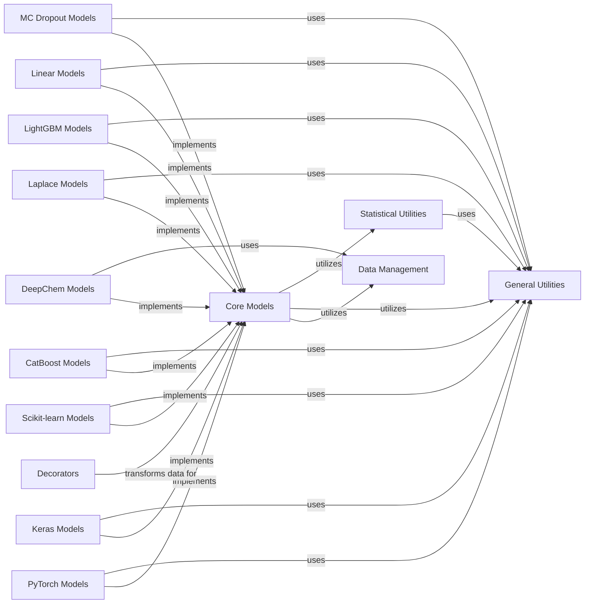

## Component Details

This central component encompasses a wide array of machine learning models, including general Model, Regressor, and Classifier abstractions, as well as specific implementations for various frameworks. It provides functionalities for model initialization, training, prediction (including sample-based and ensemble predictions), and uncertainty estimation. It is the core predictive engine of the project.

### Core Models
This component defines the foundational abstract classes for all machine learning models within the Alien subsystem, including Model, EnsembleModel, Regressor, and Classifier. It establishes common interfaces for model fitting, prediction, and data handling, serving as the base for various specialized model implementations. It also manages model reinitialization and saving mechanisms.

**Related Classes/Methods**:

- <a href="https://github.com/Sanofi-Public/Alien/blob/master/alien/models/models.py#L30-L124" target="_blank" rel="noopener noreferrer">`alien.models.models.EmbeddingMixin` (30:124)</a>
- <a href="https://github.com/Sanofi-Public/Alien/blob/master/alien/models/models.py#L127-L133" target="_blank" rel="noopener noreferrer">`alien.models.models.LastLayerEmbeddingMixin` (127:133)</a>
- <a href="https://github.com/Sanofi-Public/Alien/blob/master/alien/models/models.py#L136-L483" target="_blank" rel="noopener noreferrer">`alien.models.models.Model` (136:483)</a>
- <a href="https://github.com/Sanofi-Public/Alien/blob/master/alien/models/models.py#L486-L521" target="_blank" rel="noopener noreferrer">`alien.models.models.EntropyModel` (486:521)</a>
- <a href="https://github.com/Sanofi-Public/Alien/blob/master/alien/models/models.py#L524-L559" target="_blank" rel="noopener noreferrer">`alien.models.models.EnsembleModel` (524:559)</a>
- <a href="https://github.com/Sanofi-Public/Alien/blob/master/alien/models/models.py#L562-L620" target="_blank" rel="noopener noreferrer">`alien.models.models.Regressor` (562:620)</a>
- <a href="https://github.com/Sanofi-Public/Alien/blob/master/alien/models/models.py#L623-L680" target="_blank" rel="noopener noreferrer">`alien.models.models.CovarianceRegressor` (623:680)</a>
- <a href="https://github.com/Sanofi-Public/Alien/blob/master/alien/models/models.py#L683-L740" target="_blank" rel="noopener noreferrer">`alien.models.models.EnsembleRegressor` (683:740)</a>
- <a href="https://github.com/Sanofi-Public/Alien/blob/master/alien/models/models.py#L743-L760" target="_blank" rel="noopener noreferrer">`alien.models.models.WrappedModel` (743:760)</a>
- <a href="https://github.com/Sanofi-Public/Alien/blob/master/alien/models/models.py#L766-L887" target="_blank" rel="noopener noreferrer">`alien.models.models.Classifier` (766:887)</a>
- <a href="https://github.com/Sanofi-Public/Alien/blob/master/alien/models/models.py#L890-L966" target="_blank" rel="noopener noreferrer">`alien.models.models.EnsembleClassifier` (890:966)</a>
- <a href="https://github.com/Sanofi-Public/Alien/blob/master/alien/models/models.py#L972-L987" target="_blank" rel="noopener noreferrer">`alien.models.models.test_if_pytorch` (972:987)</a>
- <a href="https://github.com/Sanofi-Public/Alien/blob/master/alien/models/models.py#L1009-L1027" target="_blank" rel="noopener noreferrer">`alien.models.models.test_if_keras` (1009:1027)</a>
- <a href="https://github.com/Sanofi-Public/Alien/blob/master/alien/models/models.py#L990-L1006" target="_blank" rel="noopener noreferrer">`alien.models.models.test_if_deepchem` (990:1006)</a>

### Statistical Utilities
This component provides a comprehensive set of functions for statistical computations, crucial for uncertainty quantification and information theory. It includes methods for calculating covariance, variance, standard deviation, various forms of entropy (e.g., joint entropy), and mutual information from both ensembles and covariance matrices. It also defines output types for statistical results.

**Related Classes/Methods**:

- `alien.stats.Output` (full file reference)
- `alien.stats.get_output_type` (full file reference)
- `alien.stats.augment_ensemble` (full file reference)
- `alien.stats.multiply_cov` (full file reference)
- `alien.stats.covariance_from_ensemble` (full file reference)
- `alien.stats.variance_from_ensemble` (full file reference)
- `alien.stats.std_dev_from_ensemble` (full file reference)
- `alien.stats.entropy_from_covariance` (full file reference)
- `alien.stats.joint_entropy_2x2_from_covariance` (full file reference)
- `alien.stats.joint_entropy_from_covariance` (full file reference)
- `alien.stats.joint_entropy_from_ensemble` (full file reference)
- `alien.stats.entropy_from_ensemble` (full file reference)
- `alien.stats.ensemble_from_covariance` (full file reference)
- `alien.stats.entropy` (full file reference)
- `alien.stats.joint_entropy` (full file reference)
- `alien.stats.mutual_info` (full file reference)
- `alien.stats.get_label_type` (full file reference)
- `alien.stats._n_classes` (full file reference)
- `alien.stats.reduce_ensemble` (full file reference)

### Data Management
Responsible for handling and transforming data used by the models. This component includes base dataset classes like Dataset, TeachableDataset, DictDataset, and TupleDataset, providing functionalities for data loading, reshaping, flattening, and axis swapping. It ensures data is in the correct format for model consumption.

**Related Classes/Methods**:

- `alien.data.dataset.Dataset` (full file reference)
- `alien.data.dataset.TeachableDataset` (full file reference)
- `alien.data.dataset.DictDataset` (full file reference)
- `alien.data.dataset.TupleDataset` (full file reference)
- `alien.data.dataset.ShuffledDataset` (full file reference)
- `alien.data.dataset.TeachableWrapperDataset` (full file reference)
- `alien.data.dataset.find_dataset_class` (full file reference)
- `alien.data.dataset.compute_bdim` (full file reference)

### General Utilities
A collection of miscellaneous helper functions that support various operations across the Alien subsystem. These utilities include data manipulation (e.g., softmax, reshape, flatten, join, concatenate), dictionary operations (dict_pop, update_copy), numerical helpers (ranges, diagonal, is_one, sum_except), and seeding mechanisms (shift_seed, seed_all).

**Related Classes/Methods**:

- <a href="https://github.com/Sanofi-Public/Alien/blob/master/alien/utils.py#L99-L100" target="_blank" rel="noopener noreferrer">`alien.utils.dict_pop` (99:100)</a>
- <a href="https://github.com/Sanofi-Public/Alien/blob/master/alien/utils.py#L75-L83" target="_blank" rel="noopener noreferrer">`alien.utils.dict_get` (75:83)</a>
- <a href="https://github.com/Sanofi-Public/Alien/blob/master/alien/utils.py#L259-L285" target="_blank" rel="noopener noreferrer">`alien.utils.new_shape` (259:285)</a>
- <a href="https://github.com/Sanofi-Public/Alien/blob/master/alien/utils.py#L249-L256" target="_blank" rel="noopener noreferrer">`alien.utils.expand_ellipsis` (249:256)</a>
- <a href="https://github.com/Sanofi-Public/Alien/blob/master/alien/utils.py#L326-L338" target="_blank" rel="noopener noreferrer">`alien.utils.ranges` (326:338)</a>
- <a href="https://github.com/Sanofi-Public/Alien/blob/master/alien/utils.py#L437-L440" target="_blank" rel="noopener noreferrer">`alien.utils.flatten` (437:440)</a>
- <a href="https://github.com/Sanofi-Public/Alien/blob/master/alien/utils.py#L417-L434" target="_blank" rel="noopener noreferrer">`alien.utils.reshape` (417:434)</a>
- <a href="https://github.com/Sanofi-Public/Alien/blob/master/alien/utils.py#L478-L504" target="_blank" rel="noopener noreferrer">`alien.utils.concatenate` (478:504)</a>
- <a href="https://github.com/Sanofi-Public/Alien/blob/master/alien/utils.py#L507-L534" target="_blank" rel="noopener noreferrer">`alien.utils.join` (507:534)</a>
- <a href="https://github.com/Sanofi-Public/Alien/blob/master/alien/utils.py#L537-L545" target="_blank" rel="noopener noreferrer">`alien.utils._join_helper_args` (537:545)</a>
- <a href="https://github.com/Sanofi-Public/Alien/blob/master/alien/utils.py#L548-L556" target="_blank" rel="noopener noreferrer">`alien.utils._join_helper_tuple` (548:556)</a>
- <a href="https://github.com/Sanofi-Public/Alien/blob/master/alien/utils.py#L559-L568" target="_blank" rel="noopener noreferrer">`alien.utils._join_helper_numpy` (559:568)</a>
- <a href="https://github.com/Sanofi-Public/Alien/blob/master/alien/utils.py#L571-L576" target="_blank" rel="noopener noreferrer">`alien.utils._join_helper_torch` (571:576)</a>
- <a href="https://github.com/Sanofi-Public/Alien/blob/master/alien/utils.py#L579-L582" target="_blank" rel="noopener noreferrer">`alien.utils._join_helper_tumpy` (579:582)</a>
- <a href="https://github.com/Sanofi-Public/Alien/blob/master/alien/utils.py#L632-L633" target="_blank" rel="noopener noreferrer">`alien.utils.sum_except` (632:633)</a>
- <a href="https://github.com/Sanofi-Public/Alien/blob/master/alien/utils.py#L625-L629" target="_blank" rel="noopener noreferrer">`alien.utils.axes_except` (625:629)</a>
- <a href="https://github.com/Sanofi-Public/Alien/blob/master/alien/utils.py#L667-L678" target="_blank" rel="noopener noreferrer">`alien.utils.convert_output_type` (667:678)</a>
- <a href="https://github.com/Sanofi-Public/Alien/blob/master/alien/utils.py#L681-L700" target="_blank" rel="noopener noreferrer">`alien.utils._convert_output_class` (681:700)</a>
- <a href="https://github.com/Sanofi-Public/Alien/blob/master/alien/utils.py#L703-L709" target="_blank" rel="noopener noreferrer">`alien.utils._convert_output_logit` (703:709)</a>
- <a href="https://github.com/Sanofi-Public/Alien/blob/master/alien/utils.py#L712-L718" target="_blank" rel="noopener noreferrer">`alien.utils._convert_output_prob` (712:718)</a>
- <a href="https://github.com/Sanofi-Public/Alien/blob/master/alien/utils.py#L652-L664" target="_blank" rel="noopener noreferrer">`alien.utils.softmax` (652:664)</a>
- <a href="https://github.com/Sanofi-Public/Alien/blob/master/alien/utils.py#L304-L310" target="_blank" rel="noopener noreferrer">`alien.utils.shift_seed` (304:310)</a>
- <a href="https://github.com/Sanofi-Public/Alien/blob/master/alien/utils.py#L443-L464" target="_blank" rel="noopener noreferrer">`alien.utils.diagonal` (443:464)</a>
- <a href="https://github.com/Sanofi-Public/Alien/blob/master/alien/utils.py#L144-L149" target="_blank" rel="noopener noreferrer">`alien.utils.update_copy` (144:149)</a>
- <a href="https://github.com/Sanofi-Public/Alien/blob/master/alien/utils.py#L28-L35" target="_blank" rel="noopener noreferrer">`alien.utils.as_list` (28:35)</a>
- <a href="https://github.com/Sanofi-Public/Alien/blob/master/alien/utils.py#L609-L610" target="_blank" rel="noopener noreferrer">`alien.utils.is_one` (609:610)</a>
- <a href="https://github.com/Sanofi-Public/Alien/blob/master/alien/utils.py#L12-L25" target="_blank" rel="noopener noreferrer">`alien.utils.seed_all` (12:25)</a>
- <a href="https://github.com/Sanofi-Public/Alien/blob/master/alien/utils.py#L45-L57" target="_blank" rel="noopener noreferrer">`alien.utils.isint` (45:57)</a>
- <a href="https://github.com/Sanofi-Public/Alien/blob/master/alien/utils.py#L123-L141" target="_blank" rel="noopener noreferrer">`alien.utils.Peekable` (123:141)</a>
- <a href="https://github.com/Sanofi-Public/Alien/blob/master/alien/utils.py#L394-L414" target="_blank" rel="noopener noreferrer">`alien.utils.add_slice` (394:414)</a>
- <a href="https://github.com/Sanofi-Public/Alien/blob/master/alien/utils.py#L103-L120" target="_blank" rel="noopener noreferrer">`alien.utils.std_keys` (103:120)</a>

### PyTorch Models
This component provides an integration layer for PyTorch-based models. It extends the core model functionalities with PyTorch-specific features such as Lightning Trainer integration, handling of training limits, and last-layer embedding mechanisms. It also includes utilities for managing dropouts and submodules within PyTorch models.

**Related Classes/Methods**:

- <a href="https://github.com/Sanofi-Public/Alien/blob/master/alien/models/pytorch/training_limits.py#L17-L48" target="_blank" rel="noopener noreferrer">`alien.models.pytorch.training_limits.get_training_limit` (17:48)</a>
- <a href="https://github.com/Sanofi-Public/Alien/blob/master/alien/models/pytorch/training_limits.py#L106-L114" target="_blank" rel="noopener noreferrer">`alien.models.pytorch.training_limits.StdLimit` (106:114)</a>
- <a href="https://github.com/Sanofi-Public/Alien/blob/master/alien/models/pytorch/training_limits.py#L52-L103" target="_blank" rel="noopener noreferrer">`alien.models.pytorch.training_limits.TrainingLimit` (52:103)</a>
- <a href="https://github.com/Sanofi-Public/Alien/blob/master/alien/models/pytorch/lightning.py#L15-L69" target="_blank" rel="noopener noreferrer">`alien.models.pytorch.lightning.DefaultLightningModule` (15:69)</a>
- <a href="https://github.com/Sanofi-Public/Alien/blob/master/alien/models/pytorch/lightning.py#L72-L85" target="_blank" rel="noopener noreferrer">`alien.models.pytorch.lightning.get_dataloader` (72:85)</a>
- <a href="https://github.com/Sanofi-Public/Alien/blob/master/alien/models/pytorch/lightning.py#L88-L155" target="_blank" rel="noopener noreferrer">`alien.models.pytorch.lightning.LightningTrainer` (88:155)</a>
- <a href="https://github.com/Sanofi-Public/Alien/blob/master/alien/models/pytorch/last_layer.py#L46-L169" target="_blank" rel="noopener noreferrer">`alien.models.pytorch.last_layer.LastLayerEmbeddingPytorchMixin` (46:169)</a>
- <a href="https://github.com/Sanofi-Public/Alien/blob/master/alien/models/pytorch/last_layer.py#L41-L43" target="_blank" rel="noopener noreferrer">`alien.models.pytorch.last_layer.is_trainable` (41:43)</a>
- <a href="https://github.com/Sanofi-Public/Alien/blob/master/alien/models/pytorch/pytorch.py#L24-L39" target="_blank" rel="noopener noreferrer">`alien.models.pytorch.pytorch.init_weights` (24:39)</a>
- <a href="https://github.com/Sanofi-Public/Alien/blob/master/alien/models/pytorch/pytorch.py#L42-L51" target="_blank" rel="noopener noreferrer">`alien.models.pytorch.pytorch.init_bias` (42:51)</a>
- <a href="https://github.com/Sanofi-Public/Alien/blob/master/alien/models/pytorch/pytorch.py#L54-L306" target="_blank" rel="noopener noreferrer">`alien.models.pytorch.pytorch.PytorchModel` (54:306)</a>
- <a href="https://github.com/Sanofi-Public/Alien/blob/master/alien/models/pytorch/utils.py#L28-L39" target="_blank" rel="noopener noreferrer">`alien.models.pytorch.utils.dropout_forward` (28:39)</a>
- <a href="https://github.com/Sanofi-Public/Alien/blob/master/alien/models/pytorch/utils.py#L42-L46" target="_blank" rel="noopener noreferrer">`alien.models.pytorch.utils.dropout__getstate__` (42:46)</a>
- <a href="https://github.com/Sanofi-Public/Alien/blob/master/alien/models/pytorch/utils.py#L49-L78" target="_blank" rel="noopener noreferrer">`alien.models.pytorch.utils.submodules` (49:78)</a>

### DeepChem Models
This component facilitates the integration of DeepChem models into the Alien framework. It provides specialized classes for DeepChem regressors and classifiers, handling data preparation for DeepChem, model fitting, and prediction. It also includes mechanisms for early stopping and managing DeepChem-specific dataset types.

**Related Classes/Methods**:

- `alien.models.deepchem.DeepChemModel` (full file reference)
- `alien.models.deepchem.DeepChemRegressor` (full file reference)
- `alien.models.deepchem.DeepChemClassifier` (full file reference)
- `alien.models.deepchem.DeepChemPytorchModel` (full file reference)
- `alien.models.deepchem.DeepChemPytorchClassifier` (full file reference)
- `alien.models.deepchem.DeepChemKerasModel` (full file reference)
- `alien.models.deepchem.DeepChemKerasClassifier` (full file reference)
- `alien.models.deepchem.EarlyStoppingException` (full file reference)
- `alien.models.deepchem.DummyDataset` (full file reference)

### Keras Models
This component provides an interface for Keras-based models, extending the core model functionalities with Keras-specific features. It manages model compilation, weight saving and setting, and includes utilities for modifying dropout layers and handling batch normalization during prediction to ensure consistent behavior.

**Related Classes/Methods**:

- <a href="https://github.com/Sanofi-Public/Alien/blob/master/alien/models/keras/keras.py#L17-L187" target="_blank" rel="noopener noreferrer">`alien.models.keras.keras.KerasModel` (17:187)</a>
- <a href="https://github.com/Sanofi-Public/Alien/blob/master/alien/models/keras/utils.py#L9-L38" target="_blank" rel="noopener noreferrer">`alien.models.keras.utils.dropout_call` (9:38)</a>
- <a href="https://github.com/Sanofi-Public/Alien/blob/master/alien/models/keras/utils.py#L41-L44" target="_blank" rel="noopener noreferrer">`alien.models.keras.utils.humble_batchnorm_call` (41:44)</a>
- <a href="https://github.com/Sanofi-Public/Alien/blob/master/alien/models/keras/utils.py#L64-L95" target="_blank" rel="noopener noreferrer">`alien.models.keras.utils.subobjects` (64:95)</a>
- <a href="https://github.com/Sanofi-Public/Alien/blob/master/alien/models/keras/utils.py#L54-L61" target="_blank" rel="noopener noreferrer">`alien.models.keras.utils.get_mod_layers` (54:61)</a>
- <a href="https://github.com/Sanofi-Public/Alien/blob/master/alien/models/keras/utils.py#L98-L135" target="_blank" rel="noopener noreferrer">`alien.models.keras.utils.modify_dropout` (98:135)</a>
- <a href="https://github.com/Sanofi-Public/Alien/blob/master/alien/models/keras/utils.py#L47-L51" target="_blank" rel="noopener noreferrer">`alien.models.keras.utils.dropout__getstate__` (47:51)</a>

### Scikit-learn Models
This component integrates various Scikit-learn models, including ensemble methods like RandomForest and ExtraTrees, as well as Gradient Boosting and Gaussian Process models. It provides a unified interface for fitting and predicting with these models, handling ensemble-specific prediction logic and random model generation.

**Related Classes/Methods**:

- `alien.models.sklearn.al_kwargs` (full file reference)
- `alien.models.sklearn.SKLearnModel` (full file reference)
- `alien.models.sklearn.SKLearnEnsembleModel` (full file reference)
- `alien.models.sklearn.SKLearnEnsembleClassifier` (full file reference)
- `alien.models.sklearn.RandomForestRegressor` (full file reference)
- `alien.models.sklearn.RandomForestClassifier` (full file reference)
- `alien.models.sklearn.ExtraTreesRegressor` (full file reference)
- `alien.models.sklearn.ExtraTreesClassifier` (full file reference)
- `alien.models.sklearn.GradientBoosting` (full file reference)
- `alien.models.sklearn.GradientBoostingRegressor` (full file reference)
- `alien.models.sklearn.GradientBoostingClassifier` (full file reference)
- `alien.models.sklearn.HistGradientBoostingRegressor` (full file reference)
- `alien.models.sklearn.HistGradientBoostingClassifier` (full file reference)
- `alien.models.sklearn.GaussianProcessModel` (full file reference)
- `alien.models.sklearn.GaussianProcessRegressor` (full file reference)
- `alien.models.sklearn.GaussianProcessClassifier` (full file reference)

### CatBoost Models
This component provides specific implementations for CatBoost models, both regressors and classifiers. It extends the core model functionalities to integrate with the CatBoost library, handling its unique initialization, prediction, and ensemble prediction mechanisms, including the application of softmax for classification outputs.

**Related Classes/Methods**:

- <a href="https://github.com/Sanofi-Public/Alien/blob/master/alien/models/cat_boost.py#L63-L328" target="_blank" rel="noopener noreferrer">`alien.models.cat_boost.CatBoostModel` (63:328)</a>
- <a href="https://github.com/Sanofi-Public/Alien/blob/master/alien/models/cat_boost.py#L349-L409" target="_blank" rel="noopener noreferrer">`alien.models.cat_boost.CatBoostClassifier` (349:409)</a>

### Decorators
This component contains decorators that modify the behavior of functions, primarily for data transformation. The flatten_batch decorator, for instance, is used to flatten batch dimensions of input data before processing, ensuring compatibility with functions that expect a flattened input.

**Related Classes/Methods**:

- <a href="https://github.com/Sanofi-Public/Alien/blob/master/alien/decorators.py#L57-L149" target="_blank" rel="noopener noreferrer">`alien.decorators.flatten_batch` (57:149)</a>

### Laplace Models
This component provides implementations for Laplace Approximation models, specifically regressors, which are used for uncertainty quantification. It extends the core model functionalities to integrate with Laplace approximation techniques.

**Related Classes/Methods**:

- <a href="https://github.com/Sanofi-Public/Alien/blob/master/alien/models/laplace.py#L14-L43" target="_blank" rel="noopener noreferrer">`alien.models.laplace.LaplaceApproxRegressor` (14:43)</a>
- <a href="https://github.com/Sanofi-Public/Alien/blob/master/alien/models/laplace.py#L46-L70" target="_blank" rel="noopener noreferrer">`alien.models.laplace.LinearizableLaplaceRegressor` (46:70)</a>

### LightGBM Models
This component provides specific implementations for LightGBM models, including regressors and classifiers. It extends the core model functionalities to integrate with the LightGBM library, handling its unique initialization, prediction, and ensemble prediction mechanisms.

**Related Classes/Methods**:

- <a href="https://github.com/Sanofi-Public/Alien/blob/master/alien/models/lightgbm.py#L194-L270" target="_blank" rel="noopener noreferrer">`alien.models.lightgbm.LightGBMClassifier` (194:270)</a>
- <a href="https://github.com/Sanofi-Public/Alien/blob/master/alien/models/lightgbm.py#L178-L191" target="_blank" rel="noopener noreferrer">`alien.models.lightgbm.LightGBMRegressor` (178:191)</a>

### Linear Models
This component provides implementations for various linear models, including standard linear regressors and Bayesian Ridge regressors. It also includes linearizable regressors that can be used with last-layer embedding techniques.

**Related Classes/Methods**:

- <a href="https://github.com/Sanofi-Public/Alien/blob/master/alien/models/linear.py#L73-L78" target="_blank" rel="noopener noreferrer">`alien.models.linear.LinearRegressor` (73:78)</a>
- <a href="https://github.com/Sanofi-Public/Alien/blob/master/alien/models/linear.py#L51-L70" target="_blank" rel="noopener noreferrer">`alien.models.linear.LastLayerLinearizableRegressor` (51:70)</a>
- <a href="https://github.com/Sanofi-Public/Alien/blob/master/alien/models/linear.py#L11-L48" target="_blank" rel="noopener noreferrer">`alien.models.linear.LinearizableRegressor` (11:48)</a>
- `alien.models.ridge.BayesianRidgeRegressor` (full file reference)

### MC Dropout Models
This component provides implementations for Monte Carlo Dropout models, including general models, regressors, and classifiers. It extends the core model functionalities to incorporate MC Dropout for uncertainty estimation.

**Related Classes/Methods**:

- <a href="https://github.com/Sanofi-Public/Alien/blob/master/alien/models/mc_dropout.py#L101-L102" target="_blank" rel="noopener noreferrer">`alien.models.mc_dropout.MCDropoutClassifier` (101:102)</a>
- <a href="https://github.com/Sanofi-Public/Alien/blob/master/alien/models/mc_dropout.py#L13-L94" target="_blank" rel="noopener noreferrer">`alien.models.mc_dropout.MCDropoutModel` (13:94)</a>
- <a href="https://github.com/Sanofi-Public/Alien/blob/master/alien/models/mc_dropout.py#L97-L98" target="_blank" rel="noopener noreferrer">`alien.models.mc_dropout.MCDropoutRegressor` (97:98)</a>

### [FAQ](https://github.com/CodeBoarding/GeneratedOnBoardings/tree/main?tab=readme-ov-file#faq)