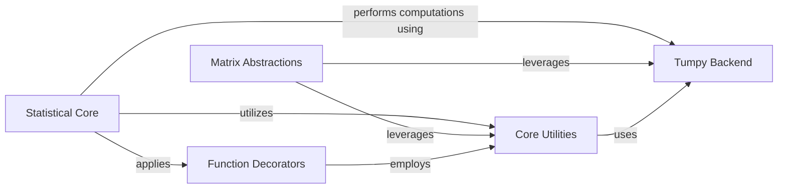

## Component Details

The `Statistical & Numerical Operations` subsystem provides a robust framework for advanced mathematical and statistical computations, abstracting underlying numerical backends like NumPy and PyTorch. It is structured into several key components: `Statistical Core` handles a wide array of statistical calculations, including covariance, entropy, and similarity metrics; `Matrix Abstractions` offers foundational data structures for lazy and ensemble matrix operations; `Tumpy Backend` provides a unified NumPy-like interface over different numerical libraries; `Core Utilities` supplies essential helper functions for data manipulation and type handling; and `Function Decorators` ensures consistent data preparation for statistical functions. This architecture enables efficient and flexible numerical processing, supporting complex data analysis and machine learning tasks within the project.

### Statistical Core
This component provides a wide range of statistical functions, including calculations for covariance, variance, standard deviation, various entropy measures (entropy, joint entropy, mutual information), and similarity metrics. It also handles ensemble augmentation and reduction.

**Related Classes/Methods**:

- <a href="https://github.com/Sanofi-Public/Alien/blob/master/alien/stats.py#L26-L29" target="_blank" rel="noopener noreferrer">`Alien.alien.stats.get_output_type` (26:29)</a>
- <a href="https://github.com/Sanofi-Public/Alien/blob/master/alien/stats.py#L33-L47" target="_blank" rel="noopener noreferrer">`Alien.alien.stats.multiply_cov` (33:47)</a>
- <a href="https://github.com/Sanofi-Public/Alien/blob/master/alien/stats.py#L51-L72" target="_blank" rel="noopener noreferrer">`Alien.alien.stats.augment_ensemble` (51:72)</a>
- <a href="https://github.com/Sanofi-Public/Alien/blob/master/alien/stats.py#L86-L188" target="_blank" rel="noopener noreferrer">`Alien.alien.stats.covariance_from_ensemble` (86:188)</a>
- <a href="https://github.com/Sanofi-Public/Alien/blob/master/alien/stats.py#L191-L226" target="_blank" rel="noopener noreferrer">`Alien.alien.stats.variance_from_ensemble` (191:226)</a>
- <a href="https://github.com/Sanofi-Public/Alien/blob/master/alien/stats.py#L229-L296" target="_blank" rel="noopener noreferrer">`Alien.alien.stats.std_dev_from_ensemble` (229:296)</a>
- <a href="https://github.com/Sanofi-Public/Alien/blob/master/alien/stats.py#L302-L312" target="_blank" rel="noopener noreferrer">`Alien.alien.stats.entropy_from_covariance` (302:312)</a>
- <a href="https://github.com/Sanofi-Public/Alien/blob/master/alien/stats.py#L315-L335" target="_blank" rel="noopener noreferrer">`Alien.alien.stats.joint_entropy_2x2_from_covariance` (315:335)</a>
- <a href="https://github.com/Sanofi-Public/Alien/blob/master/alien/stats.py#L338-L563" target="_blank" rel="noopener noreferrer">`Alien.alien.stats.joint_entropy_from_covariance` (338:563)</a>
- <a href="https://github.com/Sanofi-Public/Alien/blob/master/alien/stats.py#L569-L608" target="_blank" rel="noopener noreferrer">`Alien.alien.stats.joint_entropy_from_ensemble` (569:608)</a>
- <a href="https://github.com/Sanofi-Public/Alien/blob/master/alien/stats.py#L611-L613" target="_blank" rel="noopener noreferrer">`Alien.alien.stats.entropy_from_ensemble` (611:613)</a>
- <a href="https://github.com/Sanofi-Public/Alien/blob/master/alien/stats.py#L619-L637" target="_blank" rel="noopener noreferrer">`Alien.alien.stats.reduce_ensemble` (619:637)</a>
- <a href="https://github.com/Sanofi-Public/Alien/blob/master/alien/stats.py#L704-L718" target="_blank" rel="noopener noreferrer">`Alien.alien.stats.ensemble_from_covariance` (704:718)</a>
- <a href="https://github.com/Sanofi-Public/Alien/blob/master/alien/stats.py#L723-L743" target="_blank" rel="noopener noreferrer">`Alien.alien.stats.similarity_gaussian` (723:743)</a>
- <a href="https://github.com/Sanofi-Public/Alien/blob/master/alien/stats.py#L748-L754" target="_blank" rel="noopener noreferrer">`Alien.alien.stats.similarity_exp` (748:754)</a>
- <a href="https://github.com/Sanofi-Public/Alien/blob/master/alien/stats.py#L759-L766" target="_blank" rel="noopener noreferrer">`Alien.alien.stats.similarity_cosine` (759:766)</a>
- <a href="https://github.com/Sanofi-Public/Alien/blob/master/alien/stats.py#L782-L813" target="_blank" rel="noopener noreferrer">`Alien.alien.stats.entropy` (782:813)</a>
- <a href="https://github.com/Sanofi-Public/Alien/blob/master/alien/stats.py#L816-L952" target="_blank" rel="noopener noreferrer">`Alien.alien.stats.joint_entropy` (816:952)</a>
- <a href="https://github.com/Sanofi-Public/Alien/blob/master/alien/stats.py#L955-L959" target="_blank" rel="noopener noreferrer">`Alien.alien.stats.mutual_info` (955:959)</a>
- <a href="https://github.com/Sanofi-Public/Alien/blob/master/alien/stats.py#L962-L970" target="_blank" rel="noopener noreferrer">`Alien.alien.stats.approx_batch_entropy` (962:970)</a>
- <a href="https://github.com/Sanofi-Public/Alien/blob/master/alien/stats.py#L973-L979" target="_blank" rel="noopener noreferrer">`Alien.alien.stats.get_label_type` (973:979)</a>
- <a href="https://github.com/Sanofi-Public/Alien/blob/master/alien/stats.py#L1006-L1009" target="_blank" rel="noopener noreferrer">`Alien.alien.stats.group_edges` (1006:1009)</a>
- <a href="https://github.com/Sanofi-Public/Alien/blob/master/alien/stats.py#L993-L1003" target="_blank" rel="noopener noreferrer">`Alien.alien.stats.group_sizes` (993:1003)</a>
- <a href="https://github.com/Sanofi-Public/Alien/blob/master/alien/stats.py#L982-L987" target="_blank" rel="noopener noreferrer">`Alien.alien.stats._n_classes` (982:987)</a>
- <a href="https://github.com/Sanofi-Public/Alien/blob/master/alien/stats.py#L20-L23" target="_blank" rel="noopener noreferrer">`Alien.alien.stats.Output` (20:23)</a>

### Matrix Abstractions
This component defines abstract matrix classes, specifically LazyMatrix and EnsembleMatrix, which enable deferred computation and efficient handling of matrix operations. It provides a foundational layer for numerical data structures.

**Related Classes/Methods**:

- <a href="https://github.com/Sanofi-Public/Alien/blob/master/alien/matrices.py#L9-L35" target="_blank" rel="noopener noreferrer">`Alien.alien.matrices.LazyMatrix.__init__` (9:35)</a>
- <a href="https://github.com/Sanofi-Public/Alien/blob/master/alien/matrices.py#L37-L108" target="_blank" rel="noopener noreferrer">`Alien.alien.matrices.LazyMatrix.__getitem__` (37:108)</a>
- <a href="https://github.com/Sanofi-Public/Alien/blob/master/alien/matrices.py#L110-L127" target="_blank" rel="noopener noreferrer">`Alien.alien.matrices.LazyMatrix._early_return` (110:127)</a>
- <a href="https://github.com/Sanofi-Public/Alien/blob/master/alien/matrices.py#L129-L130" target="_blank" rel="noopener noreferrer">`Alien.alien.matrices.LazyMatrix.compute` (129:130)</a>
- <a href="https://github.com/Sanofi-Public/Alien/blob/master/alien/matrices.py#L132-L133" target="_blank" rel="noopener noreferrer">`Alien.alien.matrices.LazyMatrix.compute_diagonal` (132:133)</a>
- <a href="https://github.com/Sanofi-Public/Alien/blob/master/alien/matrices.py#L138-L143" target="_blank" rel="noopener noreferrer">`Alien.alien.matrices.LazyMatrix.diagonal` (138:143)</a>
- <a href="https://github.com/Sanofi-Public/Alien/blob/master/alien/matrices.py#L145-L147" target="_blank" rel="noopener noreferrer">`Alien.alien.matrices.LazyMatrix.realise` (145:147)</a>
- <a href="https://github.com/Sanofi-Public/Alien/blob/master/alien/matrices.py#L151-L155" target="_blank" rel="noopener noreferrer">`Alien.alien.matrices.LazyMatrixCopy.__init__` (151:155)</a>
- <a href="https://github.com/Sanofi-Public/Alien/blob/master/alien/matrices.py#L162-L174" target="_blank" rel="noopener noreferrer">`Alien.alien.matrices.EnsembleMatrix.__init__` (162:174)</a>

### Tumpy Backend
This component provides a comprehensive NumPy-like interface built on top of PyTorch and other potential backends. It includes a wide array of mathematical, array manipulation, and random number generation functions, allowing for seamless integration of numerical operations within a deep learning environment.

**Related Classes/Methods**:

- <a href="https://github.com/Sanofi-Public/Alien/blob/master/alien/tumpy/numpy_bindings.py#L56-L57" target="_blank" rel="noopener noreferrer">`Alien.alien.tumpy.numpy_bindings.Numpy.is_integer` (56:57)</a>
- <a href="https://github.com/Sanofi-Public/Alien/blob/master/alien/tumpy/numpy_bindings.py#L42-L54" target="_blank" rel="noopener noreferrer">`Alien.alien.tumpy.numpy_bindings.Numpy.is_float` (42:54)</a>
- <a href="https://github.com/Sanofi-Public/Alien/blob/master/alien/tumpy/torch_bindings.py#L45-L1437" target="_blank" rel="noopener noreferrer">`Alien.alien.tumpy.torch_bindings.Tumpy` (45:1437)</a>
- <a href="https://github.com/Sanofi-Public/Alien/blob/master/alien/tumpy/torch_bindings.py#L1447-L1448" target="_blank" rel="noopener noreferrer">`Alien.alien.tumpy.torch_bindings.TumpyTensor.__repr__` (1447:1448)</a>
- <a href="https://github.com/Sanofi-Public/Alien/blob/master/alien/tumpy/torch_bindings.py#L1450-L1451" target="_blank" rel="noopener noreferrer">`Alien.alien.tumpy.torch_bindings.TumpyTensor.__str__` (1450:1451)</a>
- <a href="https://github.com/Sanofi-Public/Alien/blob/master/alien/tumpy/torch_bindings.py#L1454-L1467" target="_blank" rel="noopener noreferrer">`Alien.alien.tumpy.torch_bindings.TumpyTensor.__torch_function__` (1454:1467)</a>
- <a href="https://github.com/Sanofi-Public/Alien/blob/master/alien/tumpy/torch_bindings.py#L1474-L1477" target="_blank" rel="noopener noreferrer">`Alien.alien.tumpy.torch_bindings.TumpyTensor.all` (1474:1477)</a>
- <a href="https://github.com/Sanofi-Public/Alien/blob/master/alien/tumpy/torch_bindings.py#L1479-L1482" target="_blank" rel="noopener noreferrer">`Alien.alien.tumpy.torch_bindings.TumpyTensor.any` (1479:1482)</a>
- <a href="https://github.com/Sanofi-Public/Alien/blob/master/alien/tumpy/torch_bindings.py#L1484-L1485" target="_blank" rel="noopener noreferrer">`Alien.alien.tumpy.torch_bindings.TumpyTensor.astype` (1484:1485)</a>
- <a href="https://github.com/Sanofi-Public/Alien/blob/master/alien/tumpy/torch_bindings.py#L1487-L1488" target="_blank" rel="noopener noreferrer">`Alien.alien.tumpy.torch_bindings.TumpyTensor.argmax` (1487:1488)</a>
- <a href="https://github.com/Sanofi-Public/Alien/blob/master/alien/tumpy/torch_bindings.py#L1490-L1491" target="_blank" rel="noopener noreferrer">`Alien.alien.tumpy.torch_bindings.TumpyTensor.argmin` (1490:1491)</a>
- <a href="https://github.com/Sanofi-Public/Alien/blob/master/alien/tumpy/torch_bindings.py#L1496-L1497" target="_blank" rel="noopener noreferrer">`Alien.alien.tumpy.torch_bindings.TumpyTensor.clip` (1496:1497)</a>
- <a href="https://github.com/Sanofi-Public/Alien/blob/master/alien/tumpy/torch_bindings.py#L1499-L1500" target="_blank" rel="noopener noreferrer">`Alien.alien.tumpy.torch_bindings.TumpyTensor.conj` (1499:1500)</a>
- <a href="https://github.com/Sanofi-Public/Alien/blob/master/alien/tumpy/torch_bindings.py#L1502-L1503" target="_blank" rel="noopener noreferrer">`Alien.alien.tumpy.torch_bindings.TumpyTensor.copy` (1502:1503)</a>
- <a href="https://github.com/Sanofi-Public/Alien/blob/master/alien/tumpy/torch_bindings.py#L1505-L1506" target="_blank" rel="noopener noreferrer">`Alien.alien.tumpy.torch_bindings.TumpyTensor.cumprod` (1505:1506)</a>
- <a href="https://github.com/Sanofi-Public/Alien/blob/master/alien/tumpy/torch_bindings.py#L1508-L1509" target="_blank" rel="noopener noreferrer">`Alien.alien.tumpy.torch_bindings.TumpyTensor.cumsum` (1508:1509)</a>
- <a href="https://github.com/Sanofi-Public/Alien/blob/master/alien/tumpy/torch_bindings.py#L1511-L1512" target="_blank" rel="noopener noreferrer">`Alien.alien.tumpy.torch_bindings.TumpyTensor.diagonal` (1511:1512)</a>
- <a href="https://github.com/Sanofi-Public/Alien/blob/master/alien/tumpy/torch_bindings.py#L1516-L1517" target="_blank" rel="noopener noreferrer">`Alien.alien.tumpy.torch_bindings.TumpyTensor.flatten` (1516:1517)</a>
- <a href="https://github.com/Sanofi-Public/Alien/blob/master/alien/tumpy/torch_bindings.py#L1522-L1524" target="_blank" rel="noopener noreferrer">`Alien.alien.tumpy.torch_bindings.TumpyTensor.max` (1522:1524)</a>
- <a href="https://github.com/Sanofi-Public/Alien/blob/master/alien/tumpy/torch_bindings.py#L1526-L1529" target="_blank" rel="noopener noreferrer">`Alien.alien.tumpy.torch_bindings.TumpyTensor.mean` (1526:1529)</a>
- <a href="https://github.com/Sanofi-Public/Alien/blob/master/alien/tumpy/torch_bindings.py#L1531-L1532" target="_blank" rel="noopener noreferrer">`Alien.alien.tumpy.torch_bindings.TumpyTensor.min` (1531:1532)</a>
- <a href="https://github.com/Sanofi-Public/Alien/blob/master/alien/tumpy/torch_bindings.py#L1540-L1543" target="_blank" rel="noopener noreferrer">`Alien.alien.tumpy.torch_bindings.TumpyTensor.prod` (1540:1543)</a>
- <a href="https://github.com/Sanofi-Public/Alien/blob/master/alien/tumpy/torch_bindings.py#L1547-L1548" target="_blank" rel="noopener noreferrer">`Alien.alien.tumpy.torch_bindings.TumpyTensor.ravel` (1547:1548)</a>
- <a href="https://github.com/Sanofi-Public/Alien/blob/master/alien/tumpy/torch_bindings.py#L1550-L1551" target="_blank" rel="noopener noreferrer">`Alien.alien.tumpy.torch_bindings.TumpyTensor.repeat` (1550:1551)</a>
- <a href="https://github.com/Sanofi-Public/Alien/blob/master/alien/tumpy/torch_bindings.py#L1553-L1554" target="_blank" rel="noopener noreferrer">`Alien.alien.tumpy.torch_bindings.TumpyTensor.reshape` (1553:1554)</a>
- <a href="https://github.com/Sanofi-Public/Alien/blob/master/alien/tumpy/torch_bindings.py#L1556-L1557" target="_blank" rel="noopener noreferrer">`Alien.alien.tumpy.torch_bindings.TumpyTensor.resize` (1556:1557)</a>
- <a href="https://github.com/Sanofi-Public/Alien/blob/master/alien/tumpy/torch_bindings.py#L1559-L1560" target="_blank" rel="noopener noreferrer">`Alien.alien.tumpy.torch_bindings.TumpyTensor.round` (1559:1560)</a>
- <a href="https://github.com/Sanofi-Public/Alien/blob/master/alien/tumpy/torch_bindings.py#L1565-L1566" target="_blank" rel="noopener noreferrer">`Alien.alien.tumpy.torch_bindings.TumpyTensor.squeeze` (1565:1566)</a>
- <a href="https://github.com/Sanofi-Public/Alien/blob/master/alien/tumpy/torch_bindings.py#L1568-L1569" target="_blank" rel="noopener noreferrer">`Alien.alien.tumpy.torch_bindings.TumpyTensor.std` (1568:1569)</a>
- <a href="https://github.com/Sanofi-Public/Alien/blob/master/alien/tumpy/torch_bindings.py#L1571-L1573" target="_blank" rel="noopener noreferrer">`Alien.alien.tumpy.torch_bindings.TumpyTensor.sum` (1571:1573)</a>
- <a href="https://github.com/Sanofi-Public/Alien/blob/master/alien/tumpy/torch_bindings.py#L1575-L1576" target="_blank" rel="noopener noreferrer">`Alien.alien.tumpy.torch_bindings.TumpyTensor.swapaxes` (1575:1576)</a>
- <a href="https://github.com/Sanofi-Public/Alien/blob/master/alien/tumpy/torch_bindings.py#L1578-L1579" target="_blank" rel="noopener noreferrer">`Alien.alien.tumpy.torch_bindings.TumpyTensor.take` (1578:1579)</a>
- <a href="https://github.com/Sanofi-Public/Alien/blob/master/alien/tumpy/torch_bindings.py#L1584-L1586" target="_blank" rel="noopener noreferrer">`Alien.alien.tumpy.torch_bindings.TumpyTensor.trace` (1584:1586)</a>
- <a href="https://github.com/Sanofi-Public/Alien/blob/master/alien/tumpy/torch_bindings.py#L1588-L1591" target="_blank" rel="noopener noreferrer">`Alien.alien.tumpy.torch_bindings.TumpyTensor.transpose` (1588:1591)</a>
- <a href="https://github.com/Sanofi-Public/Alien/blob/master/alien/tumpy/torch_bindings.py#L1593-L1598" target="_blank" rel="noopener noreferrer">`Alien.alien.tumpy.torch_bindings.TumpyTensor.var_v2` (1593:1598)</a>
- <a href="https://github.com/Sanofi-Public/Alien/blob/master/alien/tumpy/torch_bindings.py#L1600-L1605" target="_blank" rel="noopener noreferrer">`Alien.alien.tumpy.torch_bindings.TumpyTensor.var_v1` (1600:1605)</a>
- <a href="https://github.com/Sanofi-Public/Alien/blob/master/alien/tumpy/torch_bindings.py#L1607-L1610" target="_blank" rel="noopener noreferrer">`Alien.alien.tumpy.torch_bindings.TumpyTensor.view` (1607:1610)</a>
- <a href="https://github.com/Sanofi-Public/Alien/blob/master/alien/tumpy/torch_bindings.py#L1639-L1655" target="_blank" rel="noopener noreferrer">`Alien.alien.tumpy.torch_bindings.RNG.integers` (1639:1655)</a>
- <a href="https://github.com/Sanofi-Public/Alien/blob/master/alien/tumpy/torch_bindings.py#L1657-L1664" target="_blank" rel="noopener noreferrer">`Alien.alien.tumpy.torch_bindings.RNG.random` (1657:1664)</a>
- <a href="https://github.com/Sanofi-Public/Alien/blob/master/alien/tumpy/torch_bindings.py#L1666-L1674" target="_blank" rel="noopener noreferrer">`Alien.alien.tumpy.torch_bindings.RNG.normal` (1666:1674)</a>
- <a href="https://github.com/Sanofi-Public/Alien/blob/master/alien/tumpy/torch_bindings.py#L1676-L1677" target="_blank" rel="noopener noreferrer">`Alien.alien.tumpy.torch_bindings.RNG.uniform` (1676:1677)</a>
- <a href="https://github.com/Sanofi-Public/Alien/blob/master/alien/tumpy/torch_bindings.py#L1679-L1685" target="_blank" rel="noopener noreferrer">`Alien.alien.tumpy.torch_bindings.RNG.multivariate_normal` (1679:1685)</a>
- <a href="https://github.com/Sanofi-Public/Alien/blob/master/alien/tumpy/torch_bindings.py#L1687-L1704" target="_blank" rel="noopener noreferrer">`Alien.alien.tumpy.torch_bindings.RNG.choice` (1687:1704)</a>
- <a href="https://github.com/Sanofi-Public/Alien/blob/master/alien/tumpy/torch_bindings.py#L1709-L1713" target="_blank" rel="noopener noreferrer">`Alien.alien.tumpy.torch_bindings.RNG.permutation` (1709:1713)</a>
- <a href="https://github.com/Sanofi-Public/Alien/blob/master/alien/tumpy/torch_bindings.py#L1607-L1609" target="_blank" rel="noopener noreferrer">`Alien.alien.tumpy.torch_bindings.TorchNamespace.__getattr__` (1607:1609)</a>
- `Alien.alien.tumpy.fill_torch_namespace` (1612:1614)
- `Alien.alien.tumpy.get_torch_dict` (1617:1620)
- `Alien.alien.tumpy.set_backend` (1623:1625)

### Core Utilities
This component encapsulates fundamental utility functions that support various operations across the Alien subsystem. These utilities include data manipulation (flattening, reshaping, concatenation), type checking, and numerical range generation.

**Related Classes/Methods**:

- <a href="https://github.com/Sanofi-Public/Alien/blob/master/alien/utils.py#L326-L338" target="_blank" rel="noopener noreferrer">`Alien.alien.utils.ranges` (326:338)</a>
- <a href="https://github.com/Sanofi-Public/Alien/blob/master/alien/utils.py#L123-L141" target="_blank" rel="noopener noreferrer">`Alien.alien.utils.Peekable` (123:141)</a>
- <a href="https://github.com/Sanofi-Public/Alien/blob/master/alien/utils.py#L443-L464" target="_blank" rel="noopener noreferrer">`Alien.alien.utils.diagonal` (443:464)</a>
- <a href="https://github.com/Sanofi-Public/Alien/blob/master/alien/utils.py#L259-L285" target="_blank" rel="noopener noreferrer">`Alien.alien.utils.new_shape` (259:285)</a>
- <a href="https://github.com/Sanofi-Public/Alien/blob/master/alien/utils.py#L249-L256" target="_blank" rel="noopener noreferrer">`Alien.alien.utils.expand_ellipsis` (249:256)</a>
- <a href="https://github.com/Sanofi-Public/Alien/blob/master/alien/utils.py#L353-L366" target="_blank" rel="noopener noreferrer">`Alien.alien.utils.chunks.__init__` (353:366)</a>
- <a href="https://github.com/Sanofi-Public/Alien/blob/master/alien/utils.py#L371-L373" target="_blank" rel="noopener noreferrer">`Alien.alien.utils.chunks.__iter__` (371:373)</a>
- <a href="https://github.com/Sanofi-Public/Alien/blob/master/alien/utils.py#L437-L440" target="_blank" rel="noopener noreferrer">`Alien.alien.utils.flatten` (437:440)</a>
- <a href="https://github.com/Sanofi-Public/Alien/blob/master/alien/utils.py#L417-L434" target="_blank" rel="noopener noreferrer">`Alien.alien.utils.reshape` (417:434)</a>
- <a href="https://github.com/Sanofi-Public/Alien/blob/master/alien/utils.py#L478-L504" target="_blank" rel="noopener noreferrer">`Alien.alien.utils.concatenate` (478:504)</a>
- <a href="https://github.com/Sanofi-Public/Alien/blob/master/alien/utils.py#L625-L629" target="_blank" rel="noopener noreferrer">`Alien.alien.utils.axes_except` (625:629)</a>
- <a href="https://github.com/Sanofi-Public/Alien/blob/master/alien/utils.py#L632-L633" target="_blank" rel="noopener noreferrer">`Alien.alien.utils.sum_except` (632:633)</a>
- <a href="https://github.com/Sanofi-Public/Alien/blob/master/alien/utils.py#L667-L678" target="_blank" rel="noopener noreferrer">`Alien.alien.utils.convert_output_type` (667:678)</a>
- <a href="https://github.com/Sanofi-Public/Alien/blob/master/alien/utils.py#L681-L700" target="_blank" rel="noopener noreferrer">`Alien.alien.utils._convert_output_class` (681:700)</a>
- <a href="https://github.com/Sanofi-Public/Alien/blob/master/alien/utils.py#L703-L709" target="_blank" rel="noopener noreferrer">`Alien.alien.utils._convert_output_logit` (703:709)</a>
- <a href="https://github.com/Sanofi-Public/Alien/blob/master/alien/utils.py#L712-L718" target="_blank" rel="noopener noreferrer">`Alien.alien.utils._convert_output_prob` (712:718)</a>
- <a href="https://github.com/Sanofi-Public/Alien/blob/master/alien/utils.py#L652-L664" target="_blank" rel="noopener noreferrer">`Alien.alien.utils.softmax` (652:664)</a>
- <a href="https://github.com/Sanofi-Public/Alien/blob/master/alien/utils.py#L45-L57" target="_blank" rel="noopener noreferrer">`Alien.alien.utils.isint` (45:57)</a>

### Function Decorators
This component provides decorators that modify the behavior of functions, primarily for data preparation and argument normalization. These decorators ensure consistent input formats for statistical and other processing functions.

**Related Classes/Methods**:

- <a href="https://github.com/Sanofi-Public/Alien/blob/master/alien/decorators.py#L57-L149" target="_blank" rel="noopener noreferrer">`Alien.alien.decorators.flatten_batch` (57:149)</a>
- <a href="https://github.com/Sanofi-Public/Alien/blob/master/alien/decorators.py#L196-L248" target="_blank" rel="noopener noreferrer">`Alien.alien.decorators.normalize_args` (196:248)</a>
- <a href="https://github.com/Sanofi-Public/Alien/blob/master/alien/decorators.py#L251-L253" target="_blank" rel="noopener noreferrer">`Alien.alien.decorators._check_is_method` (251:253)</a>
- <a href="https://github.com/Sanofi-Public/Alien/blob/master/alien/decorators.py#L256-L261" target="_blank" rel="noopener noreferrer">`Alien.alien.decorators._get_arg_name` (256:261)</a>
- <a href="https://github.com/Sanofi-Public/Alien/blob/master/alien/decorators.py#L264-L269" target="_blank" rel="noopener noreferrer">`Alien.alien.decorators._get_batch_dim` (264:269)</a>
- <a href="https://github.com/Sanofi-Public/Alien/blob/master/alien/decorators.py#L167-L173" target="_blank" rel="noopener noreferrer">`Alien.alien.decorators.do_normalize` (167:173)</a>
- <a href="https://github.com/Sanofi-Public/Alien/blob/master/alien/decorators.py#L176-L192" target="_blank" rel="noopener noreferrer">`Alien.alien.decorators.sig_append` (176:192)</a>

### [FAQ](https://github.com/CodeBoarding/GeneratedOnBoardings/tree/main?tab=readme-ov-file#faq)