```mermaid
graph LR
    Core_Utilities_Foundation["Core Utilities & Foundation"]
    Data_Management_Generation["Data Management & Generation"]
    Machine_Learning_Core["Machine Learning Core"]
    Statistical_Numerical_Operations["Statistical & Numerical Operations"]
    Active_Learning_Experimentation["Active Learning & Experimentation"]
    Core_Utilities_Foundation -- "supports" --> Data_Management_Generation
    Core_Utilities_Foundation -- "supports" --> Machine_Learning_Core
    Core_Utilities_Foundation -- "supports" --> Statistical_Numerical_Operations
    Core_Utilities_Foundation -- "supports" --> Active_Learning_Experimentation
    Data_Management_Generation -- "provides data to" --> Machine_Learning_Core
    Data_Management_Generation -- "provides data to" --> Active_Learning_Experimentation
    Machine_Learning_Core -- "processes data from" --> Data_Management_Generation
    Machine_Learning_Core -- "uses" --> Statistical_Numerical_Operations
    Statistical_Numerical_Operations -- "supports" --> Machine_Learning_Core
    Statistical_Numerical_Operations -- "supports" --> Active_Learning_Experimentation
    Active_Learning_Experimentation -- "selects samples from" --> Data_Management_Generation
    Active_Learning_Experimentation -- "evaluates" --> Machine_Learning_Core
    click Core_Utilities_Foundation href "https://github.com/CodeBoarding/GeneratedOnBoardings/blob/main//Alien/Core Utilities & Foundation.md" "Details"
    click Data_Management_Generation href "https://github.com/CodeBoarding/GeneratedOnBoardings/blob/main//Alien/Data Management & Generation.md" "Details"
    click Machine_Learning_Core href "https://github.com/CodeBoarding/GeneratedOnBoardings/blob/main//Alien/Machine Learning Core.md" "Details"
    click Statistical_Numerical_Operations href "https://github.com/CodeBoarding/GeneratedOnBoardings/blob/main//Alien/Statistical & Numerical Operations.md" "Details"
    click Active_Learning_Experimentation href "https://github.com/CodeBoarding/GeneratedOnBoardings/blob/main//Alien/Active Learning & Experimentation.md" "Details"
```

## Component Details

The `Alien` project is designed for active learning, focusing on efficient sample selection and robust machine learning model training and evaluation. Its core functionality revolves around iteratively selecting the most informative data points, training predictive models, and assessing their performance. The architecture is modular, with distinct components handling data, models, statistical computations, and experimental workflows, all underpinned by a flexible numerical backend and a set of foundational utilities.

### Core Utilities & Foundation
This foundational component provides a comprehensive suite of general-purpose utility functions, core architectural elements, and reusable decorators. It includes functionalities for type checking, data manipulation (dictionaries, arrays/tensors), file system operations, and managing reproducibility. Furthermore, it defines fundamental classes and decorators for object-oriented programming, such as `final` for preventing subclassing and `abstract_group` for defining abstract method groups, contributing to the architectural structure and enforcing design patterns.

**Related Classes/Methods**:

- <a href="https://github.com/Sanofi-Public/Alien/blob/master/alien/utils.py#L437-L440" target="_blank" rel="noopener noreferrer">`Alien.alien.utils.flatten` (437:440)</a>
- <a href="https://github.com/Sanofi-Public/Alien/blob/master/alien/classes.py#L15-L26" target="_blank" rel="noopener noreferrer">`Alien.alien.classes.final` (15:26)</a>
- <a href="https://github.com/Sanofi-Public/Alien/blob/master/alien/decorators.py#L57-L149" target="_blank" rel="noopener noreferrer">`Alien.alien.decorators.flatten_batch` (57:149)</a>

### Data Management & Generation
This component is responsible for the entire data lifecycle, from generating new samples to managing and transforming various types of datasets. It provides functionalities for data loading, manipulation (reshaping, flattening), and ensuring data is in the correct format for model training and evaluation. It acts as the primary source and manager of data for the entire system.

**Related Classes/Methods**:

- <a href="https://github.com/Sanofi-Public/Alien/blob/master/alien/data/dataset.py#L31-L158" target="_blank" rel="noopener noreferrer">`Alien.alien.data.dataset.Dataset` (31:158)</a>
- <a href="https://github.com/Sanofi-Public/Alien/blob/master/alien/sample_generation/generator.py#L5-L20" target="_blank" rel="noopener noreferrer">`Alien.alien.sample_generation.generator.SampleGenerator` (5:20)</a>

### Machine Learning Core
This central component encompasses a wide array of machine learning models, including general Model, Regressor, and Classifier abstractions, as well as specific implementations for various frameworks. It provides functionalities for model initialization, training, prediction (including sample-based and ensemble predictions), and uncertainty estimation. It is the core predictive engine of the project.

**Related Classes/Methods**:

- <a href="https://github.com/Sanofi-Public/Alien/blob/master/alien/models/models.py#L136-L483" target="_blank" rel="noopener noreferrer">`Alien.alien.models.models.Model` (136:483)</a>

### Statistical & Numerical Operations
This component provides the mathematical and numerical backbone of the project. It offers a unified interface for array and tensor operations, abstracting over different backend libraries (NumPy, PyTorch). It also includes a comprehensive suite of statistical functions for analyzing data distributions, uncertainty, and relationships, along with specialized matrix operations for lazy evaluation and ensemble handling.

**Related Classes/Methods**:

- <a href="https://github.com/Sanofi-Public/Alien/blob/master/alien/stats.py#L302-L312" target="_blank" rel="noopener noreferrer">`Alien.alien.stats.entropy_from_covariance` (302:312)</a>
- <a href="https://github.com/Sanofi-Public/Alien/blob/master/alien/matrices.py#L8-L147" target="_blank" rel="noopener noreferrer">`Alien.alien.matrices.LazyMatrix` (8:147)</a>
- <a href="https://github.com/Sanofi-Public/Alien/blob/master/alien/tumpy/torch_bindings.py#L45-L1437" target="_blank" rel="noopener noreferrer">`Alien.alien.tumpy.torch_bindings.Tumpy` (45:1437)</a>

### Active Learning & Experimentation
This component drives the active learning process and facilitates the evaluation of experiments. It provides various algorithms for efficiently selecting the most informative samples for model training, often used in active learning scenarios. Additionally, it offers a structured framework for setting up, executing, and evaluating experiments, including managing data splits, logging results, and computing performance metrics.

**Related Classes/Methods**:

- <a href="https://github.com/Sanofi-Public/Alien/blob/master/alien/selection/selector.py#L16-L324" target="_blank" rel="noopener noreferrer">`Alien.alien.selection.selector.SampleSelector` (16:324)</a>
- <a href="https://github.com/Sanofi-Public/Alien/blob/master/alien/benchmarks/retrospective.py#L38-L207" target="_blank" rel="noopener noreferrer">`Alien.alien.benchmarks.retrospective.run_experiments` (38:207)</a>

### [FAQ](https://github.com/CodeBoarding/GeneratedOnBoardings/tree/main?tab=readme-ov-file#faq)