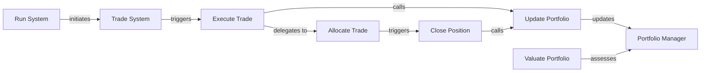

## Details

The `alphapy` system's core trading simulation is orchestrated by the `Run System`, which initiates the `Trade System`. The `Trade System` drives the simulation loop, triggering `Execute Trade` for potential new positions. Before a new trade is fully executed, `Execute Trade` delegates to `Allocate Trade` for pre-trade risk assessment. `Allocate Trade` is crucial for determining if a trade should proceed or if an existing position needs to be closed, in which case it triggers `Close Position`. Both `Execute Trade` (for new trades) and `Close Position` (for exiting trades) interact with `Update Portfolio` to ensure the `Portfolio Manager` accurately reflects the current financial state. The `Portfolio Manager` serves as the central data store for all portfolio-related information, which is also assessed by `Valuate Portfolio` to determine overall market value. This architecture ensures a clear separation of concerns, with `Allocate Trade` acting as the gatekeeper for both opening and closing positions based on risk rules.

### Run System
Serves as the high-level entry point, initiating the entire backtesting and simulation process.

**Related Classes/Methods**:

- <a href="https://github.com/ScottfreeLLC/AlphaPy/blob/master/alphapy/system.py" target="_blank" rel="noopener noreferrer">`alphapy.system:run_system`</a>

### Trade System
Orchestrates the core simulation loop, iterating through historical data, applying trading strategies (which would leverage predictions from ML models), and triggering trade execution and portfolio updates.

**Related Classes/Methods**:

- <a href="https://github.com/ScottfreeLLC/AlphaPy/blob/master/alphapy/system.py" target="_blank" rel="noopener noreferrer">`alphapy.system:trade_system`</a>

### Portfolio Manager
Manages the state of the simulated trading account. It holds `Position` objects, tracks cash, equity, and overall portfolio performance. It acts as the central data structure for the backtest.

**Related Classes/Methods**:

- <a href="https://github.com/ScottfreeLLC/AlphaPy/blob/master/alphapy/portfolio.py" target="_blank" rel="noopener noreferrer">`alphapy.portfolio:PortfolioManager`</a>

### Execute Trade
Executes a simulated trade. It handles the creation of `Position` and `Trade` objects, applies risk management rules, and updates the portfolio state.

**Related Classes/Methods**:

- <a href="https://github.com/ScottfreeLLC/AlphaPy/blob/master/alphapy/portfolio.py" target="_blank" rel="noopener noreferrer">`alphapy.portfolio:execute_trade`</a>

### Allocate Trade
Applies pre-trade risk management rules (e.g., stop-loss, kick-out conditions) to determine if a trade should proceed or if an existing position should be closed.

**Related Classes/Methods**:

- <a href="https://github.com/ScottfreeLLC/AlphaPy/blob/master/alphapy/portfolio.py" target="_blank" rel="noopener noreferrer">`alphapy.portfolio:allocate_trade`</a>

### Close Position
Manages the process of exiting an open position. It updates the portfolio, records the trade, and removes the position.

**Related Classes/Methods**:

- <a href="https://github.com/ScottfreeLLC/AlphaPy/blob/master/alphapy/portfolio.py" target="_blank" rel="noopener noreferrer">`alphapy.portfolio:close_position`</a>

### Update Portfolio
Ensures the portfolio's financial state (cash, equity, positions) is accurately reflected after any transaction, market movement, or event.

**Related Classes/Methods**:

- <a href="https://github.com/ScottfreeLLC/AlphaPy/blob/master/alphapy/portfolio.py" target="_blank" rel="noopener noreferrer">`alphapy.portfolio:update_portfolio`</a>

### Valuate Portfolio
Calculates the current market value of the entire portfolio, aggregating the value of all individual positions.

**Related Classes/Methods**:

- <a href="https://github.com/ScottfreeLLC/AlphaPy/blob/master/alphapy/portfolio.py" target="_blank" rel="noopener noreferrer">`alphapy.portfolio:valuate_portfolio`</a>

### [FAQ](https://github.com/CodeBoarding/GeneratedOnBoardings/tree/main?tab=readme-ov-file#faq)