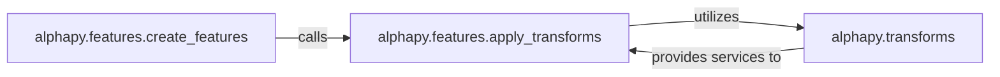

## Details

The `Feature Engineering` subsystem in AlphaPy is responsible for transforming raw or ingested data into a structured and enriched set of features suitable for machine learning models. This involves creating various feature types (numerical, statistical, interaction) and applying necessary data transformations.

### alphapy.features.create_features
This component acts as the primary orchestrator for the entire feature generation process. It is the main entry point for transforming raw input data into a comprehensive set of machine learning features. Its responsibilities include managing the application of different feature types (e.g., numerical, statistical, interaction) and handling data preparation steps like missing value imputation.

**Related Classes/Methods**:

- <a href="https://github.com/ScottfreeLLC/AlphaPy/blob/master/alphapy/features.py#L967-L1135" target="_blank" rel="noopener noreferrer">`alphapy.features.create_features`:967-1135</a>

### alphapy.features.apply_transforms
This component is responsible for managing the sequential application of individual data transformation functions. It functions as a dispatcher, iterating through a list of specified transformations and applying each function from the `alphapy.transforms` module to the data. This ensures a modular and extensible transformation pipeline.

**Related Classes/Methods**:

- <a href="https://github.com/ScottfreeLLC/AlphaPy/blob/master/alphapy/features.py#L155-L223" target="_blank" rel="noopener noreferrer">`alphapy.features.apply_transforms`:155-223</a>

### alphapy.transforms
This component serves as a library of atomic, reusable data transformation functions. Each function within this module performs a specific mathematical or statistical operation on data series (e.g., log transformation, standardization, differencing). These functions are the fundamental building blocks for more complex feature engineering operations.

**Related Classes/Methods**:

- <a href="https://github.com/ScottfreeLLC/AlphaPy/blob/master/alphapy/transforms.py" target="_blank" rel="noopener noreferrer">`alphapy.transforms`</a>

### [FAQ](https://github.com/CodeBoarding/GeneratedOnBoardings/tree/main?tab=readme-ov-file#faq)