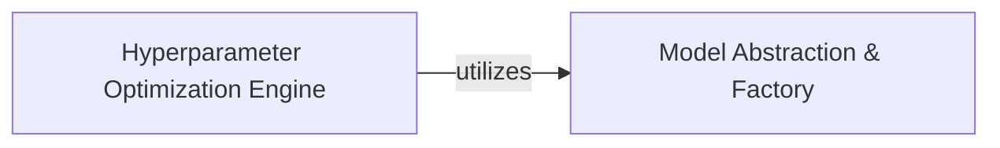

## Details

The `Model Building & Optimization` subsystem is a critical part of AlphaPy's machine learning pipeline, focusing on the selection, configuration, training, and initial evaluation of models, along with hyperparameter tuning.

### Model Abstraction & Factory
This component provides the foundational structure for all machine learning models within AlphaPy. It acts as a centralized factory, enabling the dynamic selection, configuration, and instantiation of specific model instances. Its responsibilities include ensuring models are correctly set up with their respective algorithms and verifying the availability of necessary external dependencies. This abstraction is crucial for maintaining a flexible and extensible framework, allowing new algorithms to be integrated seamlessly.

**Related Classes/Methods**:

- <a href="https://github.com/ScottfreeLLC/AlphaPy/blob/master/alphapy/estimators.py" target="_blank" rel="noopener noreferrer">`alphapy.estimators.Estimator`</a>
- <a href="https://github.com/ScottfreeLLC/AlphaPy/blob/master/alphapy/estimators.py#L320-L404" target="_blank" rel="noopener noreferrer">`alphapy.estimators.get_estimators`:320-404</a>
- <a href="https://github.com/ScottfreeLLC/AlphaPy/blob/master/alphapy/estimators.py#L212-L264" target="_blank" rel="noopener noreferrer">`alphapy.estimators.get_algos_config`:212-264</a>
- <a href="https://github.com/ScottfreeLLC/AlphaPy/blob/master/alphapy/estimators.py#L178-L205" target="_blank" rel="noopener noreferrer">`alphapy.estimators.find_optional_packages`:178-205</a>

### Hyperparameter Optimization Engine
This component is dedicated to systematically exploring the hyperparameter space of a given model to identify optimal configurations that enhance performance. It includes functionalities for executing optimization strategies (e.g., grid search via `hyper_grid_search`) and generating comprehensive reports on the optimization process and its outcomes (`grid_report`).

**Related Classes/Methods**:

- <a href="https://github.com/ScottfreeLLC/AlphaPy/blob/master/alphapy/optimize.py#L159-L294" target="_blank" rel="noopener noreferrer">`alphapy.optimize.hyper_grid_search`:159-294</a>
- <a href="https://github.com/ScottfreeLLC/AlphaPy/blob/master/alphapy/optimize.py#L130-L152" target="_blank" rel="noopener noreferrer">`alphapy.optimize.grid_report`:130-152</a>

### [FAQ](https://github.com/CodeBoarding/GeneratedOnBoardings/tree/main?tab=readme-ov-file#faq)