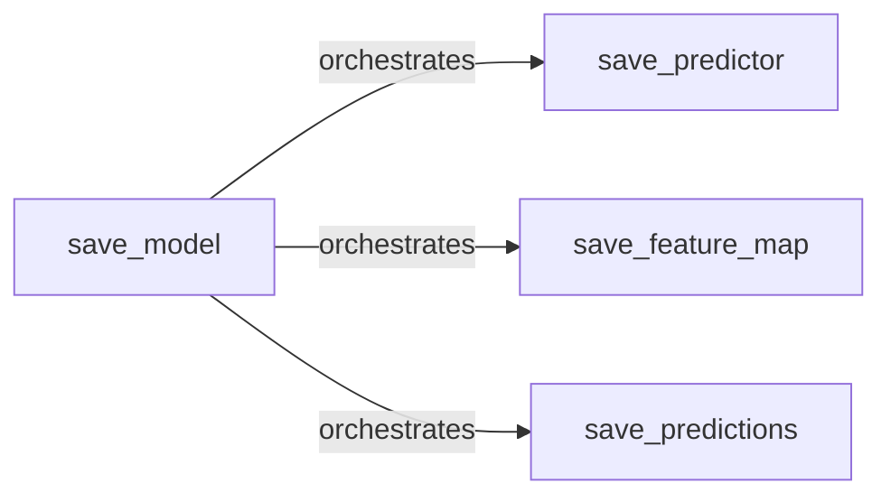

## Details

The Model Persistence & Prediction subsystem in AlphaPy manages the complete lifecycle of trained machine learning models, including serialization, storage, and retrieval of model artifacts for future inference.

### save_model
Acts as the central orchestrator for the model persistence subsystem. It coordinates the saving of all components associated with a trained machine learning model, ensuring data consistency and completeness for future retrieval and deployment. This function serves as the primary entry point for persisting a model.

**Related Classes/Methods**:

- <a href="https://github.com/ScottfreeLLC/AlphaPy/blob/master/alphapy/model.py#L1257-L1331" target="_blank" rel="noopener noreferrer">`save_model`:1257-1331</a>

### save_predictor
Responsible for the serialization and storage of the trained machine learning model object itself (e.g., a scikit-learn estimator, Keras model, XGBoost booster). This is the fundamental artifact required for making new predictions.

**Related Classes/Methods**:

- <a href="https://github.com/ScottfreeLLC/AlphaPy/blob/master/alphapy/model.py#L512-L547" target="_blank" rel="noopener noreferrer">`save_predictor`:512-547</a>

### save_feature_map
Specifically handles the serialization and storage of the feature mapping or transformation pipeline used by the model. This ensures that new input data can be preprocessed consistently before inference, maintaining the integrity of the model's input requirements.

**Related Classes/Methods**:

- <a href="https://github.com/ScottfreeLLC/AlphaPy/blob/master/alphapy/model.py#L592-L621" target="_blank" rel="noopener noreferrer">`save_feature_map`:592-621</a>

### save_predictions
Manages the saving of the predictions generated by the model, typically from a validation or test set. This is crucial for post-hoc performance analysis, debugging, and potential future ensemble building or reporting.

**Related Classes/Methods**:

- <a href="https://github.com/ScottfreeLLC/AlphaPy/blob/master/alphapy/model.py#L1157-L1250" target="_blank" rel="noopener noreferrer">`save_predictions`:1157-1250</a>

### [FAQ](https://github.com/CodeBoarding/GeneratedOnBoardings/tree/main?tab=readme-ov-file#faq)