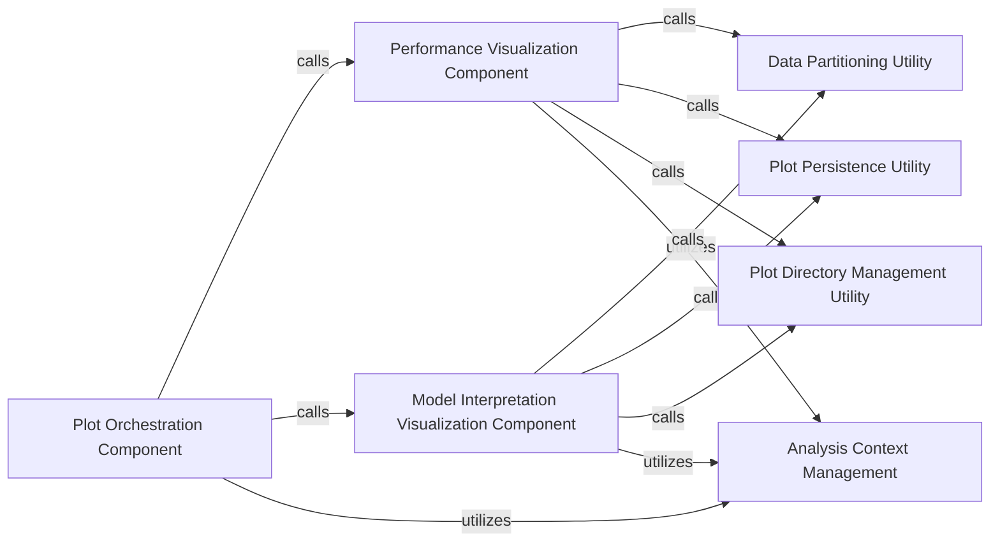

## Details

The `alphapy.plots` subsystem is structured around a central `Plot Orchestration Component` that directs the generation of various model-related visualizations. It delegates specific plotting tasks to the `Performance Visualization Component` and `Model Interpretation Visualization Component`, which are responsible for creating performance and interpretability plots, respectively. Both visualization components depend on the `Data Partitioning Utility` for data preparation and interact with the `Plot Persistence Utility` and `Plot Directory Management Utility` to save and organize the generated plots. The entire plotting process is configured and contextualized by the `Analysis Context Management` component, ensuring consistent naming and settings across all outputs. This design promotes modularity and clear separation of concerns, facilitating the creation and management of comprehensive model analysis reports.

### Plot Orchestration Component
Acts as the high-level coordinator for generating a suite of model performance and interpretation plots. It dispatches calls to specific plotting functions based on the overall analysis requirements. This component is central as it orchestrates the entire visualization process.

**Related Classes/Methods**:

- <a href="https://github.com/ScottfreeLLC/AlphaPy/blob/master/alphapy/plots.py#L142-L181" target="_blank" rel="noopener noreferrer">`alphapy.plots.generate_plots`:142-181</a>

### Performance Visualization Component
Focuses on creating plots that assess core model performance metrics, providing quantitative and qualitative insights into model effectiveness. This is a core output component for evaluating ML models.

**Related Classes/Methods**:

- <a href="https://github.com/ScottfreeLLC/AlphaPy/blob/master/alphapy/plots.py#L290-L360" target="_blank" rel="noopener noreferrer">`alphapy.plots.plot_calibration`:290-360</a>
- <a href="https://github.com/ScottfreeLLC/AlphaPy/blob/master/alphapy/plots.py#L529-L591" target="_blank" rel="noopener noreferrer">`alphapy.plots.plot_roc_curve`:529-591</a>
- <a href="https://github.com/ScottfreeLLC/AlphaPy/blob/master/alphapy/plots.py#L598-L690" target="_blank" rel="noopener noreferrer">`alphapy.plots.plot_confusion_matrix`:598-690</a>
- <a href="https://github.com/ScottfreeLLC/AlphaPy/blob/master/alphapy/plots.py#L436-L522" target="_blank" rel="noopener noreferrer">`alphapy.plots.plot_learning_curve`:436-522</a>
- <a href="https://github.com/ScottfreeLLC/AlphaPy/blob/master/alphapy/plots.py#L697-L779" target="_blank" rel="noopener noreferrer">`alphapy.plots.plot_validation_curve`:697-779</a>

### Model Interpretation Visualization Component
Generates plots aimed at understanding model behavior, feature contributions, and decision boundaries, aiding in model explainability. This component is crucial for model interpretability, a key aspect of ML frameworks.

**Related Classes/Methods**:

- <a href="https://github.com/ScottfreeLLC/AlphaPy/blob/master/alphapy/plots.py#L367-L429" target="_blank" rel="noopener noreferrer">`alphapy.plots.plot_importance`:367-429</a>
- <a href="https://github.com/ScottfreeLLC/AlphaPy/blob/master/alphapy/plots.py#L882-L928" target="_blank" rel="noopener noreferrer">`alphapy.plots.plot_partial_dependence`:882-928</a>
- <a href="https://github.com/ScottfreeLLC/AlphaPy/blob/master/alphapy/plots.py#L786-L875" target="_blank" rel="noopener noreferrer">`alphapy.plots.plot_boundary`:786-875</a>

### Plot Persistence Utility
Handles the saving of all generated plots to the file system, ensuring visualizations are persisted for review, reporting, and further analysis. This utility is fundamental for making the generated reports tangible and accessible.

**Related Classes/Methods**:

- <a href="https://github.com/ScottfreeLLC/AlphaPy/blob/master/alphapy/plots.py#L211-L283" target="_blank" rel="noopener noreferrer">`alphapy.plots.write_plot`:211-283</a>

### Data Partitioning Utility
Manages the retrieval and preparation of specific data subsets required for various plotting functions, ensuring that each plot receives the appropriate data for its visualization. This component is essential for providing the correct data context to the visualization components.

**Related Classes/Methods**:

- <a href="https://github.com/ScottfreeLLC/AlphaPy/blob/master/alphapy/plots.py#L102-L135" target="_blank" rel="noopener noreferrer">`alphapy.plots.get_partition_data`:102-135</a>

### Plot Directory Management Utility
Determines and provides the appropriate output directory paths for saving plots, ensuring organized storage and easy retrieval of visualization assets. This utility supports the organization and discoverability of generated reports.

**Related Classes/Methods**:

- <a href="https://github.com/ScottfreeLLC/AlphaPy/blob/master/alphapy/plots.py#L188-L204" target="_blank" rel="noopener noreferrer">`alphapy.plots.get_plot_directory`:188-204</a>

### Analysis Context Management
Manages the naming, initialization, and configuration of analysis contexts, which influence how subsequent plotting operations are performed and how results are interpreted. This component provides the overarching context and configuration for the entire reporting process.

**Related Classes/Methods**:

- <a href="https://github.com/ScottfreeLLC/AlphaPy/blob/master/alphapy/analysis.py#L99-L109" target="_blank" rel="noopener noreferrer">`alphapy.analysis.__new__`:99-109</a>
- <a href="https://github.com/ScottfreeLLC/AlphaPy/blob/master/alphapy/analysis.py#L113-L125" target="_blank" rel="noopener noreferrer">`alphapy.analysis.__init__`:113-125</a>
- <a href="https://github.com/ScottfreeLLC/AlphaPy/blob/master/alphapy/analysis.py#L53-L70" target="_blank" rel="noopener noreferrer">`alphapy.analysis.analysis_name`:53-70</a>

### [FAQ](https://github.com/CodeBoarding/GeneratedOnBoardings/tree/main?tab=readme-ov-file#faq)