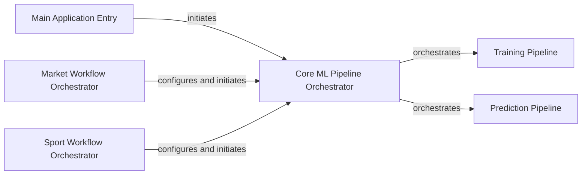

## Details

The AlphaPy application's core architecture is centered around a flexible machine learning pipeline. The Main Application Entry serves as the initial launch point, directing control to the Core ML Pipeline Orchestrator. This orchestrator dynamically selects between the Training Pipeline and Prediction Pipeline based on the application's mode. Specialized Market Workflow Orchestrator and Sport Workflow Orchestrator components handle domain-specific data preparation and configuration, subsequently invoking the Core ML Pipeline Orchestrator to execute the appropriate ML phase. This design promotes modularity, allowing for distinct data handling and configuration while centralizing the core ML logic.

### Main Application Entry
The primary entry point for the entire AlphaPy application. It is responsible for initiating the overall machine learning workflow, potentially delegating to more specific orchestrators based on user input or configuration.

**Related Classes/Methods**:

- <a href="https://github.com/ScottfreeLLC/AlphaPy/blob/master/alphapy/__main__.py#L446-L514" target="_blank" rel="noopener noreferrer">`alphapy.__main__.main`:446-514</a>

### Core ML Pipeline Orchestrator
Manages the high-level sequence of generic machine learning pipeline phases, specifically handling the training and prediction stages. It acts as a central coordinator for the core ML process, independent of the specific domain (market or sport).

**Related Classes/Methods**:

- <a href="https://github.com/ScottfreeLLC/AlphaPy/blob/master/alphapy/__main__.py#L413-L439" target="_blank" rel="noopener noreferrer">`alphapy.__main__.main_pipeline`:413-439</a>

### Market Workflow Orchestrator
Coordinates the end-to-end workflow for market analysis. This includes loading market-specific configurations, preparing market data, and initiating the execution of the market-specific ML pipeline.

**Related Classes/Methods**:

- <a href="https://github.com/ScottfreeLLC/AlphaPy/blob/master/alphapy/market_flow.py#L340-L441" target="_blank" rel="noopener noreferrer">`alphapy.market_flow.main`:340-441</a>

### Sport Workflow Orchestrator
Manages the complete workflow for sport analysis. Its responsibilities include loading sport-specific configurations, preparing and enriching sport-related data, and orchestrating the subsequent ML processes for sports.

**Related Classes/Methods**:

- <a href="https://github.com/ScottfreeLLC/AlphaPy/blob/master/alphapy/sport_flow.py#L624-L918" target="_blank" rel="noopener noreferrer">`alphapy.sport_flow.main`:624-918</a>

### Training Pipeline
Represents the training phase of an ML pipeline, where models are fitted to data. This component encapsulates the logic for model training, including data preparation, feature engineering, model selection, and evaluation.

**Related Classes/Methods**:

- <a href="https://github.com/ScottfreeLLC/AlphaPy/blob/master/alphapy/__main__.py#L95-L302" target="_blank" rel="noopener noreferrer">`alphapy.__main__.training_pipeline`:95-302</a>

### Prediction Pipeline
Represents the prediction phase of an ML pipeline, where trained models are used to make inferences on new data. This component encapsulates the logic for loading models, preparing new data, and generating predictions.

**Related Classes/Methods**:

- <a href="https://github.com/ScottfreeLLC/AlphaPy/blob/master/alphapy/__main__.py#L309-L406" target="_blank" rel="noopener noreferrer">`alphapy.__main__.prediction_pipeline`:309-406</a>

### [FAQ](https://github.com/CodeBoarding/GeneratedOnBoardings/tree/main?tab=readme-ov-file#faq)