```mermaid
graph LR
    Workflow_Orchestration["Workflow Orchestration"]
    Data_Management["Data Management"]
    Feature_Engineering["Feature Engineering"]
    Model_Building_Optimization["Model Building & Optimization"]
    Model_Persistence_Prediction["Model Persistence & Prediction"]
    Backtesting_Strategy_Simulation["Backtesting & Strategy Simulation"]
    Reporting_Visualization["Reporting & Visualization"]
    Workflow_Orchestration -- "Triggers data acquisition" --> Data_Management
    Data_Management -- "Provides raw/loaded data" --> Feature_Engineering
    Feature_Engineering -- "Supplies engineered features" --> Model_Building_Optimization
    Model_Building_Optimization -- "Passes trained models" --> Model_Persistence_Prediction
    Model_Persistence_Prediction -- "Feeds model predictions" --> Backtesting_Strategy_Simulation
    Backtesting_Strategy_Simulation -- "Outputs performance metrics and results" --> Reporting_Visualization
    Model_Building_Optimization -- "Sends model evaluation results" --> Reporting_Visualization
    Data_Management -- "Raw data for direct visualization" --> Reporting_Visualization
    Feature_Engineering -- "Engineered features for visualization" --> Reporting_Visualization
    click Workflow_Orchestration href "https://github.com/CodeBoarding/GeneratedOnBoardings/blob/main/AlphaPy/Workflow_Orchestration.md" "Details"
    click Data_Management href "https://github.com/CodeBoarding/GeneratedOnBoardings/blob/main/AlphaPy/Data_Management.md" "Details"
    click Feature_Engineering href "https://github.com/CodeBoarding/GeneratedOnBoardings/blob/main/AlphaPy/Feature_Engineering.md" "Details"
    click Model_Building_Optimization href "https://github.com/CodeBoarding/GeneratedOnBoardings/blob/main/AlphaPy/Model_Building_Optimization.md" "Details"
    click Model_Persistence_Prediction href "https://github.com/CodeBoarding/GeneratedOnBoardings/blob/main/AlphaPy/Model_Persistence_Prediction.md" "Details"
    click Backtesting_Strategy_Simulation href "https://github.com/CodeBoarding/GeneratedOnBoardings/blob/main/AlphaPy/Backtesting_Strategy_Simulation.md" "Details"
    click Reporting_Visualization href "https://github.com/CodeBoarding/GeneratedOnBoardings/blob/main/AlphaPy/Reporting_Visualization.md" "Details"
```

## Details

The AlphaPy system is architected as a modular, pipeline-driven machine learning framework, designed to streamline quantitative finance and sports analytics workflows. At its core, the Workflow Orchestration component (alphapy/__main__.py, alphapy/market_flow.py, alphapy/sport_flow.py) orchestrates the entire process, initiating specific analytical pipelines. Data ingress is managed by the Data Management component (alphapy/data.py, alphapy/frame.py), which handles acquisition and loading. This raw data then flows into Feature Engineering (alphapy/features.py, alphapy/transforms.py) for transformation into a rich feature set. These features are consumed by Model Building & Optimization (alphapy/estimators.py, alphapy/optimize.py) to train and select machine learning models. Trained models are then passed to Model Persistence & Prediction (alphapy/model.py) for saving and generating predictions. The generated predictions are critical input for Backtesting & Strategy Simulation (alphapy/portfolio.py, alphapy/system.py), where trading strategies are rigorously evaluated. Finally, Reporting & Visualization (alphapy/plots.py, alphapy/analysis.py) provides comprehensive insights by consuming data and results from all key stages, offering visual and statistical analysis of the pipeline's performance. This clear component separation and sequential data flow are ideal for visual representation in a flow graph, highlighting the end-to-end ML pipeline.

### Workflow Orchestration [[Expand]](./Workflow_Orchestration.md)
The central coordinator for AlphaPy's machine learning pipelines. It manages the overall execution flow, including loading configurations, sequencing pipeline stages, and initiating specific market or sport analysis flows.

**Related Classes/Methods**:

- <a href="https://github.com/ScottfreeLLC/AlphaPy/blob/master/alphapy/__main__.py" target="_blank" rel="noopener noreferrer">`Workflow Orchestration`</a>
- <a href="https://github.com/ScottfreeLLC/AlphaPy/blob/master/alphapy/market_flow.py" target="_blank" rel="noopener noreferrer">`Workflow Orchestration`</a>
- <a href="https://github.com/ScottfreeLLC/AlphaPy/blob/master/alphapy/sport_flow.py" target="_blank" rel="noopener noreferrer">`Workflow Orchestration`</a>

### Data Management [[Expand]](./Data_Management.md)
Handles all aspects of data acquisition, loading, and persistence. This component is responsible for interacting with external data sources and managing the internal representation of data, primarily as pandas DataFrames.

**Related Classes/Methods**:

- <a href="https://github.com/ScottfreeLLC/AlphaPy/blob/master/alphapy/data.py" target="_blank" rel="noopener noreferrer">`Data Management`</a>
- <a href="https://github.com/ScottfreeLLC/AlphaPy/blob/master/alphapy/frame.py" target="_blank" rel="noopener noreferrer">`Data Management`</a>

### Feature Engineering [[Expand]](./Feature_Engineering.md)
Transforms raw or ingested data into a structured and enriched set of features suitable for machine learning models. This includes creating numerical, statistical, and interaction features, as well as applying various data transformations.

**Related Classes/Methods**:

- <a href="https://github.com/ScottfreeLLC/AlphaPy/blob/master/alphapy/features.py" target="_blank" rel="noopener noreferrer">`Feature Engineering`</a>
- <a href="https://github.com/ScottfreeLLC/AlphaPy/blob/master/alphapy/transforms.py" target="_blank" rel="noopener noreferrer">`Feature Engineering`</a>

### Model Building & Optimization [[Expand]](./Model_Building_Optimization.md)
Encompasses the selection, configuration, training, and initial evaluation of various machine learning models. It includes functionalities for hyperparameter optimization to improve model performance.

**Related Classes/Methods**:

- <a href="https://github.com/ScottfreeLLC/AlphaPy/blob/master/alphapy/estimators.py" target="_blank" rel="noopener noreferrer">`Model Building & Optimization`</a>
- <a href="https://github.com/ScottfreeLLC/AlphaPy/blob/master/alphapy/optimize.py" target="_blank" rel="noopener noreferrer">`Model Building & Optimization`</a>

### Model Persistence & Prediction [[Expand]](./Model_Persistence_Prediction.md)
Manages the lifecycle of trained machine learning models, including saving models to disk, loading them for later use, and generating predictions based on new input data.

**Related Classes/Methods**:

- <a href="https://github.com/ScottfreeLLC/AlphaPy/blob/master/alphapy/model.py" target="_blank" rel="noopener noreferrer">`Model Persistence & Prediction`</a>

### Backtesting & Strategy Simulation [[Expand]](./Backtesting_Strategy_Simulation.md)
Simulates trading strategies based on the predictions generated by the machine learning models. This component manages portfolio positions, executes simulated trades, and tracks the performance of the trading system over historical data.

**Related Classes/Methods**:

- <a href="https://github.com/ScottfreeLLC/AlphaPy/blob/master/alphapy/portfolio.py" target="_blank" rel="noopener noreferrer">`Backtesting & Strategy Simulation`</a>
- <a href="https://github.com/ScottfreeLLC/AlphaPy/blob/master/alphapy/system.py" target="_blank" rel="noopener noreferrer">`Backtesting & Strategy Simulation`</a>

### Reporting & Visualization [[Expand]](./Reporting_Visualization.md)
Generates comprehensive plots, charts, and reports for in-depth analysis of data characteristics, model performance metrics, and backtesting results. It provides visual insights into the effectiveness and behavior of the entire ML pipeline.

**Related Classes/Methods**:

- <a href="https://github.com/ScottfreeLLC/AlphaPy/blob/master/alphapy/plots.py" target="_blank" rel="noopener noreferrer">`Reporting & Visualization`</a>
- <a href="https://github.com/ScottfreeLLC/AlphaPy/blob/master/alphapy/analysis.py" target="_blank" rel="noopener noreferrer">`Reporting & Visualization`</a>

### [FAQ](https://github.com/CodeBoarding/GeneratedOnBoardings/tree/main?tab=readme-ov-file#faq)