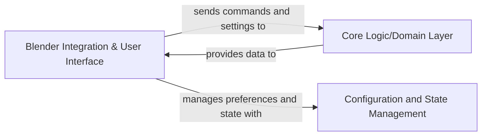

## Details

One paragraph explaining the functionality which is represented by this graph. What the main flow is and what is its purpose.

### Blender Integration & User Interface [[Expand]](./Blender_Integration_User_Interface.md)
This component serves as the primary interface between the Blender environment and the add-on's core logic. It manages all user-facing elements, including custom panels, operators, viewport drawing for lightfield visualization, and integration with Blender's rendering pipeline and preference system. It acts as the bridge, translating user interactions and Blender events into actions for the add-on's internal systems.

**Related Classes/Methods**:

- `AmberLG.ui`
- <a href="https://github.com/transcental/AmberLG/blob/master/lightfield_viewport.py" target="_blank" rel="noopener noreferrer">`AmberLG.lightfield_viewport`</a>
- <a href="https://github.com/transcental/AmberLG/blob/master/lightfield_render.py" target="_blank" rel="noopener noreferrer">`AmberLG.lightfield_render`</a>
- `AmberLG.preferences`
- <a href="https://github.com/transcental/AmberLG/blob/master/__init__.py" target="_blank" rel="noopener noreferrer">`AmberLG.__init__`</a>

### Core Logic/Domain Layer
This component encapsulates the fundamental business logic and domain-specific algorithms of the AmberLG add-on. It is responsible for processing lightfield data, managing lightfield structures, and executing core operations independent of the Blender UI. It acts as the brain of the add-on, performing computations and data manipulations that drive the lightfield visualization and rendering.

**Related Classes/Methods**:

- `AmberLG.lightfield`
- `AmberLG.operators`
- `AmberLG.properties`

### Configuration and State Management
This component is responsible for handling the persistent and transient state of the AmberLG add-on, including user preferences, scene-specific settings, and the current operational state. It ensures that configurations are loaded, saved, and applied consistently across sessions and operations, providing a centralized mechanism for managing the add-on's behavior and data.

**Related Classes/Methods**:

- `AmberLG.preferences`
- `AmberLG.properties`

### [FAQ](https://github.com/CodeBoarding/GeneratedOnBoardings/tree/main?tab=readme-ov-file#faq)